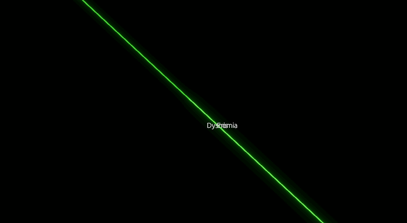

# Exotic Matters Engine

Squishy People and Hard Science

A program for course plotting and mission simulation for the Tabletop RPG Exotic Matters:
A scientific, mathematic TTRPG by Alexander Lowry

This TTRPG comes with a program to plot and calculate trajectories,
plus [a book](books/ExoticMatters-Rulebook.pdf) containing the rules for play.

**Both are incomplete right now!**
Neither are completely workable yet.

## Building the program

Assuming you have cargo and Rust (>=1.89.0) installed: `cargo run --bin exotic_matters --release`.
First-time compilation will take several minutes: about 15 minutes on my M3 Mac, and 30 minutes on my Ryzen 7.

## To Do List

* Shader to see light shine off distant objects
  * Sometimes objects are smaller than a pixel, so their bloom disappears suddenly or flickers
  * Screenspace shader that gets coordinates of objects and angles to light sources
    * phase angle?
* Add textures to objects
* Rotation and quaternion stuff (sadge)
* Procedural textures for planets
* Procedural textures for ring worlds
* Dyson spheres
* ring wolds
* potato asteroids
* rosettes
* klemperer rosettes
* let things change course over time (impulses)
* SOI changes
* Make ring habs scale properly with distance/object scale for symbolic views
* Bouncy animations for changing size
* Automatic size presets for useful stuff
* Information about trajectory lines on hover
* Little spacecraft type of object

## Bug List

Defects found and fixed while extracting `em-foundations` and `em-sim`. Each had a
test reintroduced against it, so a regression fails the suite rather than quietly
skewing an orbit.

### Orbital mechanics

* `semi_parameter` returned the semi-latus rectum's reciprocal relationship — the two
  names had been used interchangeably for different quantities.
* `apoapsis` and `periapsis` were swapped in one of the two constructors, so orbits
  built that way ran backwards through their apsides.
* `eccentricity::radii` took its arguments transposed relative to its callers, giving
  a negative eccentricity for every ordinary orbit.
* `semi_minor_axis::conic_definition1` inverted the conic relation, returning
  `a * sqrt(1 + e^2)`.
* True anomaly used `atan` where the quadrant mattered; it is `atan2`.
* The equation of the centre dropped a term of its series.
* `eccentricity_vector` had the cross product's operands reversed, flipping the
  direction of periapsis.
* Specific orbital energy carried the wrong sign, so bound orbits read as unbound.
* Mean anomaly was inverted from the eccentric anomaly rather than solved for; the
  Fourier–Bessel expansion silently diverges past the Laplace limit (e ~ 0.6627),
  which several bundled bodies exceed. Newton and Halley solvers now cover the whole
  range and the series is kept as an explicit export.

### Data

* Luna's elements were mixed-source: a semi-major axis inflated 0.66% by the absence
  of an anomalistic period, a prograde (positive) nodal precession period where nodal
  regression is retrograde, and a mass off by 22 orders of magnitude.
* Bodies orbiting a barycentre took `mu = G(M_primary + m)`, which is wrong there —
  each body's effective mu depends on the *other* body's mass. Pluto and Charon now
  carry an explicit `gravitational_parameter`.

### Application

* `update_focused_trajectory_markers` returned unconditionally, so apsis markers
  never drew.
* `presentation::rotation::render_axes` was never registered, leaving the
  `show_axes` setting inert.
* `util::format::seconds_to_naive_date` did no calendar conversion despite its name;
  it is now `format_duration`, which is what it always was.

### Known and unfixed

* The `earth_moon()` template in `presets.rs` (commented out) still carries the old
  bad Luna: positive `nodal_precession_period` and `mass: 6.4171`. Fix it if that
  template is revived.
* Eris/Dysnomia's mass ratio has never been measured, so the explicit mu for that
  pair is a guess. Luna/Earth's 1.23% ratio is worth a 0.48% period error, so this
  is worth refitting per `docs/horizons-golden-vectors.md` if it matters.

## Cool Fonts

* Futura
* Berkeley Mono
