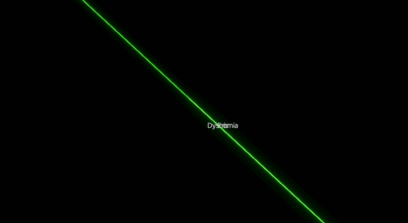

# Exotic Matters Engine

Squishy People and Hard Science

A program for course plotting and mission simulation for the Tabletop RPG Exotic Matters:
A scientific, mathematic TTRPG by Alexander Lowry

This TTRPG comes with a program to plot and calculate trajectories,
plus [a book](books/ExoticMatters-Rulebook.pdf) containing the rules for play.

**Both are incomplete right now!**
Neither are completely workable yet.

## Building the program

Assuming you have cargo and Rust (>=1.89.0) installed: `cargo run --bin exotic_matters --release`.
First-time compilation will take several minutes: about 15 minutes on my M3 Mac, and 30 minutes on my Ryzen 7.

## To Do List

* Add textures to objects
* Rotation and quaternion stuff (sadge)
* Procedural textures for planets
* Procedural textures for ring worlds
* Dyson spheres
* ring wolds
* potato asteroids
* rosettes
* klemperer rosettes
* let things change course over time (impulses)
* SOI changes
* Make ring habs scale properly with distance/object scale for symbolic views
* Bouncy animations for changing size
* Automatic size presets for useful stuff
* Information about trajectory lines on hover
* Little spacecraft type of object

## Bug List

## Cool Fonts

* Futura
* Berkeley Mono
