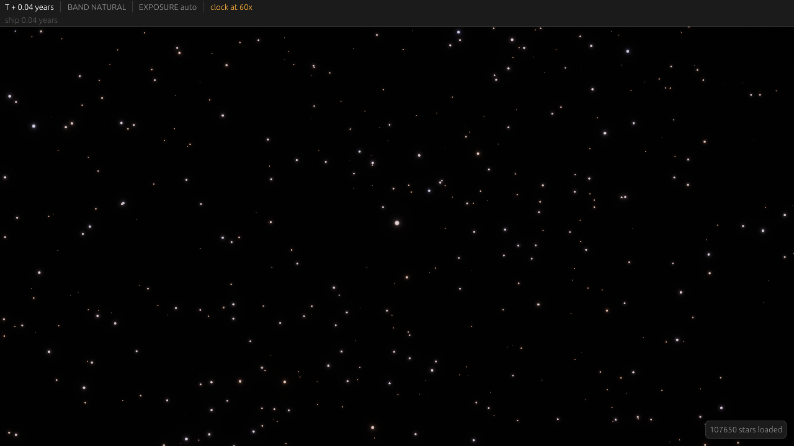
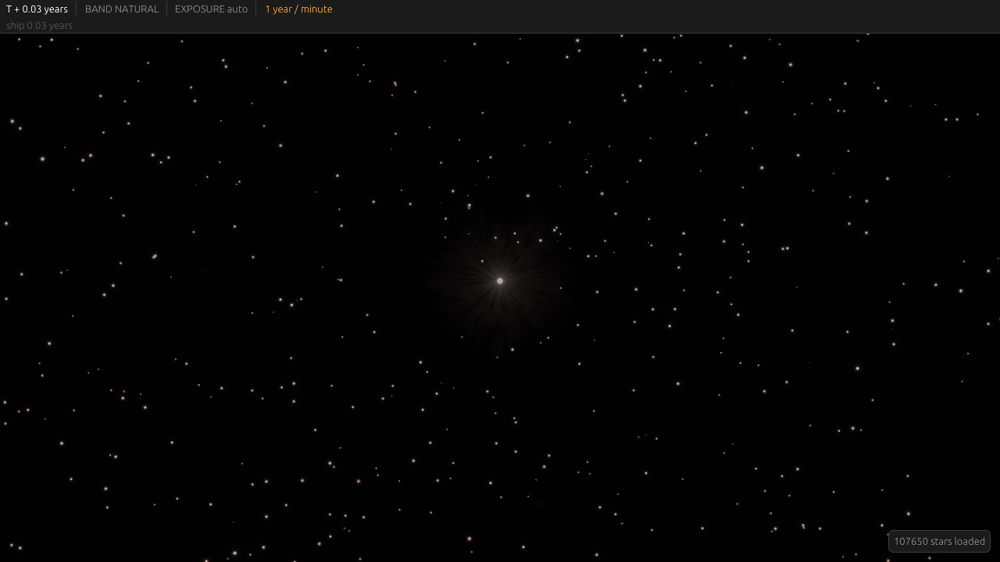
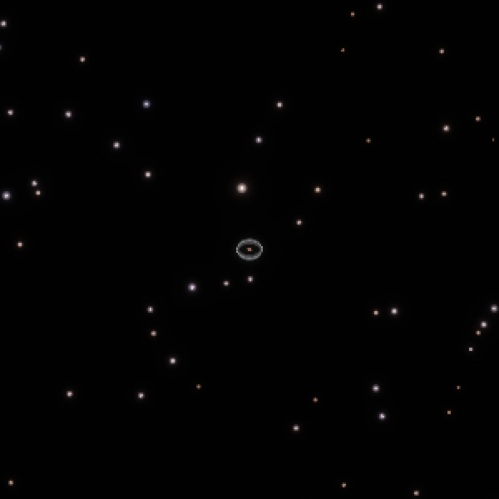
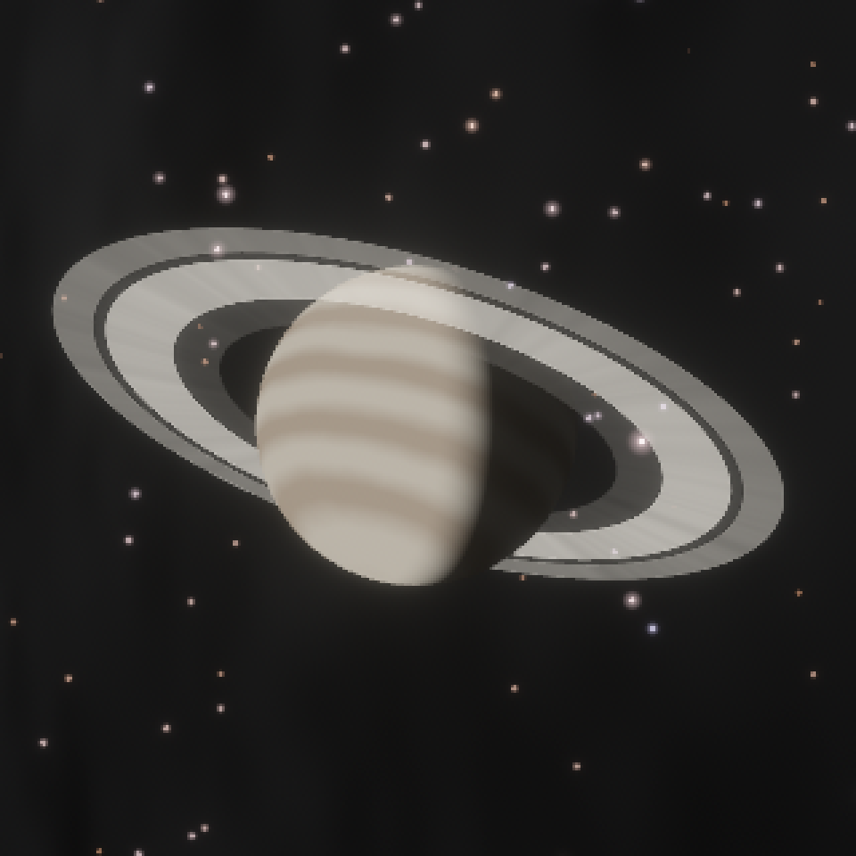
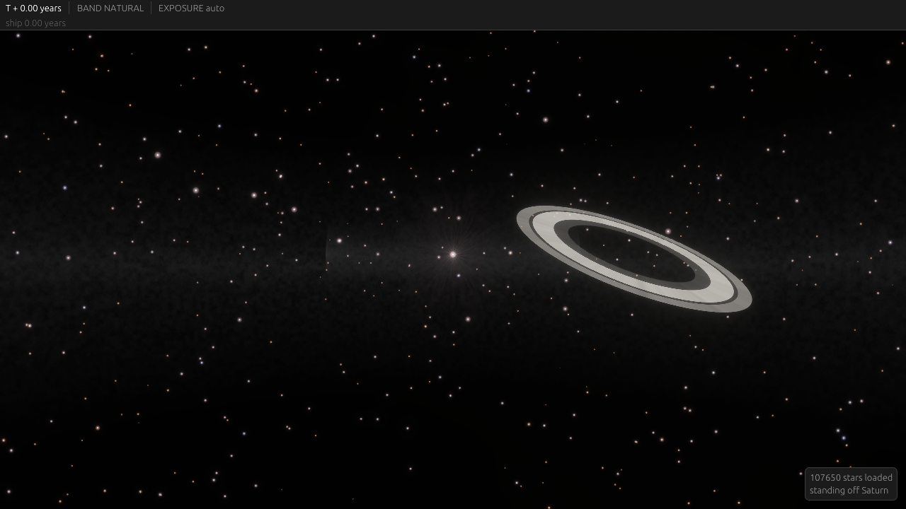
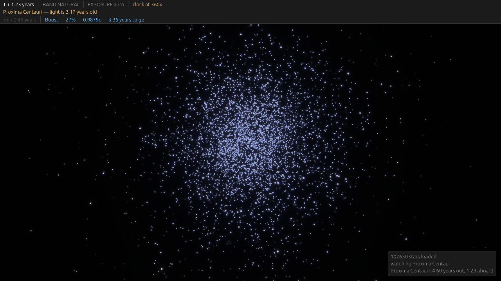
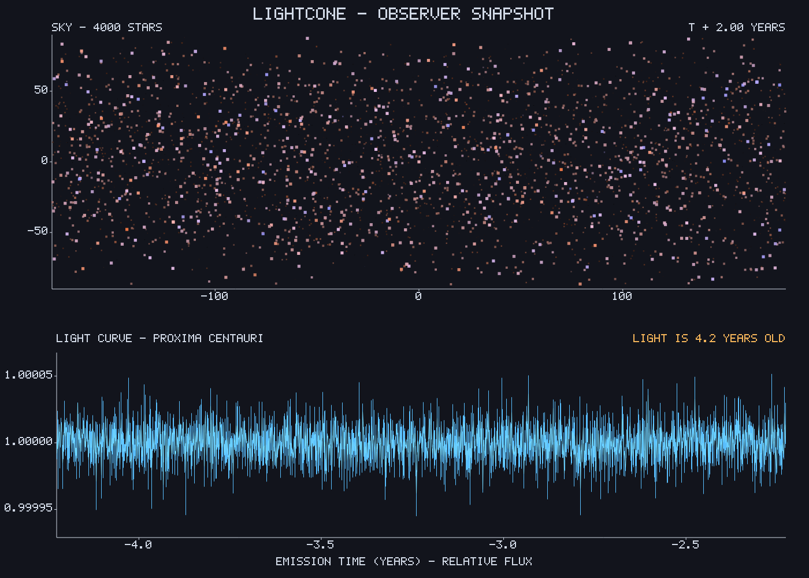
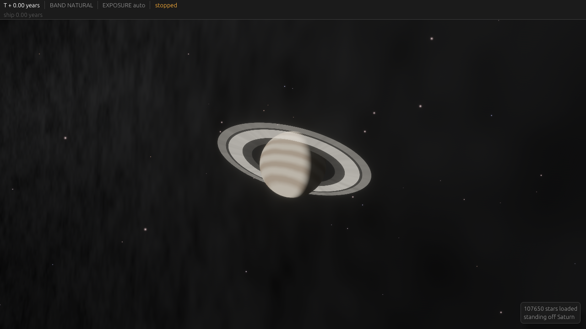

# Rendering

Bevy 0.17, wgpu, WGSL. One shader set for native and browser.

## View modes

| mode | what it draws | who gets it |
|---|---|---|
| observer view | every object at its **retarded** state, as seen from the player's ship | players, default and usually only |
| god view | every object at coordinate time `t`, no delay | development, replays, spectators |

Observer view is the game. Each drawable is evaluated at its own retarded time, solved
against the camera's worldline, so a distant ship appears where it was when its light left
and a distant star shows the brightness it emitted years ago. Two objects in the same frame
are drawn at different source times, and that is correct.

God view removes the delay. It is necessary for debugging, for authoring, and for watching a
replay, and it destroys the game's premise if a player has it.

**Decided: never exposed to players, and compiled out of the WASM build.** Two gates, because
they do different jobs:

| gate | stops |
|---|---|
| `#[cfg(feature = "godview")]`, off for `wasm32` | the code shipping to browsers at all — smaller binary, and nothing to find |
| server capability check | a modified desktop binary asking for the data |

The compile gate is about binary size and about not handing anyone the client half of the
mechanism. The server gate is the one that actually enforces it, because a desktop binary can
be patched and the server is the only thing that decides what data leaves it. Treat a client
that requests god-view data without the capability as a client to disconnect.

**God view draws causality explicitly.** For every event still in flight, draw a line from the
event's coordinate to each observer it is currently travelling toward, with the fraction
travelled shown along it. The single most common class of bug in this design is an observer
learning something early or late, and it is invisible in any view that only shows positions.
Rendered this way it is obvious: a line that reaches an observer before the client reacted, or
a reception with no line feeding it, is the bug drawn on screen.

Supporting overlays in the same mode:

| overlay | shows |
|---|---|
| in-flight event lines | which observers each live event is heading for, and how far along |
| expanding shells | the light cone of a selected event as a sphere of radius `c (t - t_emit)` |
| reception log, spatially anchored | what each observer received and when, at their position |
| knowledge diff | what observer A knows that observer B does not, at the same `t` |

These are debug instruments, so they may be expensive. Correctness of the delay model is worth
more than the frame rate of the mode nobody ships.

Both modes share one scene graph. The difference is the time at which each worldline is
sampled, which is a parameter of the extract step, not a separate renderer.

## Retarded-time sampling

**Decided: per object nearby, per system at distance.** Sampling every drawable's retarded time
individually is correct and unnecessary; sampling one per spatial cell is cheap and good enough
almost everywhere. The cell size scales with distance:

| region | granularity | error |
|---|---|---|
| the observer's own system | per object | none; this is where real-time play happens and where light delay is seconds to hours |
| any other system | one retarded time for the whole system | bounded by the system's light-crossing time |
| interstellar objects | per object | there are few of them and they are what the player is watching |

The bound on the second row is what makes it safe. A planetary system out to 100 AU is
0.6 light-days across, so one retarded time for the whole system misplaces a body by at most
`v * dt`: a planet at 30 km/s over half a day is 1.3e9 m, which at 10 light-years subtends
1.4e-7 radians. Sub-pixel by four orders of magnitude, for a system that is itself a few pixels
wide.

The rule is not "per cell" uniformly, because the observer's own system is the one place the
error would be visible and is also the cheapest place to be exact.

## Scale tiers

Positions are `f64` in the simulation and `f32` on the GPU. WGSL has no `f64` at all, so all
reduction happens on the CPU before upload. `f32` has a 24-bit mantissa: at 1e11 m the ulp is
8 km, so absolute world coordinates are unusable and everything is camera-relative.

`src/presentation/render_space.rs` already implements this as
`ToRender::to_render_relative(scale, camera_render_pos)`, subtracting in `f64` and narrowing
after. It moves to `em-render` unchanged. Do not open-code the swizzle or the subtraction
anywhere else — the Z-up to Y-up conversion is a proper rotation, not a mirror, and getting
it wrong silently flips handedness.

Three tiers, each with its own scale factor and camera:

| tier | range | unit on the GPU | contents |
|---|---|---|---|
| surface | < 1e4 m | metres | a ship, a station, a structure's geometry |
| system | 1e4 to 1e14 m | scaled metres | planets, orbits, trajectories, in-system traffic |
| interstellar | > 1e14 m | light-years | stars as points, systems as markers, light cones |

Render tiers back to front into the same target with separate depth ranges, or composite
separate passes. Reverse-Z with an infinite far plane, per tier, keeps depth precision
usable; the standard forward-Z projection wastes almost all of its precision near the near
plane, which at these scale ratios means z-fighting on everything past a planet.

## Star rendering



Stars are points with a physically-derived colour and brightness, not billboards with a
fixed sprite. The existing path is `src/presentation/local_starfield*.rs` with
`src/catalog/spectral_color.rs`, driven by the HYG catalogue.

`em-render::relativistic_starfield_material` is the descendant that the game uses, with
`crates/lc-client/assets/shaders/starfield.wgsl`. It keeps the technique — one mesh, four
vertices per star, the quad expanded in the vertex stage, `w = 0` on the direction transform so
the sky is translation-invariant, `clip.z = clip.w` for background depth — and changes what is
baked.

| | app starfield | game starfield |
|---|---|---|
| baked per star | linear RGB, brightness, size | temperature, radius, position |
| derived per frame | nothing | direction, aberration, Doppler, bands, exposure, size |
| brightness from | catalogue apparent magnitude | `L / d^2` through the band mapping |
| positions | unit directions, fixed | light-years from a bake origin that follows the ship |

### The corona



A local star's glare carries radial filaments. This is not physical and is deliberate: a real
corona is a millionth of the photosphere and invisible without occulting it. This ship occults
it. It has no eyes, only a pipeline, and the band matrix is already handed to the player on
exactly those grounds — a corona it chooses to render is the same kind of decision.

The structure is ridged fractal noise, and the one idea that makes it work is **sampling on the
normalised offset in the plane of the sky**. Normalising discards the distance out and leaves
only the angle around the star, so the field is constant along every ray and every feature
comes out radial without being asked for. The sample direction leans along the line of sight as
it goes out, so threads evolve rather than being straight spokes.

It is a function of a per-star seed and a world-space direction and of nothing else. So it does
not swim when the camera turns, it is identical for every client, and flying around a star shows
its other side.

Length and brightness come from two fields, not one, on the same angular scale and different
seeds. Driving both from one field made every long streamer also the brightest, which the eye
picks up at once. Sampling the length at half the frequency was worse again: it replaced the
streamers with half a dozen broad lobes, because the thing being varied was no longer a
streamer.

`corona_frequency` is streamers per radian and is the lever that matters — halving it halves
their number and doubles their width. Three octaves of squared ridges, not four of cubed: the
fine octaves read as fur, and every extra power narrows the crease.

Two things that looked like tuning and are not:

- **The halo is a power law out from the source, not a fade in from the edge of the quad.**
  `pow(1 - r, n)` is a property of where the quad happens to end, and it renders as a ball.
- **The outer fade must finish inside the quad.** Letting the threads push the boundary past
  `r = 1` means the `discard` at the edge cuts it, and the ragged silhouette becomes a hard
  circle — the exact artifact it was added to remove, only sharper.

### Lit bodies reuse the star shader


A planet is drawn by the starfield shader, as a blackbody at **its star's** temperature with a
smaller radius. Reflected light has the star's spectrum, so the only thing that differs is how
much of it arrives, and that is a radius:

```
R_eff = R_star * R_body * sqrt(p * phase) / d
```

from equating `pi R_eff^2 B / D^2` with the standard `L p R^2 / (4 pi d^2 D^2)`. Exact for a grey
reflector, and checked against a measured magnitude rather than asserted: Jupiter at opposition
comes out at -2.72 against an observed -2.70.

The phase term is not optional. Venus at a tenth of an astronomical unit is a razor crescent, and
a full-phase calculation puts it three magnitudes too bright.

A lit body is drawn at very nearly the background's size, and that is the point. A planet looks
like a star — it is why they were called wandering ones — and what distinguishes it is that it
moves, not that it is bigger. Drawn larger, the quad stops reading as a point source and starts
reading as a disc with a square behind it.

The body's own thermal emission goes in the same slot a swarm's does, because it is the same
physics: it absorbs starlight and re-radiates at the temperature its orbit sets. So a planet is
warm in the thermal preset without any separate machinery.

What this does not carry is a coloured albedo. Mars comes out the Sun's colour rather than its
own, because the model says reflected light has the star's spectrum. A per-body albedo colour is
the next thing this wants, and the preset carries a visualisation colour rather than a measured
albedo, so it wants a real table too.

### Where the bodies come from

Nothing is modelled here. `em-sim` holds and propagates systems, `em_sim::presets` already
carries the solar system — 230 bodies, moons and comets, fitted against JPL — and
`lc_world::sky::generate` already emits a generated system in the form `em-sim` consumes. The
client joins them: the real data where there is real data, a generated system otherwise.

The end-to-end check is that from where the Earth is, the brightest things in the sky are Luna,
Venus, Jupiter, Mars and Saturn. Real elements, real propagation, and photometry that agrees
with what a person standing outside would see.

### Two passes, two laws

The sky is drawn three times, and the passes obey different rules. This is the arrangement Exotic Matters
arrived at with `starfield` and `local_starfield`, and it is right for the same reason here.

| | background | local star | lit bodies |
|---|---|---|---|
| what it is | a dome at infinity | an object at a distance | objects in orbit |
| size | from brightness, 1 to 3 pixels | the angle it subtends, floored at 4 pixels | from reflected flux, 1 to 3.6 pixels |
| glare | slight | allowed to fill the screen | slight |
| corona | none | yes | none |
| rebuilt | when the ship crosses a shell | likewise | every frame, because they move |

A star joins the local pass when the ship is inside its Oort shell, 1.6 light-years, which
[03-world-model.md](03-world-model.md) already makes the partition boundary: being inside it is
the same statement as being in the system.

One law cannot serve both. The drawn size that makes arriving at a star look like arriving is
the size that makes a field of six thousand unreadable, and the first attempt here collapsed
them into one pass and got a sky of dust, then a sky of balloons.

Within a pass the source and its glare are also separate: the quad covers the glare, and the
core is a fraction of it. A single filled disc made a star a hundred and sixty pixels across
into a flat white ball with its actual disc swamped inside.

The reason for the split is that the observer moves. Baking a colour is right when the only
input is a catalogue magnitude and wrong when aberration, Doppler shift, the band matrix and the
exposure all change while the ship flies: re-uploading four `vec4`s per star per frame does not
scale to the target count, and computing them from a temperature costs nothing.

The blackbody is a table — `log2` of band radiance against `log2` of temperature, 2048 samples
by 7 bands, generated at startup by `em_spectra::blackbody`. That is what "the starfield and the
science instrument must not be two implementations" reduces to in practice: one Planck integral,
tabulated for the shader. The table spans 16 K to 4 million K because the lookup happens at the
*shifted* temperature, and at the drive's 0.999c cap the shift factor is 44.7 in both
directions.

Positions are baked relative to an origin that follows the ship, with the ship's offset from
that origin as a uniform, so the shader differences two small numbers instead of two
interstellar ones. The mesh is rebuilt once per light-year of travel.

For the game, the brightness fed to that shader is not the catalogue's apparent magnitude.
It is `L(n, t_r) / d^2` from [04-stellar-photometry.md](04-stellar-photometry.md), evaluated
for the camera's direction and retarded time. A star that a rival's swarm is occluding is
dimmer in the sky, and it is dimmer because of the same function the telescope samples. The
starfield and the science instrument must not be two implementations.

Note the existing catalogue rotation: HYG is equatorial, the sim is ecliptic. That
conversion already exists and is the sort of thing that silently puts everything 23.4 degrees
out of place if duplicated.

## The boundary and the skybox

The playable volume terminates at a boundary well inside the `2^60` coordinate invariant. What
lies beyond it is a skybox of distant galaxies: rendered, never simulated, never a source, never
in the BVH. It exists so the sky is not empty at the edge and so the boundary reads as distance
rather than as a wall.

The skybox is the one thing in the renderer exempt from retarded-time evaluation, because it has
no worldline and no state. Keep it in its own pass so that exemption is structural and cannot
leak into anything that does have a worldline.

## Light cones as geometry

Drawing a light cone is drawing an expanding sphere: radius `c * (t - t_emit)` about the
emission point. In observer view the visible intersection of a cone with the camera is a
single point, so cones are drawn only as an overlay, in the god view, or as a deliberate
UI affordance showing where a transmission has reached.

Implementation is an instanced unit sphere with a per-instance radius and a thin shell
shader. Cost is negligible and the spatial reasoning it supports — "has my message reached
them yet" — is central enough to justify a dedicated overlay.

## Shader portability

Target WebGPU as the baseline. WebGL2 as a fallback costs enough to be a separate decision:

| feature | WebGPU | WebGL2 |
|---|---|---|
| compute shaders | yes | no |
| storage buffers | yes | no; uniforms only, 64 KB typical limit |
| instancing | yes | yes |
| `f16` textures | yes | with extension |
| multiple render targets | yes | limited |

The emission-shell bake and any large per-instance data want storage buffers. Under WebGL2
they become textures, which is a real second code path.

**Decided: WebGPU only.** Detect WebGL2 and refuse it with a clear message pointing at the two
supported routes — a browser with WebGPU, or the desktop binary. Browser WebGPU support is
still arriving unevenly, and the desktop binary is the answer for anyone it has not reached
yet. Carrying a second renderer to cover the gap costs more than the gap does.

Rules for every shader written:

- No `f64`. WGSL does not have it.
- No platform-specific extensions without a WGSL-level fallback.
- Precision-critical arithmetic on the CPU, results uploaded as small `f32` deltas.
- Bevy's material abstraction over hand-written pipelines, so the native and WASM backends
  stay one code path.

## WASM specifics

| constraint | consequence |
|---|---|
| no threads without cross-origin isolation | ship `COOP`/`COEP` headers, or run Bevy single-threaded |
| no blocking IO | all asset loading async; no `std::fs` anywhere in the client's dependency tree |
| download size | `--release` with `opt-level = "s"`, `wasm-opt -Oz`, assets streamed not bundled |
| canvas sizing and input focus | Bevy handles it, but test the embedded case explicitly |

Single-threaded Bevy is the safe default. Cross-origin isolation breaks third-party embeds
and is worth taking only after profiling shows the render or extract stages are the
bottleneck.

## Rendering populations



**Decided: a convex proxy whose fragments march the population's own density field.** One shape
covers every case, because the shape is not geometry: it is two rows of a profile texture, and a
belt and an isotropic swarm differ only in what those rows say. The radius row comes from the
semi-major axis and eccentricity distributions, the latitude row from the inclination
distribution, nothing depends on longitude, and those three distributions are everything a
population carries. The proxy is one sphere shared by every population in the system.

This replaced a torus of proxy geometry with the density painted on its surface, and the reason
is that a surface cannot say how much material a sightline crossed. All it has is the crossing
count and the incidence angle, and from inside a belt — where the ship spends its time — every
sightline meets the far wall exactly once and nearly face-on. Looking along the belt and looking
at the pole came out within four per cent of each other, measured, where the material along them
differs by a factor of seven. The same two quantities failed the other way at a grazing edge:
four crossings each at the clamped incidence, all adding, painted a rim eight times brighter
than the material under it.

Marched, those follow from the geometry rather than from a constant. **The calibration is one
ray**: radially outward from the star in the population's plane, which is the sightline whose
extinction *is* the covering fraction. The host integrates the profile along it and the shader
solves for the extinction coefficient that puts it at the mapped opacity. Every other sightline
is then whatever the field says. Nothing is left to find by looking, and a change to the shape
cannot change what the population paints, because the shape is what the calibration is solved
against — which is what the old area correction was for, and it needed a factor of two in it
that had to be measured off a screenshot.

### A population is different in every band

**Decided: `band_response` sets the extinction, not just a colour.** A population carries a
per-band response, and until now it reached the renderer only as a choice between two hard-coded
tints — so every sensor preset drew the same grey, and "dust penetration" penetrated nothing.
Measured, the envelope was bit-identical in all six presets while the star field behind it
changed.

A band changes two separate things about a population, and both of them matter:

- **How much is in the way.** `em_spectra::extinction::RATIO` runs from 1.32 in B to 1e-10 at
  21 cm, so a dust cloud is thirteen decades more transparent in the radio. That is the whole
  mechanism the dust-penetration preset is named for, and it is the per-band extinction
  coefficient the march multiplies its one column integral by.
- **What the material that is there looks like.** In the optical a belt shines by scattered
  starlight, so it is the colour of its star; at ten microns it shines by its own two-hundred-
  kelvin glow, which the star has none of. Both scale with `band_response` — emissivity and
  absorptivity are the same number, which is why one array serves both.

The march is unchanged and so is its cost: it produces one column of material and every band's
optical depth is that column times that band's own coefficient, so seven bands cost what one
did. Only the conversion at the end differs, and it is seven exponentials and a matrix.

**The level is a display decision; only the colour is physics.** A belt's real surface
brightness is four decades under a star's and renders as nothing at all in every normalised
preset — true photometrically and useless as a picture, which is the argument the fourth root
already settles for the opacity. So the source spectrum is normalised to put the brightest
display channel at a fixed level, and what carries the information is the *balance* between
the channels and the per-band opacity. A population stays legible in a band its light barely
reaches while still saying which band it is being seen in.

What that buys, measured on the same frame with the same belt made of rock and of dust:

| preset | rock | dust |
|---|---|---|
| natural | (74, 64, 65) | (64, 66, 77) |
| thermal | (78, 42, 42) | (21, 16, 77) |
| dust penetration | (78, 1, 1) | (2, 54, 43) |

Rock reads warm in the optical, red in the thermal — it is warm — and bright at 21 cm, where a
cold body is relatively much brighter than a sun-like reference. Dust reads blue in the optical
because it interacts more in B, loses the thermal channel where its response is 0.06, and at
21 cm is simply not there. That last row is the grey-versus-reddening diagnostic of
[04-stellar-photometry.md](04-stellar-photometry.md), arrived at from the physics rather than
from an `if`.

**No drawn population is dusty yet.** The generated belts and swarms are `PerBand::splat(1.0)`,
which is right — a metre of rock is a metre of rock from B to 21 cm — and the one dusty
population the generator makes is the Oort cloud, which is below the visibility floor. So the
mechanism is correct, tested, and currently invisible in play. It becomes visible the moment
anything dusty is drawn, and a debris belt's *dust* component, which is what infrared astronomy
actually sees, would be the obvious first one.

**Cost: 0.076 ms per march step per frame**, measured on an M3 Pro at 1280x720 with two
populations each covering the sky. Thirty-two steps is about 2.4 ms and is within a mean of one
level in 255 of a ninety-six-step render. It scales with pixels and nothing else, so the same
view at 4K wants a half-resolution pass rather than a smaller step count.

### Resolved bodies



Past a couple of pixels of angular radius a body stops being a point and becomes a sphere. Below
that it is drawn at its *effective* radius, which is a photometric fiction — the radius a
blackbody would need to deliver the same flux — and that is right for anything unresolved and
wrong the moment a body has a shape. It is why Saturn's rings had nothing in the middle.

A resolved body is the only thing in this renderer that writes depth, which is what puts the far
half of a ring behind its planet and the near half in front.

**No textures and no authored appearance.** What a body looks like follows from its radius, mass
and equilibrium temperature, which every body in every system already carries, and everything
past that is a seed. `lc_world::surface` sorts the solar system the way a person would, and two
of its thresholds are set between specific pairs rather than chosen:

| | | |
|---|---|---|
| Europa 3013 kg/m³ against Io 3528 | bulk density | ice shell against no water at all |
| Saturn 5.7e26 kg against Neptune 1.0e26 | mass | an ice giant is one because it never got the hydrogen |

Sorting the giants by *temperature* was the first attempt and put Saturn, at 90 K, in with
Uranus. True about its temperature and wrong about everything a person would recognise.

Two families of surface cover it: latitude bands for anything gaseous, mottling for everything
solid. The band warp has to stay well under the band spacing — at a quarter of a period it stops
perturbing the bands and starts destroying them, and the planet reads as blobs.

The classification also supplies a per-body albedo, which replaces the flat 0.3 the photometry
had been using. Ice reflects six times what bare rock does.

The exposure meters bodies along with the stars — see [Metering](#metering) — so a planet
large enough to be the picture is what the window is placed on, and the star field behind it
drops away as it does in any photograph of a planet.

**A giant makes its own light.** Jupiter radiates 1.67 times what it takes from the Sun and
Saturn 1.78 — they are still shrinking, and the gravitational energy comes out as infrared. So a
body is shaded as two terms rather than one: starlight it reflects, which is Lambert-shaded and
has the star's spectrum, and a blackbody at its own effective temperature, which is not shaded
at all. A surface at `T` has radiance `B(T)` whichever way it is turned, and that is the whole
reason a gas giant's night side is as bright at ten microns as its day side.

The effective temperature is the grey equilibrium one cut by the **Bond** albedo and raised by
the internal heat. Bond, not geometric — a different quantity, not a different estimate of one:
Jupiter's are 0.34 and 0.50, and using the wrong one puts its temperature out by six per cent.
Against the measured values this is good to a couple of per cent for Jupiter and Saturn. The ice
giants cannot both be right: Uranus is 1.06 and Neptune 2.61 though Neptune is half again as far
out, their effective temperatures land within a fifth of a kelvin of each other, and no model
explains it. One number stands for both, nearer the Uranus end.

**In the infrared the bands invert.** A belt is a gap in the cloud deck, so it reflects less and
lets more of the warm interior out — the same fact twice, and it is why Jupiter's dark belts are
its bright ones at five microns. Mean-preserving, so changing band moves the pattern about
rather than changing how much light the body sends.

**The tone map is evaluated per fragment**, as the star field already evaluates it per star. It
has to be: the two terms mix differently across the disc and the curve is logarithmic, so one
level for the whole surface gets the terminator wrong. Mapping them separately and adding the
results put Jupiter's day side at twice its night side at ten microns, where the true ratio is
1.14 — the reflected half adds an eighth to a face that is already glowing.

An unresolved body was already summing the same two terms in the point shader; it now radiates
at the same effective temperature, so nothing changes as a planet crosses the resolution
threshold. A test compares the two paths directly, because flux is radiance times solid angle
and there is no excuse for them to disagree.

### Rings



**Opacity composites, it does not add.** A sightline crossing the shell at a grazing angle
passes through more of it, and the shader carries that as a limb term — but as `1 - (1 - t)^n`,
not `t * n`. A sightline running *along* a sheet has unbounded path length, and under a linear
law it paints unbounded light: seen edge-on from close up, Saturn's rings came out at twice
full white. It is the same exponential the photometry already applies to the star's light,
where past a covering fraction of a few tenths the elements begin shadowing one another, and it
leaves the face-on case untouched because at `n` of one it is `t`.

A ring is not a shell. It has radial structure and no latitude, so it gets a flat annulus with
each vertex's opacity from the optical depth *at that radius*. Saturn's rings span a factor of
1.8 in radius with a division in the middle that is the most recognisable thing about them;
drawn as a shell at one radius they would be a circle.

Both shapes go through one material, and the difference is a vertex normal: a shell's is its own
direction, a ring's is the pole. Passing it rather than deriving it is the whole of the change,
and it gets the limb term right for both — an edge-on ring has a normal across the view and
lights up, which is correct.

The data is in `lc_world::rings`: band radii from IAU and Cassini results, optical depths
area-averaged per band. Poles are *not* there — `em-sim`'s presets already carry every body's
IAU rotation, and a second copy of a pole is a second chance to have it wrong.

Rings take no display gain, unlike a population. The gain exists because even a Kuiper belt is a
trace; Saturn's rings cover a third of their own annulus and need no help. Applied to them it
rendered Jupiter's — three parts per million, and it took Voyager to find them — at a fifth
opacity.

Rings also reflect, which is why `effective_radius` takes an *area* rather than a radius. Saturn
plus rings is one source with one effective radius, and the ring contribution carries two
cosines: how much of it is turned toward the star, and how much toward the observer. Edge-on it
contributes nothing, which is the real 1.1 magnitude swing over Saturn's ring cycle.

### Two numbers that had to be found by looking

**The opacity mapping is a fourth root.** Covering fraction spans fourteen decades: an asteroid
belt covers 2.6e-12 of its star's sky, a Kuiper analogue 3e-8, a half-built swarm 0.4. Linearly,
everything natural is exactly zero and only a technosignature shows — true photometrically and
useless as a picture, for the same reason a linear tone map of sixty stops renders a black sky.

A logarithm was the first attempt and overcorrected badly: it put a Kuiper belt at 0.46, and
since the ship is *inside* that shell the result was a grey wash over the whole sky. A fourth
root gives 0.001, 0.013 and 0.80 — a trace, a haze and a structure, which is the right reading
of all three.

**A shell the ship is inside is dimmed to about a tenth.** From outside a belt is a ring and the
eye reads it as structure; from inside it covers the entire sky, and the opacity that made the
ring legible buries the star field. The same number cannot serve both. Dimmed, the inside case
is what it should be: a faint band along the plane, the way the zodiacal light is.

It is a weaker knob than it looks, and that is worth knowing before reaching for it. The
exposure meters the whole frame, so inside a shell that fills the sky the meter follows this
number and the displayed brightness barely moves — halving it, measured, changed the view from
inside the Kuiper belt by nothing at all and the view from inside the asteroid belt by an
eighth. What it still sets is the band against the *stars*, which is the comparison that
matters.

An envelope is a visualisation either way — an orbit line, not a photograph. What it carries
honestly is the ordering.

### The rest

**Decided: march the density field.** A population has no members to draw — that is the entire
point of [04-stellar-photometry.md](04-stellar-photometry.md) — so the renderer cannot instance
from world state and should not invent world state to instance from. It draws the distribution
instead, as above: one draw call per population regardless of element count, and it cannot drift
out of agreement with the physics because it is reading the physics.

**The grain moves the band's edge rather than dimming what is inside it.** Scaling the density
is what the surface shader did, and in a volume it disappears: a sightline crosses several
grains and averages them, so eighty-five per cent of contrast per sample came out as eighteen
on screen and read as nothing at all. An edge does not average — there is only one of it along
any sightline — so that is where the texture goes, and a band with a ragged edge reads as made
of things where a soft gradient does not. The reference ray lies in the plane, where the warp
cannot reach it, so the calibration is untouched by whatever the grain does.

Still wanting: the fine structure is one octave of value noise evaluated per step, which is most
of the shader's ALU. A tiling 3D noise texture would be one trilinear fetch instead of forty
operations and would pay for a second octave. Where the baked emission shell exists, sampling
its `m` channel would make the visible density and the photometric deficit the same number.
Single scattering — `exp(-tau)` to the star and a Henyey-Greenstein phase — is what would make a
belt read as lit rather than as glowing, and the star's position is already known.

Individual elements are drawn only when they have been promoted out of the population — when a
player selects specific members for a manoeuvre — at which point there are a handful of them
and they are ordinary bodies.

## Performance shape

The object count per frame is bounded by what is *visible*, not by what exists. The
light-cone cursor from [02-event-store.md](02-event-store.md) already yields sources in
arrival order and prunes by strength, so the renderer takes the first N and stops. A sky
with 120 000 catalogue stars draws as one instanced point cloud. A swarm is not drawn from
its members, because it has none: the renderer samples the population's distribution to
generate as many representative instances as the current LOD calls for, seeded so the same
swarm looks the same every frame and from every client. Instance count is a rendering
budget, not a world-state quantity.

`PERF_AUDIT.md` in the repo root records the existing app's measured hot spots. Read it
before assuming where time goes in the shared crates.

## Relativistic camera

**Decided: aberration and Doppler are applied to the rendered sky when the camera is moving
fast.** Not an option, not a debug toggle. A view from a ship in transit is supposed to look
wrong, and it is one of the few places the player sees relativity directly rather than reading
about it in a number.

Both effects are exact and cheap, being per-star operations in the vertex stage:

```
aberration:  tan(theta'/2) = sqrt((1 - beta) / (1 + beta)) * tan(theta/2)
Doppler:     D = 1 / (gamma * (1 - n . beta))
beaming:     bolometric intensity scales as D^4
```

At `beta = 0.5`, a star 90 degrees off the bow appears at 60 degrees — the whole sky compresses
forward.



**The forward sky brightens without limit and never goes dark.** An earlier version of this
document said otherwise — that head-on light blueshifts out of the visible band and forward
sources vanish while brightening — and the renderer disproved it. That argument holds for a
monochromatic source and a star is a continuum. The band an observer looks through is fed by
whatever the star emitted at `lambda / D`, and a hot star has plenty there.

Put exactly: a blackbody seen with Doppler factor `D` is a blackbody at `D T`, and
`B_lambda(lambda, T)` is strictly increasing in `T` at fixed `lambda`. So every band brightens
going forward, monotonically, forever. For a sun-like star the B band rises 11 times at
`D = 1.73` and 193 times at `D = 6.4`.

Astern the same identity runs the other way and the sky really does go out: at `D = 1/6.4` the
B band is down by thirteen orders of magnitude.

So at high `beta` the sky is **a brilliant blue disc ahead and darkness everywhere else** — not
a ring. It is unusable for navigation, which is correct, and it is the most striking image the
renderer can produce. Capturing a still from a ship in transit is worth making an explicit
affordance; `--shot` does it.

## Ships, and the camera that looks at one

**Decided: third person, on an orbit camera.** A ship is the thing a player owns and the thing
they are told about other people, and neither is visible from inside it.

A hull is one ovoid at a size: five long by three across by one deep, from
`lc_world::craft::BEAM_PER_LENGTH` and its neighbour, over a designed range of five hundred
metres to fifty kilometres. It is drawn by the resolved-body material with the contrast set to
zero, which turns the generated surface off and leaves a flat grey lit by the system's own star
and metered into the same exposure as everything else. Shape is a constant rather than a field
because nothing yet lets one craft differ from another in it; the *length* is on the wire, so
ships varying in size costs no protocol version.

**The nose follows the drive, not the velocity.** `lc_world::motion::facing` reads what the
current motive is *aiming* at — see `lc_world::attitude` — which is the thrust where there is
thrust. Proper acceleration, so a ballistic arc counts as unpowered rather than pointing at
whatever it is falling towards. The visible consequence is the right one: a crossing is burn,
flip and burn, so for its whole second half the ship points back the way it came while still
travelling forward at a large fraction of `c`.

**The turn is not instant, and it is not free.** A hull swings its nose at
`attitude::rate_rad_s`, which goes as `1/L` — a five-hundred-metre ship flips in a minute and a
fifty-kilometre one takes nearly two hours. So `flight::Cruise` holds the drive out between the
boost and the brake for at least `Drive::flip_s`, and the ship covers that ground at its peak
speed. It also comes about *before* it lights anything: a crossing begins with a `Phase::Turn`
in which the ship drifts at whatever it had, facing round to its first burn. A ship told to go
somewhere behind it spends a minute turning before the drive comes on, and the drift during that
minute is part of the plan rather than an error in it — which is why the turn has to be timed and
the crossing solved together, not one after the other. On an interstellar crossing it is a minute inside a journey of years and nobody will
notice; on a hop of a few light-seconds it is most of the trip, and a big hull has to arrive
slower because it spends the journey coming about. The brake never lights on a nose still
turning, which is the property the coast exists to buy.

A craft never has *no* attitude: where nothing is deciding one it keeps the one it has, so a
ship that has just braked to a halt goes on pointing where it finished rather than snapping to
whichever way its last millimetre a second happened to go.

**Arriving is not stopping.** A station is an orbit and an orbit moves, so a crossing planned
onto one ends *on* its velocity: the last burn is held at one angle — `flight::Injection` — that
kills the speed the ship came in with and imparts the speed it is joining, both at once, rather
than braking to a dead halt and finding kilometres a second out of nowhere on the next step. The
nose is visibly neither straight back down the track nor across it, but between. The form is
Newtonian and only offered below `flight::INJECTION_MAX_BETA`; an interstellar crossing brakes
to rest the exact way, as it always did.

**And a transfer about one body is flown in that body's frame.** Going from one orbit of Earth to
another is not a straight line in the world: Earth covers a whole orbit radius while the ship
flies it, so in world coordinates the destination is running away and there is no arrival time to
find. `lc_world::transfer` plans it relative to the body instead — the frame tracked rather than
anchored, since both ends hold the same system and can place the body analytically — which turns
a forty-five-thousand-kilometre miss into a millimetre. What the flight readout shows for one is
in that frame, so it says which body the speed is *past*.

### The camera still does not translate

What moves is the origin everything is drawn relative to. `hull::Eye` is a boom's length behind
the hull along the view, and every pass that read the ship's position now reads that — the
starfield uniform, the bodies, the resolved spheres, the envelopes and the reticle. The ship
becomes the one thing drawn at an offset from the render origin.

This is not bookkeeping. At the far end of the zoom a fifty-kilometre hull is thirteen thousand
kilometres from the eye, which is a couple of pixels of parallax against a small moon; drawing
the sky from the ship and the moon from the camera would have put the two a measurable distance
apart with nothing in the code to say why.

### Both zoom stops are angles

Stored in **hull lengths**, not metres, so the number is scale-free: a player who changes ships
keeps the framing rather than finding themselves inside a bigger one. The near stop puts the
hull at the width of the window and the far one at five pixels across, below which a shape is a
smudge and backing further off reads as the ship vanishing rather than as distance. For the
designed range of hulls that is a boom of 0.84 to 261 lengths.

Both come from the angular diameter, `2 asin(a/d)`, and not from a chord over a distance. The
difference is invisible at the far stop and several per cent at the near one, where the camera
is less than a length away — enough to hang the nose and the tail off the edges of the window.

### Other ships

Drawn from `Outbound::Present` — see [08-networking.md](08-networking.md) — which is to say at
their **retarded** positions. A contact under way is drawn behind where it actually is, and the
faster it is going the further behind. That is the game rather than a lag.

Every craft in the system is marked and named on the reticle whether or not the cursor is on
it, which is the one place a ship differs from a body or a star: it is a few pixels at any
range worth seeing it from and has nothing in the sky to tell it apart from the background, so
a name that only appeared on hover would be a name nobody found. Clicking one asks for nothing
yet — every `Target` is somewhere a course can be plotted to, and a course to a ship is a
rendezvous with something moving that this client only knows the past of.

### The exhaust

A burn is drawn as a volume of gas, and one number sizes all of it: the jet power `½ F v`,
which follows from what is being pushed and how hard. So a heavier ship or a harder burn is a
longer, hotter plume without that being a rule anybody wrote — it is what more power through the
same nozzle means.

**The shape is a display model and the light is not.** How many hull lengths the cone runs and
how far it flares are choices; the temperature is then *forced*, because the power has to go
somewhere and a blackbody of that area radiating it has exactly one temperature. A
five-hundred-metre ship at five gravities comes out around fifty thousand kelvin, blue-white,
and a fifty-kilometre one is hotter still. Nobody picks that.

The one thing that is neither is the **brightness**. The gas is optically thin by an amount
nothing here models, so what reaches the eye is some fraction of the blackbody radiance, and
that fraction is a fudge: the core is placed a fixed number of stops above the exposure's
reference so it overflows the window while the falloff carries the edges back down through it.
Scale it from the colour instead and a plume is a white rectangle — fifty thousand kelvin is ten
decades over a planet and no window holds both.

That overflow **leaves as an HDR value** rather than clipping, the same bargain the starfield
makes with a star twenty stops over. It has to, and the reason is the tone curve's own shape:
hue and saturation are held constant and only the value is scaled, so a clipped plume returns
one flat colour for every ray that is over the top — measured, `(135,147,202)` through the deep
middle against `(134,147,202)` at the near-nozzle throat, which is the same pixel. The column
depth between those two rays differs by decades and none of it was reaching the screen.

**Inside the window the curve keeps the colour; past it, each channel is on its own.** That is
the one place this tone map and a sensor part company, and the plume is where it matters. A
channel does not know what the other two are doing; it saturates when *it* is full. Under
`natural` the plume's three are within a stop and a half of each other and spending the overflow
along one chroma is nearly right. Under a false-colour mapping they are decades apart — ten
microns, two microns and green are three quite different questions to ask a fifty-thousand-kelvin
gas, and in `thermal` they span nearly four stops. Asking only the brightest and reporting its
answer as the colour of all three is how the hottest object in the frame came back a flat
saturated blue. Per channel, the blue fills first, then green, then red, and the core goes white
the way something too bright to photograph does. Measured at the core, `natural` goes 0.15 → 0.08
and `thermal` 0.37 → 0.16, while the flanks hold or gain — `thermal`'s go 0.70 → 0.89. `survey`
does not move, and cannot: all three of its channels are V.

The gain is an order above the sky's, because a plume is a near object filling a good part of
the frame rather than a point a few pixels across, so its overflow has somewhere to go.

**`BandMapping::bloom` is not the mechanism here, and it looks as though it should be.** It is
the one channel `thermal` sets — `with_bloom(ThermalIr, 1.0)`, industry and waste heat — and
nothing in the renderer calls it. It would not help: `thermal` maps red from ten microns and
nothing else, so `bloom` comes out a constant multiple of the red channel at every temperature
(2.5695e4, to five figures, from 300 K to 50,000 K). Wiring it in is arithmetically identical to
scaling red, which is not new information, it is a thumb on the scale.

### Why a hot plume is blue in thermal

It is the preset working, not failing. `thermal` is normalised so a Sun-like spectrum is white
and an excess at ten microns is red, so red means *infrared-dominated*, which means cool. A
fifty-thousand-kelvin plume gives channel shares of 0.06 / 0.10 / 0.84 — its thermal emission has
left the infrared, exactly as an O star's has.

None of which makes it dim there. Its ten-micron radiance is 9.8 times a Sun-like star's and
about 5,300 times the 300 K hull beside it, which is the reddest thing in the frame. The plume is
the brightest infrared source by three and a half decades; it is simply not the *reddest*, and
painting it red to say "hot" would make it read as colder than the ship it is pushing.

The mesh is a **proxy**, not the cone: a closed cylinder that merely has to contain the gas,
with back faces drawn so each pixel gets one fragment and the camera may be inside it. Each
fragment integrates the density along its own ray, which is where the feathered edge comes
from — a ray grazing the side crosses almost nothing. Two traps, both paid for:

- The march runs **from the fragment back toward the eye**, not forward from the eye. A plume is
  metres long an astronomical unit from the render origin, so the eye is of order `1e8` in the
  proxy's own units and `eye + direction * t` asks `f32` for a point near the origin as the
  difference of two numbers near `1e8`, where its spacing is about eight. Every sample comes out
  quantised to nothing and the plume does not appear at all.
- The density is bounded by one. An earlier version had both a taper along the length *and* a
  `1/r²`, which between them made the column a hundred times deeper at the nozzle than at the
  mouth — every part of the cone landed above the top of the window and the whole thing was one
  flat saturated shape.

#### Streaks

A drive burns fuel-rich, and what leaves the injector unmixed is drawn out by the flow into
filaments of cooler, sootier gas running the length of the plume. So a sample is **two gases**
rather than one: the march carries two columns, and the fragment colours them separately. Summing
one column and tinting it afterwards averages the streaks away before they can be seen.

The division of labour is the same one as everywhere else here. *That* the streaks are darker and
redder is physics — a cooler blackbody, band-mapped exactly as the core is — with one honest
correction: soot is the only constituent of a plume that is not optically thin, so it radiates as
a greybody, at some emissivity below one. That emissivity is also what makes the streaks visible
at all. Above about ten thousand kelvin the visible band is on the Rayleigh-Jeans side of the
peak, where radiance goes as `T` and not as `T⁴`, and a streak six per cent down is a plume with
no streaks in it.

Two things about the noise, both found the hard way:

- It is sampled on the cross-section **in units of the local radius**, not on the point. That
  coordinate is constant along a streamline — a parcel a third of the way out stays a third of
  the way out while the cone flares around it — so the pattern is filaments that run the length
  of the plume and widen with it, rather than dirt hanging still in the proxy while the ship
  manoeuvres round it.
- Filaments and not sheets. Using only the *direction* across the cone makes each lane a full
  radial sheet, and a ray down the middle crosses every angle there is, averages the lot and
  comes out the colour of clean gas. The plume had a striped fringe and a blank middle.

The pattern travels aft with the **simulation** clock, and how fast is a display model — a third
one, beside the length and the flare. It has to be: the gas crosses the plume in milliseconds and
the clock runs from real time to a Julian year a second, so there is no rung of the ladder at
which the true rate is anything but a blur. An eighth root of the clock's speed maps seven decades
of rate onto the factor of eight or so over which a moving pattern still reads as moving. The one
thing that is exact is the bottom of the range: a stopped clock is a still plume, which is what
every `--rate 0` photograph rests on.

### Ships in the interface

The System window has two lists, because "what is here" and "who is here" are different
questions that change at different rates — a ship that arrived a second ago would otherwise be
filed below two hundred moons. The count is on the tab, so whether anyone is here at all costs
no clicks.

The age of the light is a column and not a footnote. It is taken from the **range**: a
light-year is a year of travel by definition, so the distance to where the light left is its
age, and taking it that way needs no agreement with the server about what time it is.
Differencing the timestamps instead measures the clock skew between the two ends, which at a
frozen client rate put a ship eight kilometres away five minutes in the past.

## Checking a renderer without a window



The client's session state drawn straight to a PNG by `em-plot`: four thousand catalogue
stars shaded through the current band mapping, and the light curve the telescope has
accumulated. The galactic plane is visible as the band across the sky map, star colours come
from their own temperatures, and the curve is labelled with what it actually is — light from
Proxima that left 4.2 years ago, plotted against **emission** time rather than arrival.

```bash
cargo run -p lc-client --bin snapshot -- snap.png assets/catalogs/hygdata_v42.csv
```

A window is the obvious way to check a renderer and it is not the only one. Anything that
decides *what* to draw can be exercised headlessly, and separating that from the drawing is
what phase 5 found a renderer needs anyway.

## Bands and the display mapping

The renderer computes radiance in the seven bands of
[04-stellar-photometry.md](04-stellar-photometry.md) and ends in three. The interesting part is
the ending, not the computing.

### Channel count is not the constraint

Carrying seven bands through a fragment shader is free — they are registers. If a deferred path
ever needs them in a G-buffer, WebGPU's base limits allow `maxColorAttachmentBytesPerSample` of
32, which at `rgba16float` is four attachments, or **16 float channels per pass within the
guaranteed limits**, against seven needed. Half-float render targets are core; the
`shader-f16` extension is only needed for f16 arithmetic, which this does not require.

The constraint is the display: three primaries and a trichromat viewer. Wide-gamut and HDR
panels give more saturated primaries, not more dimensions.

So the design question is the mapping, and the mapping belongs to the player.

### The player configures it

**Decided: the band-to-display matrix is user-controlled, with presets.** The player is a ship
with no eyes, looking at the output of its own processing pipeline. Letting them reconfigure it
is characterisation, not a compromise — and it is exactly what observational astronomy does,
where every published image is a choice of filters mapped to three channels.

```rust
pub struct BandMapping {
    /// 3 x BANDS. Rows are display R, G, B; columns are physical bands.
    pub matrix: [[f32; BANDS]; 3],
    /// Bands the viewing instrument cannot sense are masked to zero and shown as
    /// unavailable, not as black.
    pub available: BandMask,
    pub bloom_band: Option<BandIndex>,
    pub bloom_gain: f32,
}
```

| preset | mapping | shows |
|---|---|---|
| natural | R, V, B to display R, G, B | what a human would see, measured rather than inferred |
| deep natural | R+I, V, B | natural colour with M dwarfs at their real brightness |
| thermal | 10 um, K, V | industry and waste heat; a rival's swarm becomes a colour |
| dust penetration | 21 cm, 10 um, K | through clouds that are opaque in V |
| composition | K, V, B | the grey-versus-reddening diagnostic, made visible: dust reads orange, a swarm reads neutral |
| survey | V as luminance, 10 um as chroma | a monochrome sky in which only excess heat is coloured |

### A wide mapping has to be normalised

A preset whose three bands are far apart in wavelength cannot use weight 1 on each. A sun-like
star delivers **88 times** more band-integrated radiance in V than at ten microns, so an
unweighted thermal mapping renders every ordinary star blue, and a swarm's thermal excess has to
beat its own star's visible light before it shows at all. Everything under about half coverage
stays invisible. The physics was right and the mapping could not show it.

`BandMapping::direct_normalised` weights each channel by `1 / B_band(5772 K)`, so a sun-like star
comes out neutral and an excess in any band is a colour. That is what a false-colour astronomical
image does and why they are readable. `thermal`, `dust_penetration` and `composition` all use it.

`natural` does not, and must not: B, V and R sit close enough together that a blackbody is
already nearly neutral across them, and the small departure from neutral is the star's real
colour.

**The natural preset is the default and exists for the player, not for the science.** It buys
no information the others do not, and a human looking at a sky that looks like a sky is worth
a band. B, V and R are close enough to the display primaries that a direct assignment works.

Strictly it is not exact, and the error is concentrated where it is most visible.
Photometric B, V and R are narrower than the CIE matching functions and `x-bar` has a blue
secondary lobe a direct map misses, so direct assignment **fails to converge to neutral near
white**: measured against the CIE route, a 5772 K star comes out about 1.5 times as saturated
as it should be. At the extremes the two agree within a few percent — a 2500 K or 20 000 K
star is strongly coloured either way.

So the CIE route — integrate the optical bands against the matching functions, convert XYZ to
sRGB — is worth it for the natural preset, where a colour cast on a sun-like star is exactly
what a player would notice, and not worth it anywhere else.

The composition preset is the one worth building first. It turns the photometric diagnostic
into something the player sees rather than reads, and the whole point of computing occlusion
chromatically is that the difference is visible.

### Bloom is a fourth channel

The tone-mapping decision below already routes overflow into glow, so halo radius is a display
dimension that reads independently of pixel colour. Assigning it a band of its own is nearly
free, and thermal IR is the obvious candidate: a structure radiating waste heat gets a halo
that a cold body of the same brightness does not.

Realistic ceiling for simultaneously legible channels is about five — three colour, one bloom,
one riding in fine luminance detail, since acuity is far higher in luminance than in chroma.
Past that, viewers stop reading it as information. Temporal cycling of channels is excluded: it
is nauseating and it destroys the ability to read a static frame, which is most of what this
game asks.

### Sensors are hardware

**Decided: the available band set is a property of the viewing instrument.** The ship's own
suite starts narrow — V alone, a greyscale sky — and widens as sensors are built. Looking
through a remote telescope uses that telescope's bands, so the view changes depending on which
instrument the player is looking through.

This is progression that is diegetic and costs nothing: the mechanism already exists because
instruments already carry a band mask for observation purposes, per
[05-observation.md](05-observation.md). The view and the science read the same field.

It also means two players can look at the same star and be working from genuinely different
data. That is correct and intended; see the same document for why it is load-bearing rather
than a UI hazard.

### What is deliberately not built

Full spectral rendering — dozens of bins, spectral transport, dispersion — buys nothing here.
There is no refraction worth modelling and the occlusion model is band-integrated by
construction. Generating more spectral resolution than the photometry has is inventing data.

Integration cost stays low because the scene is emissive-dominated: stars, point sources,
glowing structures. Emissive sources never enter Bevy's RGB-centric PBR path at all — compute
per-band radiance, apply the 3xN matrix at the end, done. **Collapse to three channels at the
end of the lighting calculation, never in the middle.**

## Tone mapping

**Decided: 2-3 stops of displayed luminance, with everything above that driving glow.**

Two things that only became clear once it was implemented:

- **The window has no absolute reference; it has to be placed by the scene.** A star's band
  radiance at interstellar range is of order 1e-10 in SI units, so any fixed reference is
  thirty stops out and the picture is uniformly black or white. Exposure is set from a high
  percentile of the sky rather than its maximum, because one star can be arbitrarily nearer
  than the rest — the catalogue puts the Sun about an astronomical unit away, and it outshines
  a star four light-years off by some thirty-six stops. Letting the brightest couple of percent
  clip is what a star map does anyway, and it is why daylight hides the sky.
- **Below the window, a point source is small rather than black.** The two-or-three-stop
  window is for surface brightness. A star field spans far more than that, so a shaded value
  carries its true signed offset from the reference, and the renderer maps that to size across
  about fourteen stops while colour stays inside the window.

Physical flux in this game spans something like sixty stops, from a star at 1 AU to the
faintest thing worth drawing. No tone curve maps that to a display. The mapping is therefore
strongly logarithmic — which is what magnitudes already are — compressed into a 2-3 stop
window, and the overflow is routed into bloom radius and intensity rather than into pixel
value.

The in-fiction justification is that the player is a ship with superhuman sensors and is
looking at a processed view, not a photograph. The practical justification is that it is the
only mapping that shows a star and a rock at the same time.

Glow carries the dynamic range the pixels cannot: a very bright source is not a brighter white,
it is a wider halo. That reads correctly, matches how bright points look through any real
optic, and leaves the 2-3 stop window free for the things that have detail in them.

### Metering

**Decided: the percentile is over area, not over count.**



*The same view metered by the star field alone put Saturn flat against the top of the window and
left the sky at full brightness.*

Two kinds of thing are drawn and they are not measured in the same unit. A point delivers a
*flux*, in W/m^2, into however many pixels the renderer decides to spread it over. A surface has
a *radiance*, in W/m^2/sr, which does not change as the ship approaches it — only its size on
screen does. Exposing both from one number means reducing each to the brightness it has per
unit of sky it covers: a surface's own radiance, and for a point the flux divided by the solid
angle it is drawn at. Weighting each sample by that same solid angle makes the sum the power
actually collected, so the rule reads as a light meter does — expose so that `1 - fraction` of
the frame clips.

Everything the old count percentile did survives, because points all carry the same weight and
the solid angle divides out of both the samples and the total. A sky with no bodies in it meters
exactly as it did, which is what lets the star field keep its tuning. A resolved planet does
not carry a point's weight: against six thousand stars a body takes the exposure once it is
about twelve pixels across, which is roughly where it stops being a dot.

The tone map therefore holds two references a solid angle apart — one flux, one radiance —
placed by the same pass and moved together by the exposure control.

Two practical constraints:

- **The metering is over the whole sky, not the frame.** A light meter sees what the lens sees;
  this one sees every star in the session, so a body's share of the picture is understated by
  the ratio of the sphere to the field of view. Restricting it to the frame would also make the
  exposure change as the camera turns, which needs the star half of the pass cached before it
  can run at frame rate.
- **Re-placing the window costs a pass over the catalogue**, so it happens when the bodies'
  contribution has moved a quarter of a stop rather than every frame. A body's surface radiance
  does not depend on the ship's distance at all, so an approach crosses that a few dozen times
  rather than continuously. Unresolved bodies are ranked by a Stefan-Boltzmann proxy and only
  the brightest thirty-two are shaded: shading all two hundred and thirty solar system bodies
  cost 2.5 ms a frame, and all but a handful sit thirty stops under the cut.

## Open

- `u-v` plane and correlation displays for interferometry, which are charts rather than scenes
  and therefore belong to [11-plotting.md](11-plotting.md), but need a place in the UI.
- Whether the layered-swarm shader needs a second appearance for dust, given that dust is
  chromatic and a swarm is grey. Probably yes, and it is the visual form of the diagnostic in
  [04-stellar-photometry.md](04-stellar-photometry.md).
- How to present an unavailable band. Masking it to zero makes a scene look dark rather than
  uninstrumented, and the difference matters when the player is deciding what to build.
