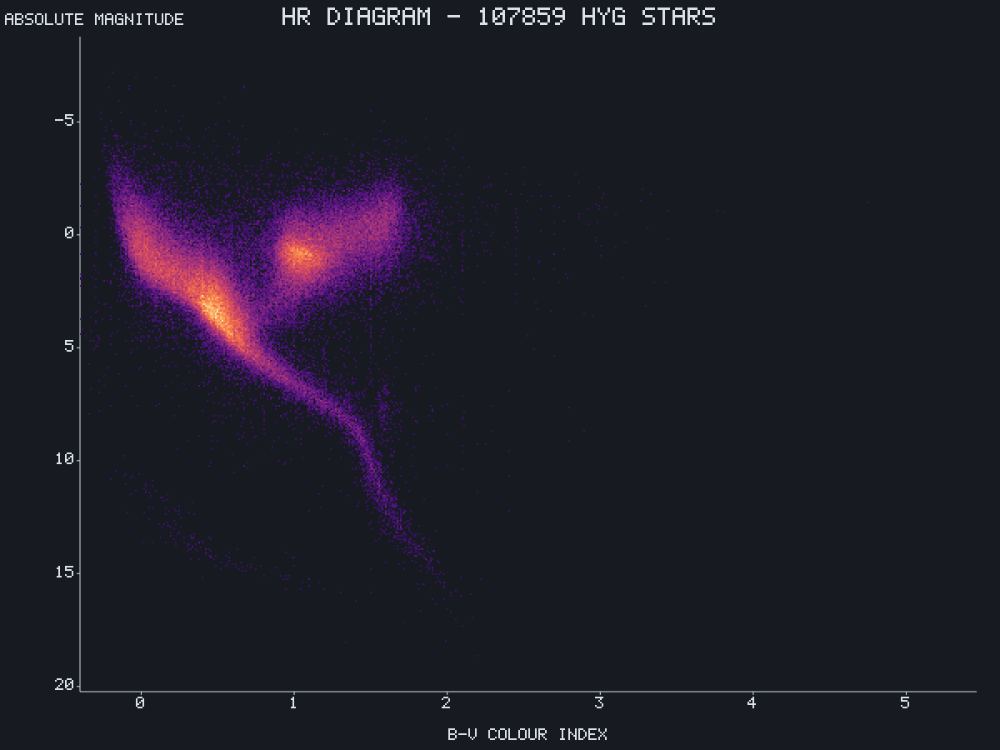

# em-plot: charts, curves and maps

A great deal of this game is reading graphs. Light curves, periodograms, BLS spectra, flicker
power spectra, histograms of orbital elements, heat maps of the emission shell, resource
histories, delta-v budgets. Exotic Matters wants the same things for fit residuals and
trajectory plots.

So: one shared crate, `crates/em-plot`, deliberately small.

## Requirements, from the actual use cases

| need | comes from |
|---|---|
| time series with millions of samples | a light curve integrated over in-game years |
| append in O(1) | a telescope's curve grows while it is being watched |
| log and log-log axes | periodograms, SNR against aperture, anything spanning decades |
| heat maps on a grid | correlation maps, `u-v` coverage, resource distributions |
| heat maps on a sphere | the emission shell, sky surveys |
| histograms | orbital element distributions, population parameters |
| error bars and bands | every measurement, because uncertainty is the point |
| step and box marks | BLS models drawn over the data they fit |
| no per-frame allocation | these are live, not static reports |
| works in WASM | the client is the primary consumer |

## The design decision that keeps it small

**The core emits geometry and text placements. It never rasterizes text and never touches a
GPU.**

Text is where plotting libraries acquire their dependency trees: font loading, shaping,
atlasing, layout. Delegating it costs one trait and removes all of that. The core needs only
a text *measurement* callback — give it a way to ask "how wide is this string at this size"
and it can place labels, size margins and avoid collisions without ever drawing a glyph.

```rust
pub trait TextMetrics {
    fn measure(&self, text: &str, size: f32) -> Vec2;
}

pub struct Primitives<'a> {
    pub polylines: &'a [Polyline],   // data, axes, grid, error bars
    pub quads:     &'a [Quad],       // bars, heat-map cells, shaded bands
    pub labels:    &'a [Label],      // position, anchor, string, size
}
```

The host draws them. A Bevy backend turns them into meshes; an egui backend turns them into
painter calls; a test backend turns them into an SVG string, which makes the whole crate
testable without a window.

Dependencies for the core: `glam`, and nothing else. Same rule as `em-foundations`, for the
same reason.

## Decimation, which is the part that matters

A light curve with 2e6 samples drawn into an 800 px plot has 2500 samples per pixel column.
Drawing all of them is wasteful and, worse, wrong: naive subsampling aliases, and a transit
one sample wide vanishes at some zoom levels and reappears at others.

**Min/max decimation per pixel column** is the correct answer and is not optional. For each
column, emit a vertical segment from the minimum to the maximum of the samples falling in it.
This preserves the visual envelope exactly, which for noisy data with narrow features is
precisely what the eye needs. A transit never disappears, noise looks like noise, and the
work is `O(visible samples)` with a constant of one comparison pair.

Add a mean or median track over the envelope when the data is dense enough that the envelope
alone is a solid block.

For a curve backed by a sorted time index, the samples in view are a contiguous range, so
panning and zooming are range queries rather than rebuilds.

## Scales

```rust
pub enum Scale { Linear, Log10, SymLog { linear_threshold: f64 }, Time }
```

`SymLog` matters more than it looks: deficits and residuals cross zero and span decades, and
a plain log scale cannot show them. `Time` is its own scale because axis ticks want in-game
calendar units and the labels must say which, given that this project has three different
clocks in play.

## Color maps

Perceptually uniform, as small tables. Viridis and magma for sequential data, and a diverging
map centered on zero for residuals. A non-uniform map — the rainbow — invents structure that is
not in the data, which in a game about inferring structure from noisy measurements is an
actual correctness problem, not a matter of taste.

Also: light and dark variants, because both products have both.

## Sphere maps

The emission shell is a heat map on an icosphere, so it gets first-class support rather than
being bolted on. Two projections:

| projection | for |
|---|---|
| equirectangular | reading values, comparing latitudes, debugging the bake |
| orthographic from a direction | what an observer at that direction would see |

Both read the same icosphere buffer used by [04-stellar-photometry.md](04-stellar-photometry.md),
so a debug view of a star's shell is the shell, not a copy of it.

## What it looks like



Density mode over the bundled catalog: 107 859 stars binned to cells and colored by count.
The main sequence, the red giant clump, the subgiant branch joining them, the M dwarf tail and
a faint white dwarf sequence are all where they should be, and the vertical striping near
`B-V` 1.4 is real quantization in HYG's source catalogs rather than a rendering artifact.

```bash
awk -F',' 'NR==1{print "ci,absmag"; next} $10>0 && $10<100000 && $17!="" {print $17","$15}' \
  assets/catalogs/hygdata_v42.csv > hr.csv

cargo run -p em-plot --features cli -- hr.csv hr.png \
  --x ci --y absmag --density --cmap magma --gamma 0.35 \
  --invert-y --dark --width 1200 --height 900
```

It is kept here because it checks more than the plotter: the CSV path, axis inversion, and
phase 4's catalog filtering all have to be right for this shape to appear. The `dist`
sentinel cut is what stops it being a smear.

## Crate placement

| crate | depends on |
|---|---|
| `crates/em-plot` | glam only |
| `crates/em-plot` with `bevy` feature | + bevy, for a mesh backend |
| `crates/em-plot` with `egui` feature | + egui, for a painter backend |

`em-*` because both products use it. The feature layout mirrors `em-sim`'s: the core is
engine-free and the engine integration is additive.

```bash
cargo tree -p em-plot --no-default-features | grep -i bevy   # must be empty
```

## Non-goals

- Not a general charting library. It serves the chart types this repo actually draws.
- No animation framework. Charts update because their data changed.
- No layout engine. One chart occupies one rectangle; arranging rectangles is the host's job.
- No statistics. Fitting, smoothing and periodograms live in `lc-world`, which owns the
  science; `em-plot` draws what it is handed.

## Open

- Whether the egui backend is worth having, given that the game client may not use egui at
  all and Exotic Matters uses it for everything. Likely yes, and cheap.
- Picking and hit-testing: reading a value off a curve needs an inverse transform, which is
  easy, and snapping to the nearest sample, which needs the same index the decimator uses.
- Whether sphere maps belong here or in `em-render`. They need the icosphere, which is
  rendering data; they are a chart, which is this crate. Undecided.
