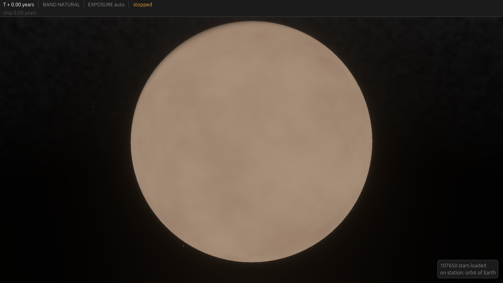
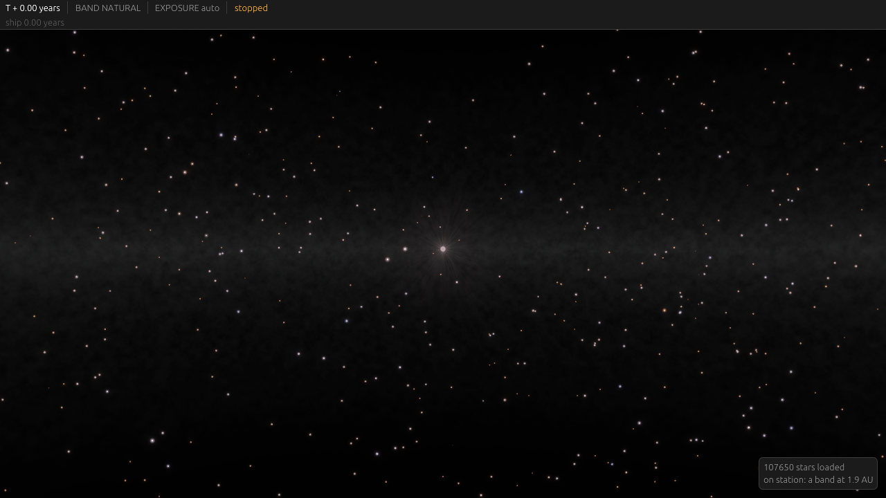
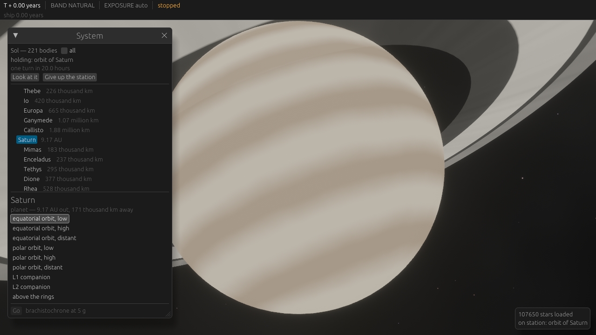
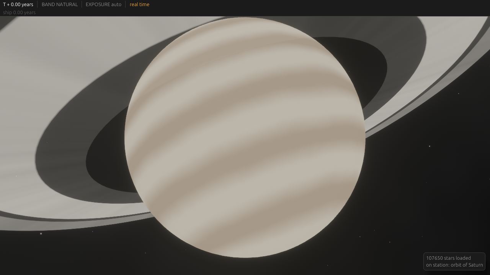
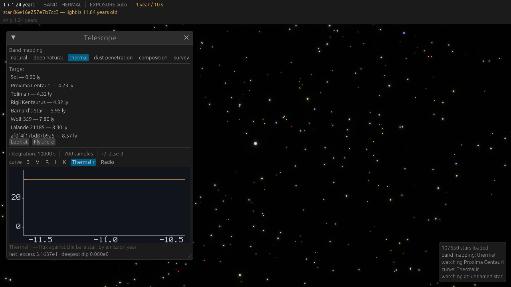

# The client shell

The application around the simulation: states, menus, windows and the rules they answer to.
`bevy_egui` for everything dense with text. The exception is the main menu, which composites
over a rendered background and is Bevy UI — see [The main menu](#the-main-menu).

[18-ui-style.md](18-ui-style.md) is the companion: this page is what the interface *is*, that
one is how to draw a surface without it fighting what is already there.

## States

```
AppState     Boot -> MainMenu -> Loading -> InGame                 desktop
             Boot -> Loading -> InGame, and Unreachable from either  browser
MenuPage     sub of MainMenu:  Root | NewWorld | Load | Settings | About
Overlay      sub of InGame:    None | Escape | Settings | Debug
```

**Nothing is modal.** Since the clock never stops, an overlay that blocks the world behind it
is claiming something untrue. `Overlay` is therefore not a state at all — the escape menu, the
settings screen and the debug window are panels in the same set as the telescope, each toggled
independently. What remains of `AppState` is where the application is, not what is on top of it.

`MainMenu` is the desktop entry point and a thin one. **The browser build has none**, gated by
`app::HAS_MAIN_MENU`: the page that launched it has already signed the player in and named the
shard, so it opens straight into `Loading`, and its escape panel has no Quit, because there is
no menu to return to and no process to end.

Without a menu there is nowhere to fall back to, so a browser build that cannot reach its shard
— refused, lost, or never named one — goes to `Unreachable`. It is terminal: it says what went
wrong and to reload the page. Nothing reconnects yet, which is what makes that honest.

`Settings` appears under both parents and is one screen either way. It is reachable from the
main menu before a world exists and from the escape overlay while one is running, so it may
not assume a world.

`Loading` exists because it has work to do: the catalogue is 120 000 rows and generation is
per star. A frozen window is not a loading screen.

## The game does not pause

**Coordinate time advances regardless of UI state.** Opening the escape overlay, the settings
screen or the debug window does not stop the clock, and neither does losing window focus.

This is an invariant with a test, not a convention, because two things will try to undo it.
Gating the simulation schedule on `in_state(Overlay::None)` is the idiomatic Bevy spelling and
costs one line. And a single-player instinct says a menu should pause. Once a server owns time,
anything that learned to pause is broken, and it will have learned quietly.

Two consequences to design for now:

- **Settings apply live.** There is no "apply on resume", because there is no resume.
- **The overlay says so.** It dims the world and leaves the clock ticking in the corner, which
  teaches the rule better than a tooltip.

## The main menu

Bevy UI, not egui: it sits in front of a starfield and has to composite with it, and there is
no point drawing an opaque egui panel over a sky in order to hide the sky. The widgets come
from `em-ui`, shared with Exotic Matters, so both products' menus are one implementation in
two palettes.

It emits actions like every other surface: a button writes `Requested(Action)` and the
dispatcher does the rest. Nothing in the menu mutates state directly, and the page it draws is
read from `UiState::menu_page` rather than mirrored into a Bevy state, so there is one record
of where the player is.

### The backdrop is generated, not loaded

The sky behind the menu is drawn by the real starfield pass, at rest, but its stars are not the
catalogue's. Loading the catalogue is what `Loading` exists for — a hundred and twenty thousand
rows, and generation per star — and a menu that waits for it is the frozen window that state
was added to avoid.

So the menu generates four thousand main-sequence stars from a fixed seed: isotropic, uniform
in volume out to four hundred light-years, masses from an inverted Salpeter IMF and effective
temperature from the same mass so the colors agree with the sizes. Fixed rather than random
per launch, because a backdrop that differs each time reads as a bug in the sky.

The field turns at one radian a minute, in yaw only. `Look` carries no roll by construction, and
a horizon that rotates is a worse backdrop than one that pans. The heading the drift reaches is
where the ship starts looking; there is no better default.

`--menu --shot <path>` photographs it, because a window nobody is watching proves nothing.

## The staleness readout is the premise

Always on screen, never in a panel a player can close:

| readout | example |
|---|---|
| coordinate time, and the ship's own | `T + 14.62 years` beside `T' + 12.08 years` |
| distance to the selected target, which is the age of its light | `Proxima Centauri — 4.24 ly` |
| stored energy, for a ship with modules | `ENERGY`, a bar, `23.4 / 30.0 ME` |
| what the band mapping is | `NATURAL` |

If a player forgets they are looking at the past, the game has failed at the only thing it is
about. This belongs where a shooter puts the health bar.

## Instruments are not settings

Some controls change *what a player can know*, and those are gameplay, not preferences:

| control | binding | why it is not in Settings |
|---|---|---|
| band mapping preset | `1`-`4` | see [07-rendering.md](07-rendering.md); the composition preset is a diagnostic |
| exposure, stops from auto | `[` / `]` | the tone map has no absolute reference, so exposure is a camera control |
| telescope target and integration | panel | the core loop |
| scale tier | `Tab`, and automatic by distance | the three tiers behave differently enough to be worth showing |

Burying the band presets in a settings menu would be burying the instrument the game is played
with.

## Windows

| window | opened by | contents |
|---|---|---|
| telescope | `T` | target, band, exposure time, survey regime, the light curve, uncertainty |
| system | `Y` | bodies and populations of the selected system, at the retarded time |
| sky | always | the all-sky map; selection happens here |
| notifications | automatic | target out of range, observation returned nothing, instrument saturated |
| communications | `C` | one conversation at a time, chosen from a list of everyone heard from and everyone in sight |
| debug | `F3` | below |
| scenarios | — | scenes to stage. Development only, and every button does nothing without a shard started for it |
| refit | `R` | module counts and hull slots as sliders, what applying them would cost and take, and the refit under way. See [19-ship-fitting.md](19-ship-fitting.md) |
| dev actions | `F5` | energy for the ship. Development only; a shard refuses it |

The map is not in that table. It is the **other mode of the main view** — see below — and `M`
switches to it rather than opening anything.

Panels are windows rather than menu pages because the clock never stops: a player has to be
able to watch a curve and fly at the same time.

### The communications window

**A list of craft on the left, one log on the right.** Everything in it is minutes to years old
and there is no typing indicator to be had, so the interface that suits it is a log with a
selector rather than a messaging app pretending the far end is present.

The list is ordered **most recently heard from first**, which is how a player finds the
conversation they are in the middle of. The cost is worth naming: a list that reorders itself can
be misclicked, and it reorders exactly when a message lands.

Two channels are pinned above the craft, and **which of the three a message lands in is decided
by who it was addressed to, never by who sent it**:

| addressed to | channel |
|---|---|
| nobody | **Public** — broadcasts, sent and heard |
| this ship | that craft's conversation |
| another craft | **Overheard** |

A message addressed to one craft is not public however openly it was sent. Anyone in range can
read it, but it was still somebody's mail, and being in earshot of it is what Overheard is.
Filing it as a conversation with its sender would be worse still: a log of "what Ada said to me"
containing what Ada said to Bry.

**Encrypted traffic is in Overheard too**, shown as fixed-length noise. The fact of a signal is
real whether or not it can be read, and a run of traffic between two craft says something even
when none of it says anything. Fixed length is the point rather than a detail: noise that tracked
the plaintext would leak the one thing about an encrypted message that is still readable — a long
one is a long one — and a player could read a conversation's shape without reading a word of it.
It is derived from when the message was heard, so it is stable across frames and reconnections,
and there is nothing in it to decode.

Nothing loose is ever answered automatically. Acknowledging a broadcast would answer everybody at
once, and acknowledging somebody else's mail would tell its sender that a craft they were not
talking to is listening.

In the public log a sender's **name is the link** to their conversation, rather than a reply
button beside it. A log is prose and prose links are words; it underlines while the cursor is on
it.

Public can transmit, and what it offers is narrower than a conversation's. There is no craft to
aim at, so "beam" is not shown at all rather than shown and disabled — an option that contradicts
the channel is worse than a missing one. Omni and a beam at the selected star remain, and so does
**send key**, which is the point of putting one out in the open: anyone in range can answer in
private from then on.

Every entry in the list is the width of the column rather than the width of its own name. A list
whose click targets are each a different size reads as a pile of labels.

Both halves scroll inside a **fixed body**, so the window is the same size with one message in it
and with two hundred. That matters more here than in most panels, because what fills it arrives
without being asked for.

A message this ship sent shows `ack` once the far end names it, and an **amber warning triangle**
until then — which is also the button that sends it again. See
[05-observation.md](05-observation.md#acknowledgement-is-the-only-delivery-report) for why that
is the only delivery report there is, and why a resend is a second pulse of light rather than a
retry. The triangle is *painted* rather than typed: the obvious glyph is U+26A0 and the default
font draws a tofu box for it, which is the trap that has already cost this interface a close
button and a pair of arrows.

Hovering a message gives two lines and no more, both about the *reception* rather than the
message: when this ship learnt of it, and how loud it was in dB. The strength is referred to one
strength unit — the same arbitrary scale the noise floor is quoted in — so it means something
compared to another signal, which is how anybody reads a dB figure anyway. A message read back
from a transcript has no reading at all, because how loudly a signal landed is a fact about one
receiver and what is written down is what was said.

A message with **nothing in it** is an acknowledgement and nothing else, and it is not shown at
either end — there is nothing to read, and a log of empty lines is one nobody can read either.
What it acknowledges is kept on the conversation rather than on the line, because the message
that carries an acknowledgement is usually the one about to be dropped for being empty; losing
the evidence along with the clutter would make every message look unanswered for ever.

An acknowledgement is also never answered. It is the end of an exchange, not the middle of one.

**auto-ack** answers that craft automatically, in the mode it was spoken to in; see
[05-observation.md](05-observation.md#answering-automatically-and-the-bearing-a-dish-answers-on)
for the bearing a beam is answered on and for why an acknowledgement is never itself
acknowledged. It is per craft and never on the public channel: a ship that answered every
broadcast it heard would announce its position to everything in range.

A resend keeps the original's encryption and takes the panel's **current aim**. That asymmetry is
the point of the button: the usual reason a message went unacknowledged is a beam aimed where a
craft turned out not to be, and the useful retry is the same words pointed somewhere else. A
message sent encrypted must never become one sent in the open by a second click.

A transmission arriving is also a **green line in the notifications box**, and the whole row is
clickable — lit while the cursor is on it, and not a button. A button's frame makes a list of
notices read as a row of controls, and a click target the width of its own text is one a cursor
slides off; these arrive unasked for, so hitting one should not need aim. The box has a width of
its own for the same reason: left to size itself, a row asking for "all of it" would be asking
the box how wide to be while the box asked the row.

**Overheard traffic is announced, not quoted.** Its notice is the `from -> to` line and nothing
else. That two other craft are talking is the news; what they said to each other is theirs, and
repeating it into this ship's own events box reads as if it had been said here. It is the one kind of event with somewhere to go: everything else in that box is the
interface reporting on itself. Somebody else's sealed message is a line too, saying that it was
heard and cannot be read — a signal falling on the antenna is a fact about the world, and hiding
it would let a player learn that nothing was sent by not being told.

Sealing is offered only for a craft whose key this ship holds, and the checkbox says why when it
is not. The client's copy of that rule is an interface courtesy; the server refuses the order
either way.

**The communications window is why `read_keys` consults egui.** Every binding in the table below is a
bare letter, and nothing in the game had a text field until there was something to say into one
— so typing a message used to open the telescope, cut the drive and fly somewhere, one keystroke
at a time. Held arrow keys are gated the same way: an arrow in a text field moves the cursor, and
turning the ship as well would make going back to fix a typo swing the whole view.

## The debug window

Development only. Its God view entry is compiled out of shipped builds and gated server-side
besides, per [07-rendering.md](07-rendering.md).

| entry | why |
|---|---|
| God view toggle | `#[cfg(feature = "godview")]` |
| causality overlay | lines from in-flight events to the observers they are traveling toward. The one bug class — an observer learning early or late — that no other view shows |
| **time-rate multiplier** | a transit at 8766x takes real hours. Dev only: the server owns the rate, and a client that can change it is a client that can cheat |
| scale tier and camera distance | the three-tier reduction is invisible until it is wrong |
| retarded-solver statistics | roots found, Newton iterations, bracket expansions |
| write snapshot | the phase 6 headless renderer, from inside the running app |
| frame and entity counts | ordinary |

## Settings

| group | contents |
|---|---|
| display | resolution, vsync, tone-map window width, default band preset |
| controls | sensitivity, invert, rebinding |
| accessibility | UI scale, redundant encodings — see below |
| audio | later |

Settings persist to a small file in the user config directory. Settings that do not survive a
restart are a development annoyance that becomes a shipping bug.

## Accessibility is load-bearing here

The band mapping is an **information channel**, not decoration. The composition preset works by
showing dust as orange and a solid occulter as neutral, which is the diagnostic
[05-observation.md](05-observation.md) and phase 3 built the observation model around. A player
who cannot separate those two colors cannot play that part of the game.

**Every color-carried readout gets a numeric twin.** The deficit ratio between two bands is a
number as well as a hue; a star's temperature is a number as well as a tint. This is cheap now
and structural later.

## Every action is a message

**No UI system acts directly.** A key press, a button, a menu item and a test all produce the
same `Action` value, and one dispatcher applies it. Nothing else changes `UiState` or reaches
into the session.

```
Action        an enum: ToggleP anel, SetBandPreset, ExposureUp, SelectTarget, Quit, ...
apply()       Action + UiState + Session -> Vec<Effect>
Effect        the few things needing the engine: Quit, WriteSnapshot, Notify
input.rs      the only place that knows about KeyCode; maps input to Action
```

Rebinding is not built yet and this is what makes it a table rather than a rewrite. It also
buys the things that usually arrive too late to be cheap: driving the UI from a test with no
window, replaying a session from a list of actions, macros, and a remote control for
debugging. The cost is one enum and one match.

`Action` is engine-free. Only `input.rs` mentions `KeyCode`, so the core stays testable and a
second front end — a touch build, a script — needs no new plumbing.

## Structure

UI state is data and the systems are thin, for the reason
[06-crate-layout.md](06-crate-layout.md) records: a renderer made of ECS systems cannot be
reused, and neither can a UI made of them be tested.

```
UiState        open panels, selected target, exposure offset, preset index
action::apply  the only thing that mutates UiState
hud::lines()   what the readout says, as plain strings
panels::*      egui systems that draw UiState and emit Actions
dev.rs         the development entry: the flags, and the pins that hold them
```

`dev.rs` is apart from `app.rs` because it is the part that grows with every flag, and because
what it does is one thing: put the world into a stated pose and photograph it. None of it is
reachable from the interface.

Anything that decides *what* to show is a function over `Session` and `UiState`, testable with
no window — which is the only way any of it gets verified, since a window cannot be inspected
from a test.

`lc-client` does not share the Exotic Matters `src/gui/style.rs`. Phase 5 established that the
GUI does not extract, and the two products want different looks.

## Running it

```bash
cargo run -p lc-client --bin lightcone -- assets/catalogs/hygdata_v42.csv
```

Omit the path for the three authored sample stars.

| key | does |
|---|---|
| `Esc` | close the top panel, then the menu |
| `T` `Y` `F` `F3` `F4` | telescope, system, flight, debug, starfield tuning |
| `M` | switch the main view between the world and the map |
| arrows, right-drag | look |
| | the cursor is pinned while the right button is held, and released on let go |
| `L` | look at the selection |
| `G` `X` | cross to the selection, cut the engine |
| `N` | target the nearest system |
| `1`–`6` | band presets |
| `[` `]` `\` | exposure down, up, auto |
| `,` `.` | clock rate down, up along the ladder |

The clock rate is a development control and the server owns it in a real session. It is
labeled by period rather than by factor — `1 year / 10 s`, not `360x` — because a factor is
not something anyone can feel, and the head-up display flags any rate off the design one so a
fast clock never looks normal.

**Owning it means stating it.** The rate is in the welcome and is restated with every clock,
and a joined client runs at whatever it is told. It used to hold a constant of its own that
happened to agree, which is a different thing: a shard at any other rate would have been joined
by a client confidently running at this one. What made the difference worth paying for is that
a scene can now choose its clock — a low orbit of Jupiter comes round every four hours, which
at the design rate is a revolution every second and a half, and a three-month chase at a year
a minute is fifteen seconds of watching.

One consequence that is not obvious and cost a debugging session to see coming. The slack the
client's clock is corrected against has to scale with the rate. It was a fixed coordinate hour,
which is comfortably more than a statement's own age at the design rate and is *less than one
tick* at sixty — so every statement would look like a runaway and the client would snap back
seven hours twenty times a second having never drifted at all.

### Development flags

| flag | does |
|---|---|
| `--observe` | skip the menu and start in the sky |
| `--shot <path>` | photograph the sky through the real pipeline, then quit |
| `--fly` | cross to the nearest interstellar star |
| `--band <n>` | band preset |
| `--rate <n>` | clock multiplier against one year per hour: `360` is a year per ten seconds. Without it a session runs at the world's own rate |
| `--watch` | target the nearest system and open the telescope |
| `--swarm` | target the nearest star carrying a swarm |
| `--curve <n>` | which band the light curve measures |
| `--map <bearing:elevation:au>` | pin the map's camera. A light-year is 63 241 astronomical units |
| `--map-plane <ecliptic\|galactic>` | which plane the map lays its rings in |
| `--map-focus <ship\|primary\|local\|star\|free>` | what the map's camera locks onto; `local` is the primary in the frame that turns with the ship. A pin, like `--map`, which holds the ship on its own |
| `--tune` | open the starfield tuning panel |
| `--frames <n>` | frames before the shutter |
| `--at <body>` | stand off a named body of the local system |
| `--station <course>` | put the ship straight on a station: `orbit:Earth`, `polar:Mars:high`, `rings:Saturn`, `l2:Earth`, `belt:0`, `leave` |
| `--panel <name>` | open a panel by name. `--panel map` holds the main view in the map's mode instead, since the map is not a panel |
| `--burst <n>` | photograph `n` consecutive frames, numbered. For flicker: two runs stopped at frame `n` and frame `n+1` have accumulated different wall time and are not consecutive at all |
| `--demo <name>` | stage a scene, and bring a shard to run it in |
| `--demo-cam <yaw:pitch:booms>` | pin the camera for the run |
| `--say <words>` | say this to the first contact that appears, and open the conversation. The only way to photograph a transcript |

These emit [`Action`]s rather than opening a second path into the client, so they can only do
what the interface can do. `--shot` exists because WGSL cannot be asserted from a test and a
window nobody is watching proves nothing; both images in
[07-rendering.md](07-rendering.md) were taken with it. `--rate` without `--shot` is the screen
recording setup.

`--demo` is the exception that proves the rule, and it is worth saying why. It cannot be an
action, because what it asks for is a craft placed somewhere by fiat and that is the one thing
no client may ask for — every order on the wire is a request a ship makes about itself. So it
is a message of its own, honored only by a shard started for it, and the scene it names is
staged on the side that decides what happened. See `lc_world::scenario` for the scenes and
`lc_server::director` for the runner.

What the camera does during one is the ordinary free orbit: a scene is something to look
around inside, not something to be shown. It turns once to face everything the camera is *not*
on — by the middle of them by bearing, so four hulls spread about an axis are framed down the
axis rather than at whichever is nearest — and is the player's from then on. `--demo-cam` pins
it instead, for a frame two runs are meant to agree about.

Which craft the camera is behind is a `CameraPerspective`, and it has one variant. An enum
anyway, because what the camera does is going to grow — a chase view along the velocity, a fixed
point a scene is composed from, a free fly-around — and each of those is a different answer to
"where is the eye" rather than a flag on top of this one.

**A scene says where to stand, and how fast to run.** Both are fields on it rather than things
to pass in: it knows what it is about, and a rendezvous is two different events seen from its
two ends. `approach` and `closing` are the same two ships doing the same maneuvere, watched from
one end and then the other.

**The eye moves and the observer does not**, which is the boundary to know about. Everything the
client works out about light — retarded times, aberration, what a contact looked like when it
left — is still solved from the player's own ship, because that is the craft the session has a
worldline for. Across a scene, where the cast is kilometers apart, the difference is
microseconds and there is nothing to see. Across the Oort cloud it would be hours. Watching from
a craft you are not on is a development view until the observer can move too, which is why the
only way to reach it is a flag and a panel that does nothing in a shipped build.

## Getting about inside a system





Five things a ship can be told to do — cross to a point, take up an orbit, sit at a libration
point, drop into a belt or a ring, leave the system — are two mechanisms, not
five. A **waypoint** says where to be at any coordinate time; the same crossing that goes
between stars takes the ship there. Arriving is not the end of it: the ship then *holds* that
waypoint, which is what makes an orbit an orbit rather than a point it drifts away from.

A hold is read, never integrated. The waypoint is a closed form in the coordinate time, so a
paused clock, a clock at a year a second and a dropped frame all leave the ship in the same
place, and nothing accumulates.

None of this is orbital mechanics, and the ship never transfers. It is a torch under five
gravities: it points at where the destination will be and burns. What the simulated mechanics
are for is the *destinations* — a real Hill radius for the libration points, a real ring plane
out of the body's own pole, a belt at the radius that actually carries its light.

Three things the shapes buy:

- **An altitude is in radii above the surface**, not kilometers, so `low` means the same thing
  at Deimos and at Jupiter — bodies four orders apart in size.
- **A polar orbit is one whose normal is perpendicular to the body's pole**, and an equatorial
  one has the pole for its normal. One line either way, and the same `Orbit` draws a ring
  system by taking the ring plane instead.
- **A crossing meets an orbit at its nearest point.** An orbit is a circle and a ship arriving
  at one has a near side; entering at whatever point the clock happened to have it can mean a
  crossing straight through the body. The phase is therefore chosen when the course is planned
  rather than when it is resolved — which point is nearest is a question about where the ship
  is coming *from*, and that is not known until then. It is part of the same fixed point as the
  arrival time, since the nearest point moves while the ship is flying.
- **Leaving goes straight out from the star**, along the radius the ship is already on. Not
  along the star's own axis: that is one fixed direction whatever the ship is doing, so every
  departure rose out of the ecliptic instead of taking the shortest way out. A ship at the star
  itself has no radius to follow and falls back to the axis.
- **A crossing leads its target.** Flip-and-burn time goes as the square root of distance, so
  aiming at where the body will be converges in three rounds. It matters: Earth runs a
  fiftieth of an astronomical unit during a crossing from Mars, which is four thousand
  planetary radii of miss.

### The System window



Two sections, and nothing flies between them.

The **inventory** runs outward from the star with each body's satellites behind it. The
ordering is hierarchical rather than by distance from the star, because a moon's heliocentric
distance *is* its planet's: ordering on that would shuffle Jupiter's moons into whatever
arrangement they happened to be in this instant. Each body is keyed by the chain of orbital
radii from the primary down to itself, so planets come out by their own distance and a planet's
moons come out behind them by theirs. Bands land among the planets by radius, which puts the
asteroid belt between Mars and Jupiter where it belongs.

The whole thing is built **once, when the system loads**, from the positions at one epoch. A
list that reorders itself while a player is reading it is worse than one that is a few per cent
stale. Straight out of the file every body sits at the origin and has no parent — the derived
columns are rebuilt by the first evaluation — so the first version of this came out in file
order with every radius zero.

Forty-one of the solar system's bodies are the ones it is usually described by and a hundred
and eighty-nine are not, so the list shows the former until you ask for `all`.

Picking one opens its **courses**: equatorial and polar orbits at three altitudes, the two
collinear libration points if it has a parent, above the rings if it has rings, and leaving the
system if it is the star. What is offered is what exists — a moon of nothing has no libration
points, and rather than gray the option out it is not there. A test flies every option every
major body offers and fails if any of them fails to resolve, so the list cannot lie.

Arming a course and flying it are separate: **Go** is what commits, and it uses the ship's own
acceleration. The crossing is a brachistochrone to the injection point and then the ship holds
station on it.

**A body is called what it is called.** Its own name first, then whatever catalogue designation
it carries, and only then a made-up one — the primary's name and a Roman numeral, which is how
an unnamed body has been designated since Galileo. When players can name worlds, that name goes
in the first slot and nothing else changes.

### Cutting the engine does not stop the ship

**Decided: canceling keeps the velocity, and inside a system that velocity is an orbit.**

The `×` beside the flight readout cuts the drive, with no confirmation — the action is not
destructive and a dialogue between a player and their own throttle is worse than the mistake it
prevents. What it does is stop the *engine*. The ship keeps what it had, and what it had is now
a conic about whichever body's sphere of influence it is in.

None of that arithmetic is written here. `em-foundations` turns a state vector into elements
and back and solves both anomalies; `em-sim` finds the sphere of influence. The client is the
join, plus the patched-conic rule: one conic is exact only inside one sphere of influence, so
when the ship crosses into another body's the arc is re-solved about it. Done when the crossing
is reached rather than predicted ahead, which is the cheap half of patched conics and the half
that cannot be wrong.

A torch ship makes this less forgiving than it sounds. Five gravities passes solar escape
velocity in minutes, so cutting out of a brachistochrone halfway to Earth leaves an eccentricity
of a hundred and sixty — a near-straight line out of the system. Canceling off a station gives
back the orbit the station was holding, which is the case the readout is really for.

Two things it cannot do:

- **A radial state has no elements.** A ship at rest relative to what holds it is falling
  straight down the line to it: the angular momentum is zero and the orbital plane is
  undefined, so no conic can be written. It refuses, and a refusal leaves the ship drifting at
  the velocity it has, which is none. Standing still is the wrong physics and the right
  behavior; falling into the star over the following two months is neither.
- **Parabolic is nudged off.** Both anomaly solvers divide by the distance from `e = 1`, and a
  state landing exactly there is an accident of arithmetic rather than a trajectory anyone
  chose.

There are now three ways for the ship to be moving and they are exclusive: under thrust the
crossing says where it is, on station the waypoint does, otherwise it is ballistic — a conic
inside a system and a straight line between them. All three are **read** at the new time rather
than integrated from the old one, so a paused clock, a clock at a year a second and a dropped
frame all leave the ship in the same place. Holding a station used to be a rendering system
running a frame behind the model; now that the session owns the local system it is one branch
of three in the same place.

### The clock has to slow down for an orbit

The design rate is already 8766 times real time, which puts a whole low orbit inside a second.
The rate ladder therefore reaches below the design rate as well as above it — real time, a
minute a second, an hour a second — and the navigation panel prints the orbital period next to
the station and says so when the clock is outrunning it.

### A ring has no thickness, so there is nowhere inside it to stand



The ring station started out mid-annulus, in the ring plane — which is what "enter a ring"
sounds like, and it was unusable. A ring is drawn as a surface with no thickness. With the ship
inside the annulus that surface passes through the camera: the nearest geometry is at no
distance at all, and the camera's own offset from the plane is smaller than f32 render
positions can hold — about six meters at Saturn. The rings swung between a hairline and a
bright wedge from one frame to the next, and nine and a half per cent of the screen changed
every frame at real time.

A ring station now stands a quarter outside the outer edge, in a plane tipped a quarter turn
out of theirs, so the rings read as rings and the orbit still closes them to a line twice a
turn. Outside the annulus the same six meters of jitter is six meters in a hundred and forty
thousand kilometers, and the flicker falls by a factor of four thousand — from 87,704 changed
pixels a frame to twenty, which is what a star field crossing pixel boundaries costs anyway.

Edge-on from *outside* still shimmers on the one-pixel line the rings collapse to. That is
ordinary geometric aliasing of a thin bright edge, it is bounded, and it is 141 pixels.

### The near plane is fifteen meters

A low orbit is a fraction of a planetary radius above the surface, and the render unit is an
astronomical unit. The camera's near plane stood at a million and a half meters, which is
further from Earth than a low orbit is: the sphere was clipped away entirely while its own
billboard still drew, so a planet filling the sky rendered as a dot. Reversed float depth costs
nothing for the range — its precision is relative — but the constant the star field writes is
tied to it, because that has to stay under the smallest depth a real body produces.

## The light curve



Drawn by em-plot into a `tiny_skia` pixmap and handed to egui as a texture, rasterised only when
what it shows changes. Not with egui's own painter: em-plot already has the min/max column
decimation that a curve of thousands of samples in a panel of hundreds of pixels needs, and a
second plotting implementation is the thing to avoid.

Two rules the picture follows:

- **It plots relative flux, not the deficit.** With re-emission a measurement lands *above* the
  unobscured star, and a plot of how much is missing cannot show that at all.
- **The baseline is always in frame.** A curve auto-scaled to its own noise looks like a
  detection when the star is doing nothing.

The caption is egui text rather than pixels. Baked into the bitmap it collided with the axis
labels, and egui draws text better than a twelve-pixel bitmap font.

The band the curve measures is chosen separately from the display mapping. They are different
questions — one is what the instrument integrates, the other is how three numbers become a
color — and the screenshot above is the reason they have to be separate: the display is in the
thermal preset and the curve is in the thermal *band*, and only the second one is what makes the
excess a number.

A band the sensor cannot reach is shown as unavailable rather than omitted, so the instrument's
limits are visible instead of merely enforced.

## Tuning the starfield

`F4` opens every drawing parameter of both starfield passes as a slider, applied as it is
dragged. The panel is generated from a table beside the parameters themselves, so a knob cannot
be added without a slider appearing for it, and a test checks that the table covers the struct
and that every shipped value falls inside the range its slider offers.

It follows the same rule as everything else: the panel reads state and emits actions, and a
drag is one `SetPointStyle` per frame carrying the whole style. Nothing in the panel mutates,
so the same tuning can be driven from a test or a script.

Uniforms are written only when a value actually differs from the last upload. Reaching for
`get_mut` on a Bevy asset marks it changed whether or not anything did, and re-uploads the
buffer; at rest the starfield now uploads nothing at all.

Nothing here is saved. These are numbers to find, not settings to keep — once one is right it
belongs in `DISTANT` or `LOCAL` where it can be read and reasoned about.

## Not in this phase

WASM, networking, and God view in any shipped build. The last is compiled out from the start
rather than added and later removed.

## The map

**A mode of play, not an accessory.** The main view under the readout is either the world seen
through the ship's camera or the map, and `M` switches between them. Windows float over either
one, so a curve or a conversation can be read with the map behind it.

**Whichever mode is not in force is the square in the bottom left**, and a click on the square
swaps them. It is in the same place in both, which is what makes the click one control rather
than two: the map in the corner while flying, the world in the corner while reading the map.
The world's own camera takes that square as its viewport, so the corner is the live view and
not a picture of one.

**A thumbnail is not a viewfinder.** Both ends of the boom are angles, so the corner square is
the tighter frame — and clamping the framing against it would pull the player's own view in on
the way to the map and not give it back on the way out. So the boom is held to the view the
player is being shown, and left alone while the world is a thumbnail. For the same reason
nothing on the sky is picked or marked from the map's mode: every mark is measured against the
whole window.

The map's own controls — the reference plane, the source, and what the camera is centered on —
sit in **one strip directly under the readout**, shown only in that mode. Everything on it says
what the map is a map *of*, which is why it is a strip to glance at rather than a panel to work
down.

**Both, and one camera.** The question this section used to pose — a window or the world seen
from a ship — is answered by having the sky be the view through the camera and the map be a
second camera on its own render layer, drawing into an image that egui shows. So it is real
geometry with real depth rather than a projection painted by egui, which is what lets it reuse
the wireframe spheres Exotic Matters draws bodies with. The flat map was the cheaper first
version and was never built, because the expensive one turned out to be a fortnight rather than
a quarter.

It draws a **snapshot**: a flat list of things and where they are, with a label saying how it
was arrived at. One observer's instruments, several folded together, and a coordinate-time
reading with no light delay are three providers and one type, so switching perspective is
choosing a function rather than writing a second renderer. That is the whole reason the seam is
in `em-map` and not in the ECS.

**The rings and the spokes are centered on the ship, always.** Not on whatever the camera is
looking at: a decade ring answers "how far is that from *me*", and the whole game is the ship's
perspective. Center the camera on a star and the scale stays where you are, which is what makes
the offset between the two readable instead of hiding it.

### The scale is drawn, because there is no fixed one

Fifteen orders of magnitude of zoom means the map has no scale of its own, so a rule is drawn
in the bottom right of whichever surface is up: a bar of a round length, labeled in a unit a
reader holds — `5 Gm`, `2 AU`, `1 ly`. Where the label is a small whole number of its own unit
the bar is ticked into that many parts, so five ticks on a `5 Gm` bar are a gigametre each and
the reader gets a second scale for nothing.

Astronomical units and light-years sit among the metric prefixes because this is a map of space:
between a gigametre and an astronomical unit there is nothing anyone measures in, and `150 Gm`
is a worse answer than `1 AU` to the same question.

The rule is lifted clear of anything floating across the bottom of the surface — the events box
takes that same corner with the same inset, and a scale rule under it is not one.

**The camera is perspective, so there is no one scale even within a frame.** The rule asks the
reference plane how far a pixel reaches at the rule's own height down the viewport, which is
where the bar is drawn — taking it from the middle of the view would be wrong by the depth
between the two. Edge-on, where the ray meets no plane, it falls back to the stand-off.

**The wheel zooms toward what the cursor is over, when the camera is free.** The pointer names
a ray, the ray meets the reference plane, and that place is held still while the camera comes in
— so a body is reached by putting the pointer on it and scrolling. The eye scales about the
anchor, which is what keeps it on the same pixel rather than merely nearer. Edge-on, where the
ray runs along the plane and meets nothing, it falls back to an ordinary zoom.

**Locked on the ship or on a body, it zooms toward that instead.** A held center is a statement
about what the map is *of*, and the wheel aiming somewhere else would quietly undo the thing
that was asked for. So the pointer only decides in the mode where the center is nobody's in
particular.

Moving the focus that way is a pan by another name, so it gives up following — but only when the
focus actually moves. Scaling about the center through itself changes nothing, so the wheel over
a locked center does not cost the lock.

What the camera looks at is a separate thing with four states. **Free** is wherever a pan left
it; **the ship**, **the primary** and **a body** lock the center and hold it every frame until
the next pan, which drops back to free. A left-drag is that pan.

**The primary is a mode and not the body it resolves to today.** It is whatever holds the ship
— a moon's planet, a planet's star — and it follows the ship across a sphere of influence into
the next, where centering on Earth by name stays on Earth after the ship has gone. It is the
same body the readout names while coasting, because both ask the system the same question.

It is centered in one of **two frames**, which is the pair beside it. **Fixed** measures the
camera against the reference plane's own axes and the ship goes round; **local** holds the
camera against the line from the primary's center to the ship's, so the ship keeps its place on
screen and the system turns behind it. That is the view that makes an orbit legible: in the
fixed frame a low orbit is a ship going round a disc several times a second, and in the local
one it is a stationary ship with a planet rotating under it.

The turn is written into the camera's own azimuth, as the change in that line's bearing — not
held as a second copy of the camera. So a drag, a cursor ray and a label all go on being
measured in the one number, and leaving the frame leaves the camera exactly where the turning
left it rather than snapping back. The
button is grayed where nothing holds the ship, which is between the stars; it is not hidden,
because a control that vanishes shuffles the two either side of it out from under the cursor.

The reference plane is the **local ecliptic or the disc of the galaxy**, and the toggle tilts
the whole view because the camera's own angles are measured in the plane's basis. Concentric
rings mark order-of-magnitude distances; anything off the plane hangs from a dashed drop-line.
The reach is a fixed sphere of twenty-five light-years — a reach that moved with the zoom would
change what exists as well as what is framed.

### A body too small to be a sphere is a symbol

A wireframe sphere drawn small is a dozen sub-pixel tubes laid over each other: the most
expensive thing on the layer to draw and the least legible, and at a system's scale most of
what is on the map is that size. Below the symbol's own size it is a circle facing the eye
instead — a sixteenth of the sphere's geometry, and a shape rather than a smudge.

**The symbol is a share of the view, not a count of pixels.** One texture is drawn into a
190-point corner and into a whole screen, so a fixed size right for one is wrong for the other:
twenty pixels suited the full view and left the corner a pile of overlapping rings with no grid
visible behind them. Two percent of the viewport's height, floored at twice a
line's own width — and at that floor a ring has no inside left and is simply a dot, which is
the honest answer for a surface with no room for more.

**One number is both the threshold and the size the symbol is drawn at**, which is the point of
having one: a body shrinks until it reaches it and then holds, so nothing jumps at the
crossover. It also means a small surface resolves fewer things into spheres, which is correct
for the same reason.

**And a mark is sized by what it weighs — two per decade, so ten times the mass is twice the
radius.** Full size at the mass floor and above, so anything worth a name is drawn whole, and
shrinking below it: a rock still shows, it just shows as a rock. Eight orders of magnitude of
mass cannot be eight orders of pixels, and a logarithm is the only honest way to hold a range
like that in one picture. It is measured against the heaviest thing in the whole snapshot
rather than the heaviest on screen, because a name may come and go as the view moves and a size
may not — bodies that resized every time the star left the frame would pulse.

Two floors hold the bottom of it: a quarter of full size in `em_map::weight`, and twice a
line's width in pixels, which is usually the one that binds. In the corner square, where every
mark is already at the pixel floor, there is no room to vary at all.

**The crossover is the surface's size and not the mark's, which is the one place the no-jump
rule gives way.** A body heavy enough to be drawn whole still holds its size across it; a
lighter one steps *down* to the mark its mass earned. The alternative was letting a rock stay a
sphere until it was three pixels across, and a three-pixel wireframe sphere is the smudge all
of this exists to be rid of.

**A ship is a filled dot, at every zoom there is.** It has a hull size and the map is not where
anyone reads it off; a contact that grew a model on approach would be the one thing here
drawing a shape nobody sent. It keeps its amber, which is the one channel the map has that a
list does not, and it is the one solid thing on a layer of wireframe — so shape says it too,
and color is not carrying it alone.

It is a handle swap and not a respawn. Zooming in on a body crosses the threshold without
changing the set of things drawn, the same way a body drifting off the plane gains a dash.

### The plane is drawn, never filled

Rings and radial spokes, all of them tubes with a real radius. Nothing in the map is a surface,
which is most of what keeps `AGENTS.md`'s warning about a camera on an infinitely thin sheet
from applying at all — and the map's whole point is the edge-on view, where what is above the
plane and what is below it are finally distinguishable.

Two numbers had to be found by looking, and both are about the same thing: a line is a tube, so
it has a width the geometry does not know about.

- **The camera is never exactly in the plane.** The floor is three degrees, not the tenth of a
  degree it started at, because a tube drawn 1.6 pixels wide has an angular radius of about
  three milliradians — and a camera closer to the plane than that is *inside* the nearest ring.
  The inside of a tube is a solid wall, so the first edge-on photograph was a rectangle of flat
  green with nothing in it.
- **A spoke's thickness is set by its near end.** Every point of a ring is the same distance
  from the center, so one tube radius serves all of it. A spoke runs from near the eye out to
  its rim, and a constant width that is a pixel at the far end is eighty at the near one.
  Scaled to the outermost decade, twelve spokes were twelve solid wedges across the view.

### The corner square, and one set of gestures

The map is one texture on whichever surface it has — the whole view, or the corner square while
the world is being flown. Transforms are camera-relative, so an entity belongs to exactly one
camera and two independently aimed views would need two sets of them. There has never been a
second framing to want.

Both surfaces take the same gestures — **right-drag turns, left-drag pans, the wheel zooms** —
through one function, because two views of one thing that answer a drag differently is worse
than either answer. A click is the extra one, and it swaps the modes.

**The right button turns whichever view is under it.** It is the sky's look button, and the map
is the other mode of the same screen, so one button meaning opposite things on the two of them
is worse than either meaning. Read the other way round, that is also why a right-drag on the
corner square showing the **world** turns the ship's view, exactly as the same drag on the sky
would and by the same radians per pixel: the square answers for what it is showing. Panning is
what the button that was left over does, and over the world it does nothing — there the left
button belongs to picking.

The keyboard is the exception, and deliberately: the arrow keys turn the view only while the
world is the screen. A pointer is on a surface and can be answered by it; a key is not.

**Nothing paints in the square while the map is the view.** The world's camera is drawing into
exactly those pixels, so the image is painted as the pieces around the square and a name that
would land on it is dropped: a name alone over the world reads as a name for the world.

**The ship's own view controls are held to the world's mode.** In the map's mode a drag over the
map would otherwise turn the ship behind it, and two modes would be fighting over one pointer.
The corner square is where the ship's view can still be turned, because that is where it is.
In the world's mode the corner costs what every panel costs: egui takes the pointer over it, so
hovering the square stops the boom zooming and a right-press begun there turns the map rather
than the view. The square is the only surface that is never closed, and it is 190 points.

### Belts, rings and clouds are drawn as themselves

A population is an outline — two edge circles and four cross-sections — in **its own** plane
rather than the reference one, and it traces the edge of the material: the inclination sweeps
every element through the same latitude band, so the cross-section is an annular sector and not
an ellipse. It degenerates correctly, which is the reason for the shape: an isotropic cloud
reaches a right angle, its cross-sections close into meridians, and the Oort cloud reads as the
shell it is while the asteroid belt reads as a donut.

`em_map::outline` owns it and the reticle draws the same one over the sky when a swarm is
selected. Two answers to "where does this belt stop" is one too many, and the half-angle travels
with the two radii for the same reason — without it a belt and a cloud are the same pair of
numbers.

### The heaviest name wins the pixels

A planetary system has fifty names in it and a panel has room for six, so the map names what it
can and drops the rest. The rule is **mass**: Jupiter is named and the moons crowding it are
not, and where the moons have room it is the Galileans that get it. Nothing in the layout knows
about primaries or satellites — a hierarchy is what mass already says, and encoding it twice is
two answers to one question.

Ships outrank every body there is and are written in their own amber, the same amber their mark
is drawn in. **Every craft is named, this one included** — by the name the account carries,
which is the name every other client has for it, and not a word for "you". A map that draws
five ships and names four of them has a hole in it where the reader is. It is laid out before
everything else: two craft at one pixel is one name, and the one worth keeping is the reader's
— the other is the thing they can point at to ask about.

Offline there is no broker to have said a name, so a ship with no account behind it is
**Anonymous Ship** — `uplink::ANONYMOUS`, and the radio window calls it the same thing on this
ship's own lines. A name and not a word for the reader. It was "this ship", which reads as the
interface describing you rather than as a name: with that on screen there is no telling a real
name from the absence of one, which is the one thing worth seeing at a glance.

**Nothing on the map is white.** The palette has two phosphors, and this ship is drawn in the
same amber as the rest, as the same filled dot. Drawn as a white circle it was a white outline
around whichever contact happened to be beside it, which at these scales is most of them: ten
kilometres is well under a pixel at a hundredth of an astronomical unit. What says which craft
is the reader's is the rings, which are drawn from it.

The amber is `em_ui::vfd::AMBER`, at the **same perceptual lightness as the interface's green**
— Oklab `L`, asserted in a test rather than eyeballed. A ship and a body are two kinds of
thing, not one more important than the other, so only their hue says which is which. Against
that constraint it is as chromatic as sRGB reaches, which is what keeps it amber rather than
cream.

**A name that would leave the viewport is dropped, not dragged to the rim.** An arrow at the
edge names something the reader cannot see and spends the pixels of something they can.

A label sits at one anchor and gets no second try on the other side of its symbol. A name that
hops when a neighbour drifts past reads as a twitch, and a map of moving things would twitch
constantly. Ties are broken by key for the same reason: two bodies of equal mass must not trade
places between frames.

The text is egui over the image rather than geometry on the layer, per `18-ui-style.md`, and
the projection is `em_map::camera::Orbit::project` — the exact inverse of the ray the cursor is
cast with, which is a round-trip test rather than two functions hoping to agree.

**And a floor, because the collision rule thins a crowd and says nothing about an empty view.**
Without one a lone asteroid in open space is named as readily as a planet, and the inner system
came out a field of catalogue designations. A thing must weigh at least a hundred-millionth of
the heaviest thing **on screen** to be worth a name. That bar is set from the case that has to
work — Earth beside the Sun, three parts in a million — and sits well under it, because what it
is really aimed at is the gap between the smallest planet and the largest asteroid: Mercury is
1.7e-7 of the Sun and Ceres 4.7e-10, a factor of three hundred, and a floor in the middle of
that keeps all eight planets and drops every numbered rock.

On screen, not in the snapshot: pan the star off the edge and the question becomes what is worth
naming beside whatever is left, which is how one ratio serves a map spanning fifteen orders of
magnitude. Jupiter's irregular moons lose their names to Jupiter for the same reason its
Galileans keep theirs.

### What is selected is one thing, whichever view you are looking at

**Decided: the map and the world pick into the same field.** Clicking Europa on the map, clicking
it in the sky and picking it out of the System window are the same event by the time anything
downstream sees them — they all send `Action::FocusTarget`. A selection made in one mode is
marked in the other, so switching modes does not lose your place, and there is no second notion
of "what is selected" to keep in step with the first.

That is a statement about state, not about code sharing, but the code follows it: `pick.rs` and
`map_pick.rs` both reduce what their view drew to `em_ui::picking::Candidate` and both ask
`em_ui::picking::pick` which one was meant. Neither knows how the other drew anything, which is
the point — the sky puts stars at their aberrated direction and the map puts them at their true
one, and picking agrees with each picture because each candidate carries the position its own
pass used.

The quality-of-life rules come with it, unchanged, because they are one function:

- **Rank beats distance outright.** A craft beats a body, a body beats a star, and everything
  beats a belt. Without it the asteroid belt swallows every planet inside it, and from an inner
  orbit the primary's disc swallows the rest.
- **Nearest *center* wins inside a rank**, which is what makes a moon in front of its planet
  selectable: a big disc's center is far from wherever you clicked on it.
- **Twelve pixels of slack**, because a moon four pixels across cannot be hit exactly.
- **A belt is picked along its outline**, at whatever part of it is nearest the cursor — the
  same curves `em_map::outline` gives the geometry, so what you point at is what you see.

Two things are true of the map only. **The mark is measured against the surface, not the
window**, so a selection off the edge of the map gets an edge arrow at the *map's* edge and
clear of whatever the interface is floating over it — the corner square included, where the
world's own camera is drawing. And **a double click centers the map** on what was clicked,
which is the one thing the map can do with a selection that the sky cannot, and the only way to
center on a body the control strip's three buttons do not name.

**Nothing is picked off the corner square.** It is 190 points; the map there is a thumbnail, not
a surface to work on. This is the same rule that keeps the sky from being picked while the map
is the view, and for the same reason.

A mark carries its own name, and the layout drops that name rather than writing it twice a few
pixels away. So pointing at a rock too light to have won a label is how you find out what it is
— which is most of what pointing at something is for.

**The reticle is one instrument, so it keeps its own two colors across both modes**: the
hover ring and the selection's brackets look the same on the map as they do on the sky. They are
the interface's overlay rather than the map's drawing, which is why they are not held to the two
phosphors everything drawn *by* the map is.

## Open
- A contact can be pointed at and read but not selected: every `Target` is somewhere a course
  can be plotted to, and a course to a ship is a rendezvous with something moving that this
  client only knows the past of. A double click still centers the map on one.
