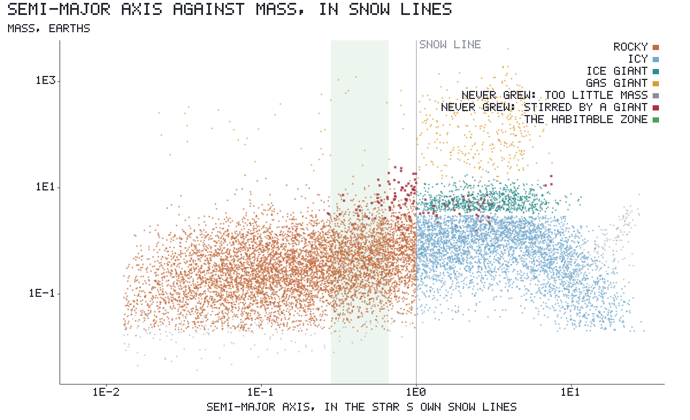
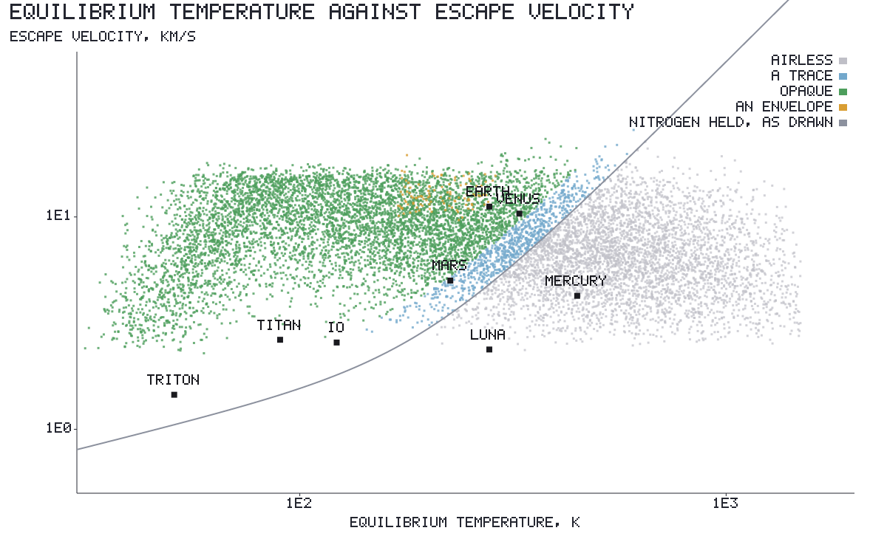
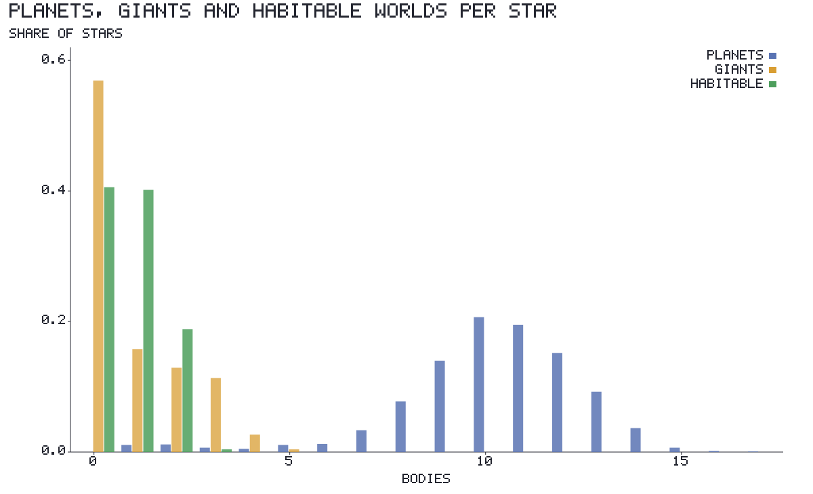
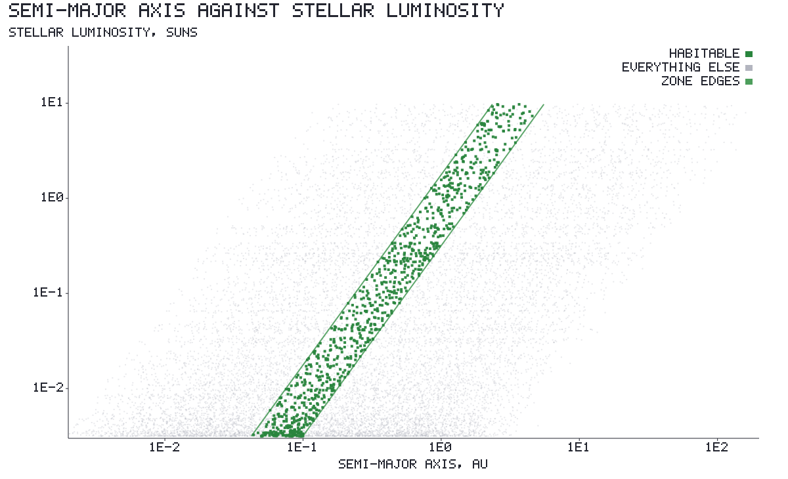
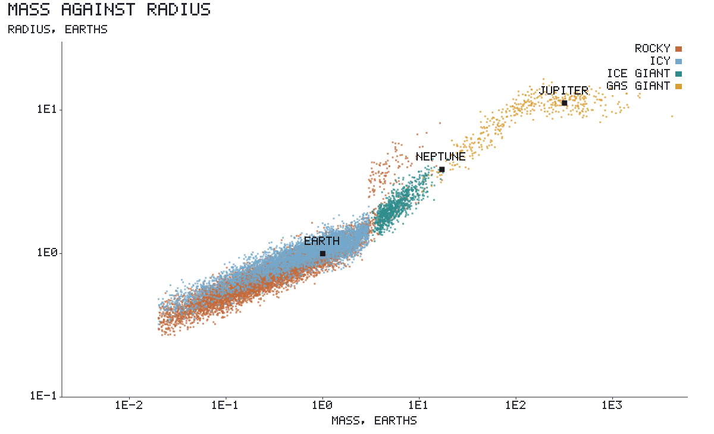
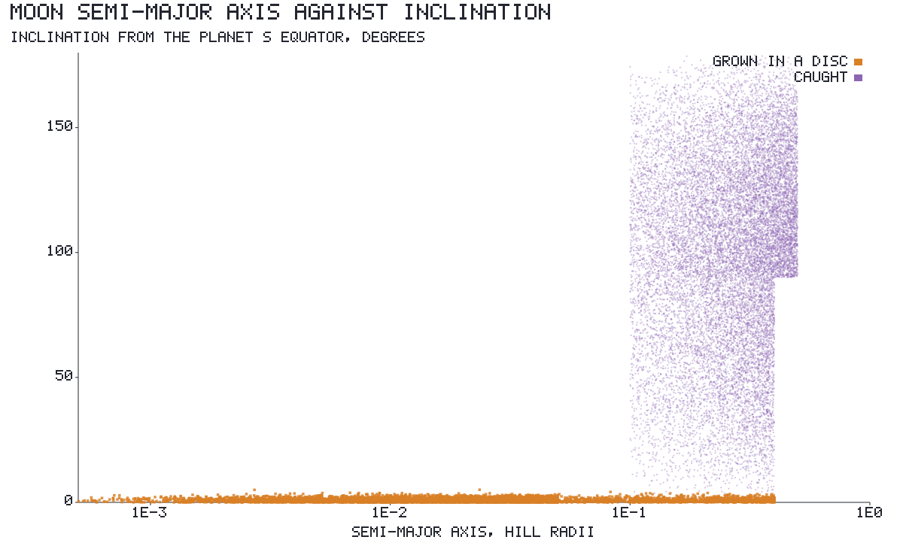
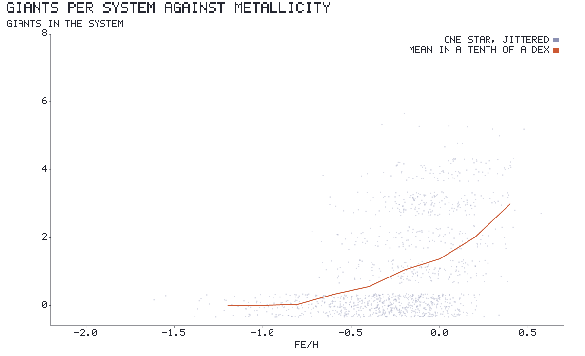

# Generating a system

A hundred thousand stars, each with a system nobody has stored. The generator is what turns a
star's eight-byte seed into planets, moons and belts, and this document is what it does and why
each rule is the rule it is.

**Nothing here is hard-coded and nothing is drawn independently.** The textures came out of
composing noise rather than authoring terrain, and systems come out the same way: one
temperature curve, one mass budget, one retention test, composed until the solar system falls
out of them without ever having been described. Every number any of it draws from lives in
[`sky::generate::tuning`](../../crates/lc-world/src/sky/generate/tuning.rs), so the whole
architecture can be swept rather than recompiled.

The code runs one way:

| module | what it decides |
|---|---|
| [`disc`](../../crates/lc-world/src/sky/generate/disc.rs) | the disc's edges, its snow line, its habitable zone and where its solid mass is |
| [`architecture`](../../crates/lc-world/src/sky/generate/architecture.rs) | a ladder of feeding zones, what each assembled, and what a giant stirred out of assembling |
| [`planet`](../../crates/lc-world/src/sky/generate/planet.rs) | air, water, a magnetic field, and whether anything could live there |
| [`moon`](../../crates/lc-world/src/sky/generate/moon.rs) | a retinue grown in a disc and a swarm of caught stragglers |
| [`belt`](../../crates/lc-world/src/sky/generate/belt.rs) | belts, the trans-planetary disc and the Oort cloud, from what never assembled |

The plots below are drawn by the generator itself, over twelve hundred stars, under the default
tuning:

```bash
cargo run -p lc-world --features plots --bin systems -- lightcone/docs/plots
```

## One curve does the geometry

A gray body at radius `a` from a star sits at `T = T* sqrt(R*/2a)`. Invert it and four radii
that matter are the same curve read at four temperatures:

| radius | temperature | around the Sun |
|---|---|---|
| sublimation edge, inside which there are no solids | 1500 K | 0.034 AU |
| **snow line**, outside which ices condense too | 170 K | 2.69 AU |
| habitable zone, warm edge | 321 K | 0.75 AU |
| habitable zone, cold edge | 209 K | 1.77 AU |

This is the piece the rest leans on hardest. A red dwarf's system is the Sun's pulled inward by
one factor, everywhere at once, and no part of the code carries a separate case for one.

The habitable zone is the optimistic one — recent Venus to early Mars rather than the
conservative bounds. That is a choice, and it is the first of several made in the player's
favor.

## The disc, and where its mass is

Solid mass scales with the star's mass and with `10^[Fe/H]`, spread by a quarter of a dex.
Surface density falls as `r^-1.5` with a step of four at the snow line, so most of the solid is
outside it — which is why giants form out there and not in here.

Left at that, nineteen twentieths of the mass is outside the snow line and every inner planet
is a Mercury. That is what the solar system looks like and not what the galaxy does: most stars
have compact inner systems of several Earth masses each. The mechanism that fixes it in nature
is **inward drift** — gas drag spirals pebbles toward the star — and the tuning carries it as
one number, the share of the icy reservoir that ends up inside the snow line. At the default
twelve percent the inner disc holds about a fifth of the solids, and an Earth in the habitable
zone becomes ordinary rather than lucky.

## The ladder

Rungs are laid from the inner edge outward, each a uniform 1.35 to 2.1 times the last. Each
sweeps the annulus between the geometric midpoints with its neighbours, and the annuli tile the
disc exactly, so **mass is conserved across the whole ladder**. That is the claim everything
else rests on: the belts are not placed, they are what is left.

Growth slows as the cube of the orbit, so past about four and a half snow lines the disc runs
out of time and leaves its solids where they lie. That leftover *is* the trans-planetary belt.
It costs nothing to place because conservation already put it there.

What a rung becomes follows from its core and where it sits:

- inside the snow line — **rocky**
- outside, under three Earths of core — **icy**
- outside, three to eight — **ice giant**
- outside, past eight — **gas giant**, taking two to sixty times its core in gas

The eight is drawn per rung with a sixth of a dex of spread, because the critical core mass
depends on the opacity and accretion rate where the core sits, and one number for a whole disc
puts an edge in the mass distribution that nothing in nature has.



Read left to right: the snow line is razor sharp because it is the one radius the whole
architecture is built around. Rocky planets grow heavier outward, because a wider annulus at
the same surface density holds more. Everything past the line is icy, and the heaviest of those
took envelopes. Gas giants are outward and only outward — the few inside the line got there by
moving, which is the next section.

The gray points are rungs that never assembled for want of mass; the dark red ones are rungs a
giant stirred past assembling. **The red population sits just inside the snow line carrying
three to twenty Earth masses of debris**, which is the asteroid belt and its famous missing
mass, and nothing placed it there.

### Migration, and why hot Jupiters are lonely

A twelfth of gas giants migrate inward to somewhere between the disc's inner edge and the snow
line. A giant crossing the inner disc does not leave it behind, so everything interior goes with
it. That is why the real hot Jupiters are found alone, and here it is a consequence rather than
a rule.

### Shepherding

A giant's mean-motion resonances stir a band around it past assembling. The width is
`a(1 ± C mu^0.2)` with `C = 2.4`, which puts Jupiter's inner edge at 0.40 of its own axis — 2.1
astronomical units, where the asteroid belt starts. Not the giant's chaotic zone, which is far
narrower; this is the reach of the resonance web.

Only a *gas* giant does it. An ice giant's reach is a third as wide and the rung inside it
assembles unbothered, which is why Neptune has no belt in front of it. About a third of gas
giants that stayed where they formed leave a belt inside them.

## What a planet turns out to be

Air, water and habitability are one chain, not three tables.

1. The equilibrium temperature sets the **exosphere**: `T + 807 K × (T/278.3)^4`. Stellar
   extreme ultraviolet heats it, and that falls as the inverse square of the distance while the
   equilibrium temperature falls as its square root. Earth's 278 K becomes the 1000 K exosphere
   that is measured; Titan's 90 K stays at 99 K.
2. The exosphere and the escape velocity give a **retention margin** per molecule: escape
   velocity over six times the thermal speed. Above one the gas stays for the age of the system.
3. Margin above 1.5 is an opaque atmosphere, above 1.0 a trace, below 1.0 nothing. A body whose
   core was heavy enough to bind nebular gas and is cold enough to hold hydrogen keeps an
   envelope and becomes a sub-Neptune.



The curve is where nitrogen is held. Nine real bodies are laid on top, and they are placed by
mass, radius and distance alone — nothing about them is authored. Venus and Earth are opaque,
Mars and Triton are traces, Mercury and Luna are bare. **Titan is the one that matters**: it is
lighter than Luna and it has the atmosphere, because it is cold, and that is the whole reason
the exosphere is in the middle of the chain rather than the equilibrium temperature.

The model misses Ganymede, which it gives a thick atmosphere and which in fact has a trace. It
is within a few percent of the line and there is no gain in bending the line to catch it.

### Water, and the field

Past the snow line water is what the body is made of. Inside it there was never any, so all of
it arrived: icy bodies thrown inward by whatever giants the system has, which makes a system
with no giant a dry one.

Then it can be lost, and **the field decides that, not the air**. An unmagnetised planet warm
enough for its water to be vapour loses it unless its gravity is far above what thermal escape
alone would need. Venus is the case: the same size as Earth, an atmosphere it had no trouble
keeping, and bone dry. A dynamo needs a core hot enough to convect and fast enough rotation to
organise it, so mass and spin both gate it — Venus fails on the spin at 243 days and Mars on the
mass at a tenth of an Earth.

A planet is habitable when it is in the zone, has a surface, has air over it and water on it.
Four independent rules have to agree, so the rate is a measurement of the tuning rather than a
dial.



About three stars in five get a habitable world, and most get between seven and fourteen
planets. That is generous — real occurrence rates are nothing like it — and it is deliberate.
The knobs that move it are the disc's solid mass, the drift share and the habitable zone's two
temperatures.

Life, unlike habitability, *is* a dial: `life_fraction`, the share of habitable worlds something
lives on, is a half. Nobody knows the real number, and a half is a universe worth the trip. A
living world draws how much of its wet land is alive, between three tenths and all of it, and
states it as a `Life:` tag beside its water. A habitable world nothing lives on keeps its sea
and its air and has bare ground under them.



The zone is a clean diagonal because it scales as the square root of the luminosity, and it is
occupied across three and a half decades of starlight. A red dwarf's habitable planet is on an
orbit of days.

### Mass and radius

The relation is a piecewise power law anchored on Earth, Neptune and Jupiter: rock compresses
slowly, a volatile envelope buys radius cheaply, and past a Jupiter mass degeneracy takes the
radius back down. Radii carry a twentieth of a dex of spread, because two bodies of one mass
differ by a good deal if one is mostly iron and the other mostly water.



The orange spur above the rocky band at three to ten Earth masses is the sub-Neptunes: rocky
cores that kept the hydrogen they were born under. They are the reason a habitable world has to
be a small one, and they are why the transit prior reads planet radii rather than core radii —
the envelope is most of what transits.

## Moons

Two origins that look nothing alike, which is the point: a survey tells them apart from their
orbits.

A **retinue** condensed in a disc around its planet. Its total mass is a ten-thousandth of the
planet — measured, and remarkably constant across Jupiter, Saturn and Uranus — and that one
number sizes a generated retinue with no other tuning. It sits within a twentieth of the Hill
radius, flat, circular and prograde. A rocky planet has no such disc, so its only route is a
giant impact: rare, and a fifth of Earth's Hill radius out, which is where Luna is.

A **catch** was a passing body the planet held. How many is a cross-section, so the count goes
as the square of the Hill radius — a Jupiter analogue comes out near the ninety-odd the real one
has. They sit far out, eccentric, at any inclination, and two thirds go backwards.



The step at four tenths of a Hill radius is the prograde stability limit: past it only
retrograde orbits stay bound, which is part of why so many distant moons go backwards.

A migrated giant dragged its retinue into a Hill sphere a tenth the size, so what is left of it
is crowded against the planet rather than spread through a disc.

Captured stragglers are tagged as minor bodies rather than moons, so the map and the inventory
treat them as the loose rubble they are.

## Belts and the cloud

Everything the ladder did not assemble:

- a rung a giant stirred → a **belt** over its own annulus, holding a two-thousandth of what its
  feeding zone started with
- everything past the growth radius → one **trans-planetary belt**, holding a five-hundredth
- what the giants threw → the **Oort cloud**

Mass says how much is there; a measured area-to-mass ratio says how much of it is surface, which
is what a telescope sees. The three ratios differ by orders of magnitude because their size
distributions do — the asteroid belt's mass is in a handful of large bodies and the Oort cloud's
is in a great many small ones.

The cloud needs a scatterer. A system with no giant has nothing to throw with and ends up with
almost no cloud, which is a statement about where comets come from rather than a rule invented
here.

**Sol is the exception.** Its bodies come from a preset fitted against JPL, so its belts are
measured too: an asteroid belt between Mars and Jupiter, a Kuiper belt past Neptune, and a few
Earth masses of comets. A generated asteroid belt in the one system that is right would have
been the one wrong thing in it.

## Metals

A tenth of the metals is a tenth of the disc, and the disc is what builds cores, and cores are
what reach runaway.



The giant-planet–metallicity correlation falls out: flat and near zero below about `-0.7`, and
climbing steeply above it. That is the observed relation, and nothing here was fitted to it.

Metallicity itself is inferred from kinematics rather than read, because the catalogue has no
abundance column — fast is old is metal-poor. The relation is saturating rather than
exponential: an exponential starts falling immediately, which made every ordinary disc star
metal-poor and left the whole galaxy short of the rock that builds planets.

## What is measured and what is chosen

Worth keeping separate, because the second kind is where the game lives.

**Measured**, and not ours to move: the temperature curve and the four temperatures on it; the
mass–radius anchors; the retention criterion of six thermal speeds; the ten-thousandth
satellite mass ratio; Jupiter's resonance reach; the three area-to-mass ratios; the solar
system's own belt masses.

**Chosen**, and tuned for a game people play: seventy-five Earth masses of solids in a
solar-metallicity disc, where the minimum-mass nebula is fifty. Twelve percent drift. The
optimistic habitable zone. A runaway core of eight Earths rather than ten. A hundred captured
moons where the count is a performance question as much as a physical one.

## Reading it back

The generator is also the prior a craft classifies against. A survey measures a radius, a
density, a temperature and a colour, and `knowledge::sort` weighs those against this same code's
own population of worlds to answer what kind of body it is — as a list of types with
probabilities, because none of those numbers is a type and every one has an error bar.

Two consequences are worth stating here, because they are properties of the rules above rather
than of the classifier. The types are very nearly a function of radius, density and temperature,
since the retention chain that decides a body's air is a function of exactly those. And the one
pair that escapes it is Venus against Earth, which differ only in whether there is water under
the air — so telling a habitable world from a dead one needs a colour, and a colour needs a
visit. See [25-system-knowledge.md](25-system-knowledge.md).

## Open

- **Extreme ultraviolet is taken as bolometric.** M dwarfs are XUV-loud out of proportion to
  their light, so their planets' exospheres should be hotter than this model makes them and
  their atmospheres harder to keep. Modelling it would cost the galaxy a good share of its
  habitable worlds, which is a reason to do it carefully rather than not at all.
- **Rings are not generated.** [`crate::rings`](../../crates/lc-world/src/rings.rs) has the real
  ones and nothing gives a generated giant its own.
- **Binaries take the primary's system unchanged.** A companion at twenty astronomical units
  truncates a disc and this does not know it.
- **Nothing ages.** Every system is handed over at the same moment in its life, so there are no
  young discs, no debris discs still settling and no white dwarfs with what is left of theirs.
