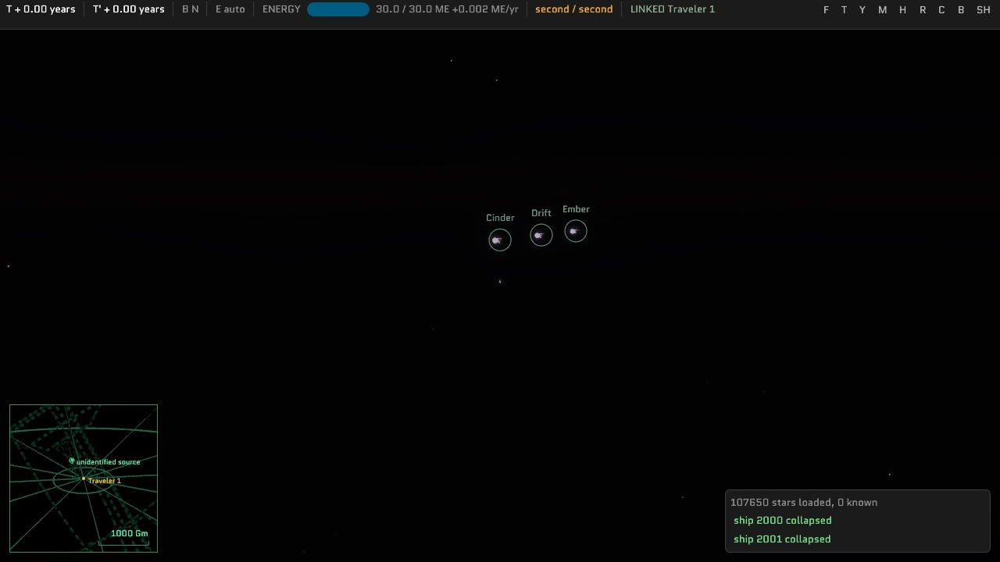
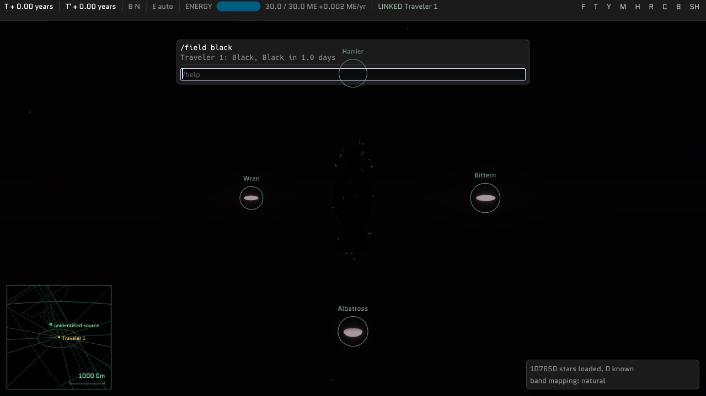
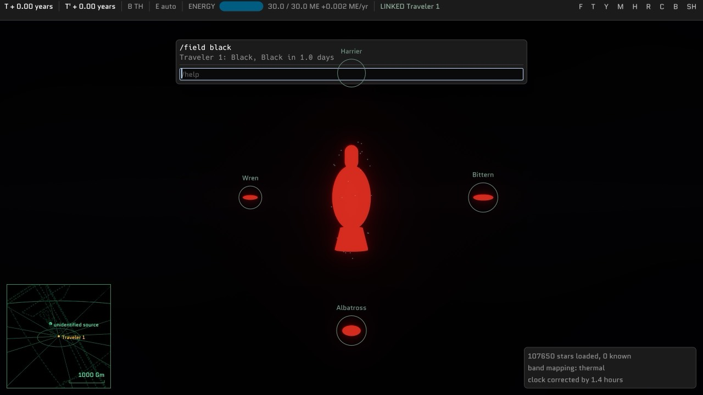

# The field

Every ship is wrapped in a field. It is the collector, the radiator and the shield, and when it
fails, the ship is gone and the whole system sees it happen.

**Status: in the account.** The closed forms are `lc_world::field`, with their anchors derived in
`Balance::DEFAULT`. A fitting settles `Q` beside stored energy (`lc_world::fitting::heat`), `Fitted`
carries it and a checkpoint keeps it. A field is Clear, Black or Auto, and a new ship starts in Auto
(`lc_world::fitting::mode`, `lc_server::field`); a completed switch is an event. A field that
reaches `Q_max` collapses (`lc_server::field`); its spike does not yet reach neighbors. A ship
whose storage has run down to what its motive has committed pays only as much of the living drain
as conversion brings in, and the rest makes no heat, so an empty ship far from a star cools below
400 K. A refit's transfers and a burn's spending are draws on storage inside the account, cut where
each refit step begins and ends, so conversion refills what a build takes out as it goes, and the
drain and the rating change where a step ends. An observer sees a ship by its field
(`lc_world::glow`): `1 − α` of the starlight and σT⁴A of its own heat, as its light left it; the fixed
400 K hull, `HULL_K`, is gone. It turns the hull collectors of
[20-solar-power.md](20-solar-power.md) into the field receiving starlight. The field is part
Culture and part the Langston Field of *The Mote in God's Eye*: a skin that absorbs what hits it,
glows as it fills, and collapses when it is full. Where the energy it sheds goes is
[31-directed-energy.md](31-directed-energy.md).

## What the field is

- **Its shape is always derived from the hull.** It is the envelope of
  [29-ship-form.md](29-ship-form.md): the hull's distance field offset by a margin and smoothed,
  so it covers everything and follows the ship loosely. A player shapes the hull and gets the
  field that covers it. A large or sprawling hull pays for its field automatically.
- **Everything that reaches the ship reaches the field first:** starlight, beams, the glow of a
  neighbor, a collapse. It absorbs a fraction set by its mode, Clear or Black, and reflects the
  rest. What it absorbs and can pass into storage it passes, and the rest stays as heat.
- **Everything the ship wastes ends up in the field:** what conversion loses, what dismantling
  loses, the living drain, and storage vented for lack of room.
- **Heat leaves in three ways:** radiation, which is always on; the drive, which spends heat as
  exhaust before it spends storage; and collapse.

There is one field in the simulation. It is drawn as two layers ([32-ship-rendering.md](32-ship-rendering.md)):
a clear inner one and the glowing radiator. Whether the inner one holds air is still open.

## The heat account

`Q` is the heat the field holds, in joules.

### Why heat goes as the fourth power of temperature

A field holding energy is a cavity holding radiation, and the energy of trapped radiation goes as
`T⁴`. The field's temperature is therefore

**T = T_idle · (q / q_idle)^¼**, where q = Q / A_envelope

and what it radiates, σT⁴ per unit area, is **proportional to `Q`**. That is the fortunate part.
Radiation in proportion to what is held makes the account linear:

**dQ/dt = P_in − Q / τ**

where `τ` is the field's time constant and `P_in` is net power into the field. With `P_in`
constant over a segment, the account has a closed form in both directions:

- **Q(t) = P_in τ + (Q₀ − P_in τ) e^(−t/τ)**
- **Time to reach `Q_max`: t = τ ln((P_in τ − Q₀) / (P_in τ − Q_max))**, which exists only when
  `P_in τ > Q_max`.

The second is what makes collapse schedulable. The server knows, when it settles, exactly when
a field will fail if nothing changes. It schedules that the way it commits a burn. Every change
of input re-solves it.

Physically, `τ` for a field this size would be microseconds. Here it is a balance number, which
is the same step the solar gain takes: keep the physics' shape and choose its scale.

### The inputs

Constant over a segment unless marked as a burst. A burst jumps `Q` at the instant it arrives.

| source | power into the field |
|---|---|
| starlight, beams, a neighbor's glow | what arrives, less what is converted to storage |
| conversion loss | `1 − conversion_efficiency` of what is converted |
| the living drain | all of it |
| the drive below ε = 1 | `1 − ε` of what the rocket law spends, which the exhaust cannot draw (below). Nothing at the default ε = 1 |
| dismantling | the 5% a dismantling loses, spread over the step as the energy moves |
| a return arriving at full storage | all of it, as it arrives: room the round planned for that starlight filled first |
| **vented storage** | **a burst**: what the round planned to vent for want of room, and what a shrinking store actually holds past its new capacity, at the end of the step ([29-ship-form.md](29-ship-form.md#refits)) |
| **a collapse's spike** | **a burst**, on arrival: see below |

### Conversion

What arrives is converted to storage at up to the **conversion rating**, at
`conversion_efficiency`, while storage has room. The rest is heat.

- **The rating is the engines'.** Engine volume is aperture ([31-directed-energy.md](31-directed-energy.md)),
  and what can send that much can take that much in. The starting drive section is rated
  1.1 × 10²⁰ W.
- **`conversion_efficiency`**, 0.7, applies to everything that arrives, starlight included. The 30%
  lost is heat, which is where the sun-diving limit comes from.
- **Heat never converts back.** Once energy is in `Q`, it leaves by radiation, exhaust or collapse.
- **Full storage stays full.** It converts only what the draw on it takes out, the living drain
  and the drones, and everything else that arrives becomes heat. So a full ship sheds all it absorbs
  as heat, and is a hotter ship at the same distance. A draw larger than conversion empties storage
  however full it was, and conversion runs throughout.
- A burst arrives faster than any rating, so **all of it is heat**. Empty storage stops sustained
  power, never a burst.

- **A refit's transfers are draws on storage**, a build's cost out of it and a dismantling's return
  into it, spread over each step. A return arriving at full storage is heat as it arrives, like
  starlight: storage never holds more than its capacity. What the round planned to vent still
  bursts at the end of its step, and a store that shrinks spills what it actually holds past its
  new capacity, which starlight may have made more than the plan expected.

Storage filling partway through a segment splits it. The fill time is linear in the segment's
inputs, so the split is closed form too. Holding full storage full, rather than switching
conversion off, is what makes a settlement independent of where its segments are cut.

While the drive is lit, exhaust draws on `Q` before storage
([31-directed-energy.md](31-directed-energy.md#the-drive-is-the-radiator)), and heat reaching zero
splits a segment as well. **At the floor, all the heat the ship makes goes out with the exhaust as
it is made**, conversion's loss and the drain's heat included, so storage pays the exhaust less
that, and the drain costs nothing there. Within a segment, the floor ends only where storage fills
there and the heat made outruns the exhaust. A segment is at most three stretches: filling, then
full or at the floor, then the other.

**The drive's own waste is the exception.** Below ε = 1 the rocket law spends `P`, but only `εP`
leaves as exhaust; the other `1 − ε` is heat. If the exhaust could draw that heat, a ship at the
floor would send its waste straight back out, storage would pay `εP` less nothing, and the drive
would fly as if ε were 1: at 5 g the starting ship's beam is 1.07 × 10²⁰ W however inefficient
its drive. So the account holds the waste apart. `Q` is **drawable heat**, which is everything
above, plus **waste**, whose one input is `(1 − ε)P` and which radiates on the same `τ`. The
exhaust draws only the first. Both are linear on one time constant, so their sum is still one
exponential over each stretch, and the stretches are still the drawable heat's. Storage pays the
whole of `P` less what drawable heat supplies, which is what the plan committed, and temperature,
mass and collapse read all of `Q`. Waste is saved with the account. An emission is not the rocket
law, so it makes none.

At ε = 0.8 and 5 g, the starting ship spends 1.34 × 10²⁰ W and keeps 2.7 × 10¹⁹ W of it, 0.35 of
its rated load. Its waste tends to 3.5 ME, about 3 500 K, and a boost as long as a full ship can
buy leaves it at 2.6 ME. The exhaust still takes all the starlight's heat, so the sun-diving
limit moves in while burning, and a ship arrives carrying what it made, which radiates on `τ`.
A burn brings a collapse on once `(1 − ε)/ε` of the beam passes the rated load: below ε = 0.59
for the starting ship at 5 g.

## Clear and Black

A field runs in one of two modes, and the player chooses.

| | **Clear** | **Black** |
|---|---|---|
| absorbs | `clear_absorptivity`, 0.3 | everything |
| reflects | the rest | nothing |
| looks like | a shimmering, mostly transparent skin: the sheen of a soap bubble, which is thin-film reflection | matte black, with the heat glow the only thing on it |
| starlight income | 30% | full |
| a beam, exhaust, a collapse's spike | heats at 30% | heats in full; a beam or exhaust converts to storage while there is room, and a spike, being a burst, converts nothing |
| in reflected light | bright | invisible |

**Absorptivity multiplies everything arriving at the field**, before conversion. Reflected light does
nothing to the ship.

In this model a field is hurt only by what it absorbs, so **neither mode is simply the safe one**:

- **Storage empty, facing sustained power:** Black. The attack becomes fuel, up to the conversion
  rating.
- **Storage full, or facing a burst:** Clear. Nothing can be stored, so reflecting is the only
  defense.
- **Sun-diving:** Black to fill. Clear once storage is nearly full, to stay close longer: a full Clear
  ship reaches its rated load at about 0.027 AU instead of 0.05.
- **Hiding:** Black in visible light. Nothing hides a ship in the infrared.
- **Flying near others:** Clear. It forgives other people's exhaust.

**Switching takes `field_switch_s`**, one game day, about 200 ticks or ten real seconds. The new
absorptivity applies when the switch completes, which is a settlement boundary like any other. A
beam arrives with its own warning, so a switch started when it lands is too late. Mode is posture,
chosen beforehand.

A switch can be ordered at any time, under way or refitting, and is refused only while another is
running.

### Auto

The third setting is **Auto**: a thermostat that switches between the two. It is what a player sets
before logging off, and a new ship starts in it.

- **Clear** when heat rises to `auto_clear_above` of `Q_max`, or storage fills.
- **Black** when heat falls to `auto_black_below` and storage is under `auto_refill_below` of capacity.

The defaults are a half and three tenths of `Q_max`, about 3 850 K and 3 400 K, well short of
collapse, with storage refilling below 95%. The gaps between the pairs are hysteresis, so the field
does not chatter at a boundary. A player can move either threshold. They travel with the order.

A ship left in Auto at 0.1 AU fills Black, turns Clear when full and sits there at about 2 400 K.
Clear starlight there more than pays the living drain, so storage stays full and the ship stays
Clear. It turns Black again only where Clear no longer pays: farther out, or with a bigger draw.

**Auto runs on the authority**, like every standing order: logging off does not stop the world. It
needs no polling. The heat account and the fill time are closed form, so the authority works out when
the next threshold is crossed and schedules the switch then, as it schedules a collapse, and re-solves
at every change of input. A burst that jumps past a threshold starts the switch at once. The switch
still takes `field_switch_s`, so Auto is posture too, not a reflex: it cannot answer a beam in time,
only the heat the beam leaves behind.

### As built

- **The mode, the shade and any switch are in the account**, saved and sent with it as `Field`. The
  new absorptivity applies from the switch's `done_s` in every read, however the account is settled.
- **The flip is an event.** A completed switch stays in the account until the authority takes it
  out, and that is the one place it becomes `kind::SHADE`, stamped at `done_s` where the ship was,
  carrying a `ShadeChange`. Everyone else learns of it when its light arrives; what they then see
  is [What an observer sees](#what-an-observer-sees). Its power is the starlight Clear reflects,
  which is what appears or vanishes.
- **Auto is solved, not stepped**, as a collapse is: `Fitting::auto_s` walks the account's stretches
  for the first crossing, and the shard walks that across starlight segments, taking each switch as it
  completes and beginning each one Auto calls for, in order, before it looks for a collapse. A
  collapse that comes first stops it.
- **Black's condition is only searched until storage fills**, since a full store is never under
  `auto_refill_below`.
- **Thresholds without both gaps are refused** as `Impossible`: `black_below` at or above
  `clear_above`, or `auto_refill_below` at 1. A field with either gap closed switches back as soon as
  a switch completes.
- **Every mode order is refused `Switching` while a switch runs**, one that only moves Auto's
  thresholds included.
- **A new ship starts Clear**, the shade Auto keeps a full store in, rather than switching on its
  first day.
- The console's `field clear|black|auto` gives the same order.

## The anchors

Three numbers set the field. Each is anchored to a situation rather than chosen, as `solar_gain`
is. All three assume a Black field, since Black is the mode that collects.

| anchor | sets |
|---|---|
| **The starting ship, idle and far from any star, sits at 400 K.** Its living drain alone holds it there, so `HULL_K`'s value is derived rather than set | `q_idle` |
| **The starting ship's field holds 10 ME** from empty to collapse. The starting ship is [29-ship-form.md](29-ship-form.md)'s starting form | `field_capacity`, the capacity per unit envelope area |
| **A full starting ship broadside at 0.05 AU from a Sun-like star is exactly at its rated load**: it would reach collapse only in the limit | `τ` |

One number needs the starting form's grid ([29-ship-form.md](29-ship-form.md)): its envelope,
3.39 × 10⁵ m², pinned as `STARTING_ENVELOPE_M2` by a test that re-solves it to a part in a
million. The rest are derived in `Balance::DEFAULT`. `q_idle` is not a setting: it is the
starting drain times `τ` over that envelope, 2.40 × 10¹⁶ J/m², so turning `field_capacity` does
not move the idle anchor. The anchors hold for the default geometry: a shard that changes the
starting envelope, through `envelope_margin` say, moves them with it.

The starlight in the third anchor falls on the shadow table's broadside, with the gain that
[20-solar-power.md](20-solar-power.md)'s anchor gives on that broadside, and the gain now sits on
the star's output. Since that
anchor fixes what the starting ship collects, the broadside cancels: `τ` is the same whichever
shadow it is worked on, and agrees with the old ovoid's collection. The gain has to be solved on the same
broadside the starlight falls on: the old gain on the new, smaller broadside would give
2.79 × 10⁶ s and a field failing at 4 126 K.

Capacity per unit area is the same for every ship, so **every field fails at the same
temperature**. Here that is about 4 600 K, a yellow-white glow. The rated load, the sustained
power that would bring a field to `Q_max`, is `Q_max / τ`.

| | value |
|---|---|
| `τ` | 1.84 × 10⁶ s: 21 game days, 3.5 real minutes |
| `field_capacity` | 4.12 × 10²⁰ J/m² |
| rated load, starting ship | 7.6 × 10¹⁹ W |
| field at collapse | 4 577 K, peaking at 630 nm |

### The starting ship, by distance from a Sun-like star

| | filling | full |
|---|---|---|
| 5 AU | 444 K | 458 K |
| 1 AU | 772 K | 1 024 K |
| 0.1 AU | 2 396 K | 3 237 K |
| 0.05 AU | 3 388 K | **4 577 K, at the limit** |

The sun-diving limit comes out of this with no rule of its own. **A filling ship can go closer
than a full one.** The dive that pays best is the one timed to leave as storage tops out. Filling
at 0.05 AU takes about fifteen real minutes, the same as [20-solar-power.md](20-solar-power.md)
found, and the time constant is a fifth of that. A ship that stays past full walks up to its
limit in a few minutes.

A single 5 ME vent into an idle starting field takes it to about 3 850 K. One is survivable. Two
back to back at 0.1 AU are not.

### Square–cube

Internal heat goes as volume and the field's area as its square, so bigger ships run hotter at
rest. With the scaled ships of [20-solar-power.md](20-solar-power.md) (10% of volume living):

| hull | idle, far from a star | full, 0.1 AU |
|---|---|---|
| 500 m | 476 K | 3 237 K |
| 5 km | 846 K | 3 237 K |
| 50 km | 1 504 K | 3 237 K |

At the default living drain, **square–cube shows up in the signature, not the survival limit.**
Starlight and beams scale with shadow, the same as the field, and a full ship sheds everything it
absorbs whatever its drain, so the sun-diving limit does not move with size at all. What moves is
how brightly a ship glows at rest: a GSV at 1 500 K is visible in the near infrared to anyone
looking, and it cannot go dark. The survival pressure will arrive with anything that makes heat in
proportion to volume. The drive below ε = 1 already does: its waste goes as the beam, as volume. A
5 km ship at ε = 0.8 and 5 g makes 3.5 times its rated load, collapses after about seven game days
of burning, and can hold about 1.4 g indefinitely.

## Collapse

When `Q` reaches `Q_max`, **the field fails and the ship is destroyed.** Everything it held is
released as light:

**E = Q_max + stored energy**

The committed burn energy is part of what is stored, so it goes too. The parts' own mass does not.

- **It is an event**, at the craft's position at the scheduled instant, and it goes out as light
  like any other. Every observer learns of it when the light arrives, not before.
- **A spike and an afterglow.** `collapse_spike_fraction` of `E` leaves at once, as a blackbody at
  `collapse_spike_k`. The rest leaves over `collapse_afterglow_s`, with the temperature falling from
  the field's limit. The spike is the part that hurts neighbors. The afterglow is what makes the
  event catchable by an instrument integrating a long stare, as a supernova is.
- **The account's owner gets a new starting ship** at the shard's spawn point, knowing nothing.
  What that means for players is the harshest rule in this doc, and it is in Open.

How it looks from the next system, taking the spike as one second long:

| ship | E | peak | seen from 5 ly |
|---|---|---|---|
| starting, full | 40 ME | 1.5 L☉ | magnitude 0.3: a bright new star, gone in a second |
| 5 km, full | 31 000 ME | 1 100 L☉ | −6.9, brighter than Venus |
| 50 km, full | 3 × 10⁷ ME | 10⁶ L☉ | −14, about the full Moon |

A war lights up its neighbors' skies **in order of their distance**, for years, each system
seeing it replayed as the light passes.

### As built

- **The instant is solved, not stepped.** `Fitting::collapse_s` walks the account's stretches from
  its settlement, fill and empty storage splits, the exhaust's floor and refit steps included, and
  takes the closed form in each. It reads the burn: at ε ≥ 1 exhaust only ever lowers `Q`, so a burn
  puts a collapse off, and a solve that ignored it would destroy a ship its drive was saving. Below
  ε = 1 the drive's waste rises however hard the exhaust draws, and can bring one on; the solve adds
  it to each stretch, which is exact because it relaxes on the same `τ`. A vent that crosses `Q_max` crosses it at its step's end. The shard walks that across the
  day-long starlight segments the account will be settled at and fires what falls due, once before
  the tick advances anything and once after its orders. Nothing is stored for it: every change of
  input settles the account first, so asking again is the re-solve, and a checkpoint restores it with
  the account.
- **The event** is `kind::COLLAPSE`, stamped at the instant and where the ship was, carrying a
  `Released`. It goes through the journal like a burn. Its power is the spike taken as a second
  long, which is what an instrument's inverse square reads; the spike's energy lands on neighbors
  as [Proximity](#as-built-1) says. The afterglow is not yet light anything can see; H10 makes it so.
- **The wreck** stays in the fleet with its worldline ended at the instant. A ship that could see
  it goes on seeing it until the light of the end arrives, then stops, and the wreck is dropped once
  that light has passed every craft. A checkpoint keeps it with its end and no account, since the
  successor carries the account and an account holds one row; a restart brings it back as a wreck,
  nobody's, with nothing to resume, and so ends nobody's view of it early. Its row and what it knew
  are deleted at the checkpoint after the sweep.
- **The successor** is a new ship, with a new id, at the spawn point. A connected owner is sent
  `Collapsed` and then welcomed to it as on signing in.

## Proximity

Everything a field emits heats whatever is near, through the same intake as starlight. The
received power is the emitted power times `A_shadow / (4π d²)`, where `A_shadow` is the
receiver's shadow toward the source.

- **A neighbor's glow** is `Q / τ` of the neighbor's field, isotropic. It is negligible except in
  contact or inside a bay.
- **A collapse's spike** is a burst: all of it becomes heat on arrival, whatever storage is empty.
- **A neighbor's exhaust** is directed, spreads at `drive_spread_rad`, and cooks a full ship within a
  few kilometers behind a starting ship's drive and within 68 km behind a 5 km ship's. See
  [31-directed-energy.md](31-directed-energy.md#exhaust-lands-on-whatever-is-behind).
- **Beams** are directed, and are [31-directed-energy.md](31-directed-energy.md).

A spike of `E`, `collapse_spike_fraction` of what the collapse releases, is lethal to a ship with
headroom `H` and absorptivity `α` inside

**r = √(α · E · A_shadow / (4π H))**

Shadow and headroom both go as the receiver's size squared, so **the lethal radius does not depend
on the victim's size**. It depends only on the dying ship's energy and on the victim's headroom
per unit area, which is how hot it already is.

| collapsing ship, full | lethal radius, victim idle and Black | company standoff, 5 combined lengths, beside a starting ship |
|---|---|---|
| starting, 570 m | 150 m | 5.7 km |
| ×10, 5.7 km | 4.2 km | 31 km |
| ×100, 57 km | 130 km | 290 km |

The ships are the starting form and it ten and a hundred times over, and the victim is broadside to
the spike. The radii were 190 m, 5.4 km and 170 km before [F10](plans/forms-and-fields.md) gave
the starting form its own shadow, which is smaller than the old ovoid's.

A Clear victim's radius is √0.3 of these, a little over half. So at the defaults, **ships in
company are safe and ships in contact are not**. Docked ships, tight
formations and anything inside a bay die with the ship next to them, and a cascade needs that
density. A hot victim has less headroom and a larger lethal radius, so a fleet sun-diving together
is a fleet at risk. `field_capacity` is the lever: lowering it widens every lethal radius and
lowers every sun-diving limit together.

**Proximity heating is in from the start.** It is what makes the energy exchange mean something.
The risk it creates, a player overloading themselves beside someone on purpose, is the mechanic,
not a bug. What stops it is [23-factions.md](23-factions.md) and the fact that an approach is
visible for as long as it takes light to cross it.

Delivery is the existing light-delay machinery. A collapse's spike reaches each neighbor at the
retarded time on that neighbor's worldline and jumps its `Q` there, so a cascade spreads at c.

### As built

- **The spike rides the collapse event's fan-out.** Every delivery the event is scheduled to a
  fitted craft is queued as a burst at that delivery's arrival, carrying the spike's energy and
  where it left. On landing it takes `A_shadow / (4π d²)` from where the receiver is then, onto
  its shadow toward the source, and `α` of that goes into `Q`. This is the isotropic case of the
  one emission path of [31](31-directed-energy.md#as-built): the spike rides the collapse event,
  whose payload carries it, and lands through the same landing as a beam.
- **A cascade is time order and nothing else.** Each tick takes due collapses and due landings
  together, earliest first. A landing settles its receiver to the arrival and re-solves its
  collapse, and a collapse queues its own spike's landings, which may fall in the same tick.
  Nothing about a cascade is written anywhere. Arrivals are whole microseconds, rounded up as
  every delivery is, so a long chain runs a little late: each hop can lose up to a microsecond,
  and light from further back can overtake it.
- **The glow is restated each tick.** `Q / τ` of every fitted neighbor, as its light left it, onto
  the receiver's shadow toward it, is the receiver's intake from other craft beside its starlight.
  Light that left before the neighbor's last settlement is read at that settlement.
  A neighbor whose glow could not move `Q` by a billionth of `Q_max` over a time constant is not
  solved for. It is not saved: a restart restates it on its first tick.
- **A receiver takes at most half of what surrounds it,** the most one in contact faces: from one
  source, and from all of them together. Ships stacked at the spawn point feed each other their glow
  and convert it like starlight, and settle at an idle heat raised by a sixth. Capped per source
  instead, a stack of three or more would heat itself until it collapsed.
- **A shadow toward a neighbor** is read off the shadow table at the roll the hull presents to its
  star, the only roll a hull holds.
- **`--demo cascade`** is five hot ships ten times the starting size, 23 km apart. The first vents
  and each spike kills the next. Nothing draws a collapse yet: a wreck disappears when the light of
  its end arrives, and the console says it collapsed.

  
  
- **A spike in flight survives a restart.** The collapse event's deliveries are in the journal, and a
  shard coming back lands every one its clock has not reached, as it does every emission's.

## What an observer sees

`HULL_K` retires. A ship's appearance in each band has two terms:

- **Reflected**: `1 − α` of the starlight × shadow toward the observer, with the phase angle. A
  Clear ship reflects 70%, twice what today's gray hull does. A Black ship reflects nothing.
- **Thermal**: a blackbody at the field's temperature over the envelope's area. Physical flux,
  σT⁴A, with no gain. This is the second face of the field, exactly as starlight has one: `Q / τ`
  is energy moving at game scale, and σT⁴A is what an instrument sees.

The shade an observer sees is the last `kind::SHADE` whose light has reached it, never the owner's
account now: a flip is news, and arrives at light delay like any other.

| field | peak | seen in |
|---|---|---|
| 400 K, idle | 7.2 µm | the ten-micron band |
| 1 000 K, full at 1 AU | 2.9 µm | K and redward |
| 2 400 K, diving | 1.2 µm | the near infrared, and red |
| 4 600 K, failing | 630 nm | the visible, as an orange-yellow point |

A craft's field temperature and mode go on `Presence`, arriving with its light, as a `Glow`. The mode
there is the `Shade` the field is in, Clear or Black: Auto is a setting, and nothing about a field
shows its thresholds. What a player can infer from it:

- **How full someone is.** Temperature at a known distance from a known star reads back to
  whether they are converting. Whether attacking them feeds them is on the screen.
- **What they have been doing.** A hot field far from any star has recently been beamed, vented,
  or been beside something that died.

### As built

- **`lc_world::glow`** is the photometry: per band at the observer, `Light { reflected, thermal }`.
  Reflected is `1 − α` of the star's band radiance diluted to the ship, over the shadow toward the
  observer, times the lit share `(1 + cos φ) / 2`, as a Lambertian face. Thermal is the band radiance
  at `T` over a quarter of the envelope, the mean projected area of a convex body, so it integrates
  to σT⁴A over every direction and wavelength. Neither carries `solar_gain`. The band brightest for
  its width moves through 30's table: ten microns at 400 K, K at 1 000, I at 2 400 and R at 4 600.
  `glow::snr` is what an instrument makes of a band's flux against its own glow.
- **The field as its light left it.** A craft keeps its field at each settlement, the way it keeps
  its forms (`lc_world::seen::Glows`): heat, envelope, shade and any switch under way. Between
  samples heat is read off the line joining them, and a sample is dropped while that line passes
  within a part in ten thousand of it and of every sample dropped before it, so a field at rest is
  one sample. A burst is kept as a step. `Craft::glow_at` reads it; a new fitting is the field for
  all time before it. H5's glow between neighbors reads the same history.
- **`Presence.glow`** is filled from it at the emission time, so a vent two light-hours off is news
  two hours later. A craft with no fitting is stated as the starting field at rest: 400 K, Clear.
- **A wreck is seen in the field it ended in.** Its fitting is gone, but its history is not, so its
  light still in flight carries the failing field's temperature. The history is not checkpointed: a
  wreck restored after a restart is stated as the starting field at rest until its light has passed.
- **The client draws and meters a ship by it.** A hull's reflectance is `1 − α`; a real hull's
  textures, which average 0.35, are scaled to it. The field's heat is an even glow over the hull in
  the hull shader, and a star's spectrum cache serves its per-band radiance. A Black field hides the
  lit windows too. The field's own envelope is still undrawn, so for now the hull carries both terms;
  R11 moves the heat onto the envelope. Nothing yet draws a distant ship as a point: the metering
  sums the terms (`hull::Sent`), and R18's point starts from that sum.
- **Instruments:** the photometry and the detection test are in `lc-world`; no duty yet points a
  telescope at a craft. H10's stare at a position is the first.

## Balance

`Balance` gains, and `solar_efficiency` becomes `conversion_efficiency`:

| setting | first guess | meaning |
|---|---|---|
| `field_idle_k` | 400 | the anchor temperature |
| `field_capacity` | *anchored*: 10 ME on the starting envelope, 4.12 × 10²⁰ | heat per m² of envelope at collapse |
| `field_tau_s` | *anchored*: 1.84 × 10⁶ | the time constant |
| `conversion_efficiency` | 0.7 | of what is converted, the fraction stored |
| `clear_absorptivity` | 0.3 | what a Clear field absorbs. Black absorbs everything |
| `field_switch_s` | 86 400 | one game day to change mode |
| `auto_clear_above` | 0.5 | of `Q_max`: Auto goes Clear |
| `auto_black_below` | 0.3 | of `Q_max`: Auto goes Black, if storage has room |
| `auto_refill_below` | 0.95 | of capacity: what counts as room |
| `collapse_spike_fraction` | 0.9 | of `E`, released at once |
| `collapse_spike_k` | 10⁷ | the spike's color temperature: X-rays |
| `collapse_afterglow_s` | 30 game days | how long the rest takes |

The star's gain stays `solar_gain` and moves from collection to **the star's energy output**
([31-directed-energy.md](31-directed-energy.md)). Nothing downstream of a star is multiplied again.

## Where it goes

| crate | new | changed |
|---|---|---|
| `lc-world` | `field.rs`: the account, its closed forms, time to collapse, temperature, the lethal radius | `solar.rs` becomes intake: starlight onto the shadow, gained at the star. `fitting.rs` folds heat beside stored energy. `refit.rs` reports each step's heat, and whether the plan crosses `Q_max` |
| `lc-proto` | `field.rs`. `Outbound::Collapsed { at_t, released_j, successor }`, to the owner only: observers learn of a collapse from its light. `Order::FieldMode { mode: Clear \| Black \| Auto { clear_above, black_below, refill_below } }`, `Refusal::Switching`. `kind::SHADE`, a completed switch, carrying `ShadeChange` | `Fitted` gains `field: Field`, with `Q` and its time, the mode, the `Shade` it is in, and any switch under way. `Presence` gains `glow: Glow`, the field's temperature and shade |
| `lc-server` | collapse scheduling and delivery, respawn | the tick settles heat. Refit and order acceptance warn |
| `lc-client` | | `hud.rs` gains `Field`, `panels.rs` draws the bar. The refit panel, photometry. The field shader is [32-ship-rendering.md](32-ship-rendering.md) |

## Client

### The field bar

A second bar in the top header, beside the energy bar and built the same way: `Hud` gains a
`field: Option<Field>` with a fraction and a line of text, and `panels.rs` draws it as an
`egui::ProgressBar` of the same width.

- **The fill is heat over capacity**, `Q / Q_max`: how much of the headroom is used.
- **The color follows the field.** Below 798 K, the Draper point where hot things start to glow
  visibly, the bar is a calm blue. Above it, the bar takes the color of a blackbody at the field's
  temperature, the same color the shader gives the ship's field, blended in from the blue over the
  next 200 K so the change is not a jump. Red on a dive, orange past
  2 500 K, and yellow-white near collapse, brightening as it goes. The bar and the ship tell the
  player the same thing.
- **Past 80% of `Q_max` it pulses**, faster as it nears the limit, as the shader flickers.
- **A tick marks where the field is heading**: the equilibrium `P_in τ` for the inputs in force.
  A tick below the fill means the field is cooling, and above it, heating. When the equilibrium is past
  `Q_max`, the tick is pinned at the end and the text shows the countdown.
- **The text beside it**: temperature, net heat flow, and **a countdown whenever a collapse is
  scheduled** — `3 240 K ↑ 1.2 ME/yr — collapse in 4:10`. That is the one number a player must never
  have to compute.
- **Three buttons at the bar's left: Black, Clear and Auto.** The chosen one is lit. In Auto, the mode
  the field is actually in shows as a small `CLEAR` or `BLACK` beside it, and a switch under way reads
  `→ BLACK`.
- **In Auto, two markers on the bar** show the thresholds. Dragging one sends a new order.
- **Color is never the only signal.** The countdown and the numbers say everything the hue does, for
  a player who cannot tell red from orange.

The blue is a palette entry and is passed in, as [18-ui-style.md](18-ui-style.md) says, not typed as
a hex value. The blackbody color comes from `em_spectra::blackbody`, normalized to full brightness,
so it follows the physics rather than a table. `Field` is a pure function of `Session`, as `Energy`
is, and is tested the same way: a hot ship's bar is past the Draper point, and a scheduled collapse
puts a countdown in the text.

### Elsewhere

- **Refit panel:** what the plan does to the field: the peak temperature it reaches, and at which
  step. A plan that crosses `Q_max` shows it in red and
  asks once more before Apply. **It is not refused.** A player may choose to die.
- **Flight:** a dive shows the equilibrium temperature at the destination, full and filling,
  before it is flown.

## Tests

- **The anchors.** Starting ship idle at 400 K; 10 ME of capacity; full at 0.05 AU exactly at
  rated load. Each to within a part in a million, from `Balance::DEFAULT`.
- **Closed form against stepping.** An account with a starlight segment, a vent burst and a
  storage-fills split, stepped finely, agrees with the closed form. Break the equation of state on
  purpose (a linear `T` instead of a fourth root) and check that the temperature tests fail.
- **A round under starlight.** A refit whose steps end between settlements, settled at every tick
  and in one leap, agrees on heat and storage, and never holds more than capacity. A return into
  room starlight has filled ends as heat, joule for joule.
- **Collapse is on time.** A scheduled collapse fires at the predicted instant, and a change of
  input before it moves it.
- **Light delay.** A collapse is observed by a distant client no earlier than the light allows,
  and a neighbor's `Q` jumps no earlier. Break the retarded solve on purpose and watch the test
  fail, per [AGENTS.md](../../AGENTS.md).
- **Burst versus rate.** A beam under the conversion rating with storage empty adds only its
  conversion loss. The same energy as a burst adds all of it.
- **Modes.** A Clear field takes `clear_absorptivity` of a beam and a Black one all of it. A switch
  changes nothing until `field_switch_s` has passed, and a second switch meanwhile is refused.
- **Auto.** A ship in Auto at 0.1 AU switches at the predicted instants, stepped finely and in one
  leap, and a ship with no client connected does the same. Set both thresholds equal on purpose and
  check the hysteresis test fails.

## Open

- **Death.** A new starting ship, knowing nothing, is the harshest reading. Whether the Mind, the
  data part's contents or a faction's relays survive the ship is a question for
  [22-provenance.md](22-provenance.md). An owner signed out when it happens is told nothing and
  finds the new ship on signing in; the transcript and knowledge went with the old one.
- **Air under the field.** Parks held by the field would cap its temperature well below 4 600 K.
  Whether that is a real rule or only a look is undecided. The two layers are drawn either way.
- **Direction of intake.** Reciprocity says an aperture receives best along its own axis. The
  rating here ignores direction. Whether catching a beam means facing it is a later refinement.
- **Eclipses** still do not shade, as in [20-solar-power.md](20-solar-power.md).
