# Ship rendering

How a form becomes a picture: the hull, a refit being built, the drones doing it, and the field
around all of it.

**Status: partly built.** The hull material, the mesher, the drones and the field shader are in, each in a void. Construction is drawn on the placeholders in the game, and truss and plating on the meshed hull under `--demo refit`; see the "As built" notes. [29-ship-form.md](29-ship-form.md) is what is drawn,
[30-the-field.md](30-the-field.md) is the field's physics, and [31-directed-energy.md](31-directed-energy.md)
is what beams do.

## Two looks

- **From TNG: parts you can read.** Each part is one kind, and each kind looks like what it is.
  A drive section, a habitat and a bay are recognizable from outside.
- **From the Culture: a smooth field with the ship inside it.** Not the surface clutter of a Star
  Destroyer. Light does most of the work: lit living areas on the night side, the field's glow,
  the plume.

The construction look is Cities: Skylines and SimCity 4: a skeleton goes up, is closed in, is
fitted out, and the scaffolding comes down. It is mechanical on purpose. The one time the ship
looks like machinery is while it is being built.

## The hull

### From distance field to mesh

The client evaluates the same signed distance field that `lc_world::form` defines, so the surface
drawn is the surface the server reasons about.

- **Surface nets**, on a grid sized to the ship's pixels on screen: coarse when it is a smudge, fine
  when it fills the view. Surface nets are smooth, cheap, and have no ambiguous cases to get wrong.
- Meshed **off the main thread** on Bevy's async compute pool, cached by a hash of the form and
  each part's solved scale, and swapped in when ready. A new mesh is needed only when a step
  completes. Within a step, the growing part is drawn by the construction pass below, not
  remeshed.
- **Finish** is a per-form choice: *smooth* (surface nets as they come), *faceted* (flat normals),
  or *blocky* (occupied cells drawn as cubes, for anyone who wants a brutalist ship). It changes
  extraction, not the shape, so it touches nothing the server computes.

As built (`lc_client::hull_mesh`): one cell per four pixels along the ship's longest side, as a
power of two from 16 to 256, held until the ideal is more than three quarters of a doubling away.
Before extraction the grid is cleaned of every lattice square whose corners alternate in sign by
turning one outside corner inside, so each cell face carries at most one segment of surface; a
vertex per loop of crossings in a cell, not per cell, then makes the mesh closed and manifold
whatever the form. Blocky is the same topology with each vertex moved to its cell's center, which
is exactly the cubes' faces. A feature thinner than a cell is kept only where a sample lands in
it: a strap on a coarse grid comes out holed or gone, never torn. The cache key is FNV-1a over a
canonical encoding of the form and each part's solved shape, since `Form` holds `f64`s. A
256-cell mesh takes a few seconds in a dev build and never holds up a frame; the old mesh stays up
until the new one lands. `cargo run -p lc-client --example mesh_void` photographs the fixtures.

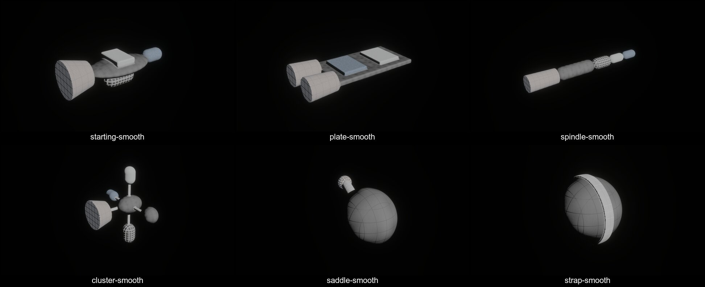

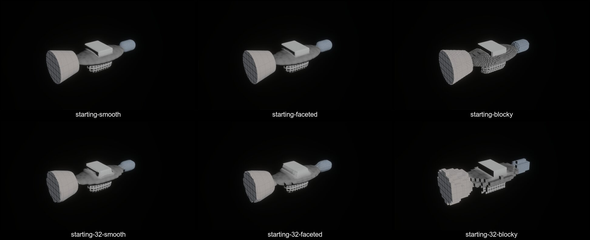

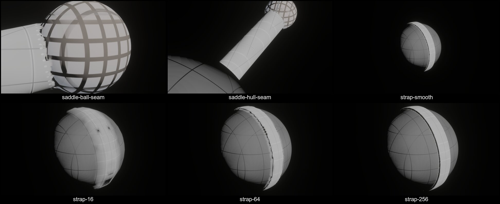

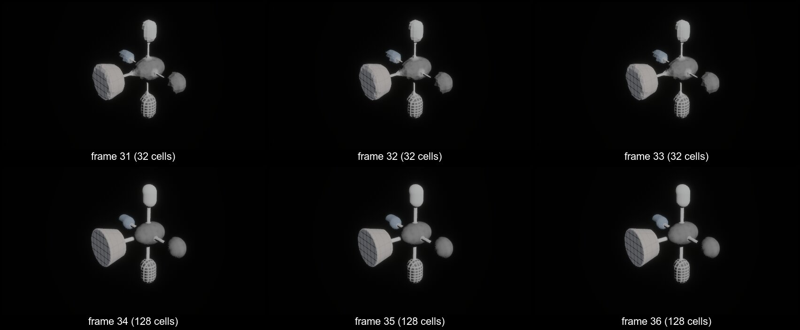

### Details are sized in meters

The eye judges size by how small repeated detail is. So **every repeated detail has a fixed size
in meters, whatever the hull's size**: windows every few meters, panels tens of meters across,
girders at a fixed pitch. A 50 km ship reads as enormous because its girders are fine against its
length.

At a distance where detail would be smaller than a pixel, it fades into a texture that averages
it, to stop the shimmer. A distance-field mesh has no UV coordinates, so materials are mapped
**triplanar**, from world position in the ship's frame.

As built (`em_render::hull_material`): each kind's graph is baked as one repeating tile of 64 m,
and the fade is the tile's mip chain, built on the CPU in linear light, so a window too small to
see becomes its own average — a lit window's power spread over the pixel, not lost from it.
`cargo run -p lc-client --example hull_void` photographs it on a sphere of any size.

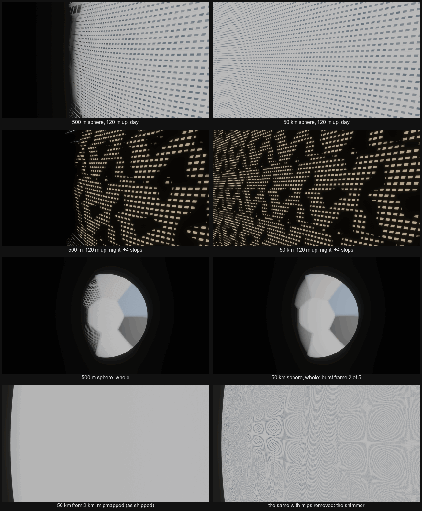

### Materials by kind

One texture-graph graph per kind, delivered like the planet graphs, with the region set by which
part a point is nearest. Fillets blend between the two regions.

The mesher hands the material each vertex's weight for every region, a byte apiece, read off the
per-part distances it already evaluates, and the shader draws the two heaviest. Weights rather
than two indices and a share, because a triangle whose corners name different pairs cannot
interpolate a share, and every triangle crossing the edge of a fillet is one: that was tried, and
drew the edges as stairs. The material knows regions only as indices
into the caller's palette of graphs; which kind is which is Lightcone's. A graph's output color is
albedo, and a layer named `lights` beside it is the lit share of each texel, which the caller
scales by a power per region.

| kind | look |
|---|---|
| storage | dark and smooth, faint seams. The mass of the ship |
| drone | hangar doors in rows, docks lit when drones are home |
| living | window bands. Lit on the night side, where they are the brightest thing on the hull |
| engine | an emitter grid on the open face, glowing with exhaust power. As built the grid is lit over the whole region, which is right in a void; which face is open is the form's, and R13 limits it there |
| data | fine dense panels |
| mind | a small dark cube with one faint light. Drawn only when nothing encloses it, and always in the editor |
| spar | plated structure, with a row of bolt heads along every line where it meets a neighbor. The line is where the spar's distance and the neighbor's grown distance are both near zero, so the shader finds it with no geometry of its own. As built, the mesher hands each vertex its signed distance to the nearest seam and meters along it, and the shader puts a head every 1.5 m, 0.8 m in from the seam. Along is the one number a distance field does not hand over. The mesher classes each seam whole, from the two primitives' gradients along it, as a ring about the spar's axis or a line along it, and measures it as meters around at the seam's mean radius or meters along. A boom's end and a rib's edge are both in meters, and a seam that climbs spreads its heads only by the cosine of its climb. Chosen per vertex, the heads shear where the choice changes |
| bay | a shell with a mouth, and a lit interior grid of decks and gantries |

Living lights are emitters with a real (small) power, through the same exposure as everything
else, so they show on a night side and vanish in sunlight as they should.

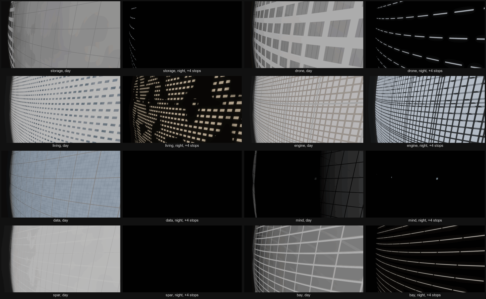

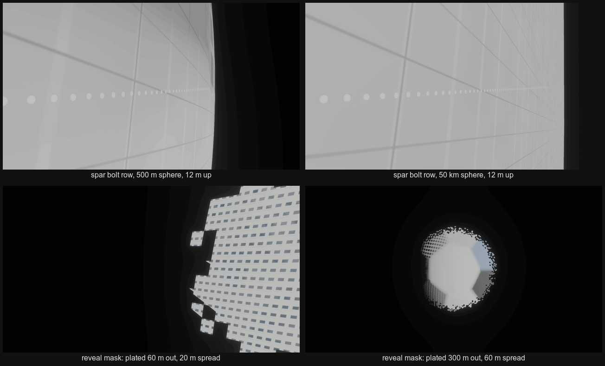

## Building, as a function of time

**What is drawn is a pure function of the refit's recipe and the time `t`.** No animation state is
stored, and nothing is sent. Each planner step is one part's whole change, and says which part, which
phase of the round, and the interval it occupies ([29-ship-form.md](29-ship-form.md#refits)).

Each part's volume at `t` is its volume at the round's start plus completed steps plus the completed
fraction of the current one. The step in progress acts on a **sliver**: the shell between the part at
its volume before the step and after it, or the whole part when it is new.

### A build step is a frontier

Every point of the sliver goes through four phases in turn. **When** a point starts depends on its
distance from where the part meets its parent, so the phases sweep across the sliver as bands, one
behind another:

| phase | drawn |
|---|---|
| **truss** | a lattice of girders |
| **plating** | panels close over the lattice |
| **fitting-out** | the kind's material fades in, windows light, emitters appear |
| **scaffold down** | the outer truss comes apart, and drone traffic carries it off |

The band widths and how far the sweep leads are client constants. The step's duration is the
planner's, so the last band reaches the far edge as the step ends.

- **The truss is a distance field too**: a repeating lattice of capsules at a fixed pitch in meters,
  intersected with the sliver's shell. It is meshed once at the step's start, since the sliver is
  known then.
- **Plating is a reveal mask** on the hull material: each panel has a hashed threshold offset by its
  distance from the attachment point, and a uniform sweeps across them.

One rule covers every size. Drone power and part volume both go as the ship's volume, so a
proportionate change takes about as long on any hull: a quarter more storage is about a real minute on
a starting ship with its drones, and about a real minute on a GSV with the same share of drones. What
differs is what that minute looks like. On the starting ship, the frontier crosses a new pod at a
glance. On a GSV it is a band of scaffolding kilometers wide, sweeping a face tens of kilometers long
with drone traffic streaming to it: a shipyard that is also the ship.

### The other steps

- **Dismantle** runs a build's phases in reverse, from the far edge in: scaffold goes up, the
  fitting-out comes out, the plating comes off, which shows the truss, and then the truss is taken
  down. Point by point that is the build played backward; what is not a rewind is the drone traffic,
  which carries loads home (R9).
- **Move** slides the subtree from its old anchor to its new one along a smooth path over the
  step. No construction, and drones swarm the joint.
- **Rebuild** is a dismantle of the whole part to nothing in the round's first phase, and a build of
  the new one in its last.
- **Cancel** runs the step in progress backward from the fraction it had reached, at its own pace.
  The ledger is back at the moment of cancel for every kind of step
  ([29-ship-form.md](29-ship-form.md#cancel)), so the backward run is only the picture. A dismantling
  that storage could not pay back finishes at once, in the picture as in the ledger.

As built (`lc_client::construction`): `Frame::at` takes the plan and the round's clock and reads
`Plan::at` for what is finished and what is under way, so no timing is derived twice. A form partway
through a round need not place, since a part may hang from one taken apart or not built yet; such a
parent stands in from the start's form while dismantling and from the target's once moving and
building, and is not drawn. Growth and shrinkage re-place the form at the interpolated volume, so
children ride out on a growing parent. A part appearing or going whole is scaled about its foot, which
is where the planner's placement would put it at that volume. A copy gained or lost is its own piece,
so both copies of a mirrored part build together. Each point's phase is `Working::look`, `d` of the
way across the sliver from the joint; each point spends 30%, 15%, 15% and 10% of the step in the four
phases, and the rest is the front's travel, so the far edge finishes as the step does.

On the placeholders the working part is solid at its volume at `t`, inside a cage at the sliver's
outer size: rings and meridians through `Shape::exit` from the part's center, so one grid fits
every primitive, drawn as tubes in `BodyWireframeMaterial`. The cage's thickness follows the scaffold
averaged across the sliver, so it goes up with the truss and thins away as the scaffold comes down;
the crossfade to solid is the solid filling the cage, since both materials are opaque. The game keeps
this until R15 draws construction there the way the demo does.

As built for truss and plating (`lc_client::refit_hull`, `lc_client::truss`): **`--demo refit` draws
the whole ship on the mesher and the hull material**, and the placeholders stand aside. Plating is a
mask on R3's material and means nothing on a Bevy primitive, so the demo could not wait for R10. A
step is meshed once, as it starts: the ship it leaves alone (`Frame::standing`, placed as a form, or as
its bare copies where it hangs from a part not built yet), each copy it works on at its larger size,
and each copy's truss. Within the step only uniforms and poses move: what hangs from a part being
resized rides out on it, each copy posed every frame from `Frame::pieces`, as a move's carried copies
are, and the truss keeps out of where those copies will stand. Once the clock passes a step, its copies
are drawn as the step left them until the next step's meshes land, so a part taken apart stays gone. `Working::sweep` turns `Working::look` into
meters from the joint, a front and a width a band, which is all the shader needs to give every point
its own phase; a test holds the two to agreement across every step. A step's meshes are shown only
once all of them have landed, and the last step's stay up until then. A carried or riding copy is meshed in its own frame, bare,
so a fillet it has with the resized part is missing until the step is done.

- **The truss is whole girders, not a distance field meshed.** The lattice is the one described, at
  8 m square to the ship's frame, girders 0.35 m in radius, and it is kept where both of a girder's
  nodes lie between two pitches inside the copy's surface and one outside it, and outside the
  standing ship. The girders outside the finished surface are the scaffold. Meshing the lattice's
  field by surface nets would cost the shell's volume over the girder's radius cubed, about twenty
  million samples on a starting ship's hull; whole girders cost what is kept, 15 600 of them, and a
  truss stops at a node anyway. Each girder carries its distance from the joint and a hashed
  threshold, and stands while its band's share is past it, so the truss goes up and comes down a
  girder at a time. The mesher's core is shared all the same: `surface_nets` takes any Lipschitz
  field, and the working copies are meshed through it as bare shapes.
- **Past 60 000 girders there is no truss mesh**, and the shader draws the same lattice on the
  sliver's surface, in the face's two axes at the same pitch. That is every GSV. Close up it is
  girders over the gaps, which are discarded. Once a girder is under a pixel nothing is discarded,
  and plating, girders and what is behind them are drawn as their shares of the pixel, counting the
  three layers a line of sight crosses; a band of scaffolding kilometers wide is then a band of
  that color. The girders are safety yellow with their own work lights, so it reads as construction.
- **Plating** is R3's reveal mask with the joint as its origin, a panel a lattice cell. **Fitting-out**
  fades the kind's material in over bare plating and lights its emitters. **Scaffold down** takes the
  outside girders away. A dismantle is the same uniforms with the fraction run backward, so it goes in
  reverse. Where nothing is up yet the working surface is discarded, and the ship it grows from shows.

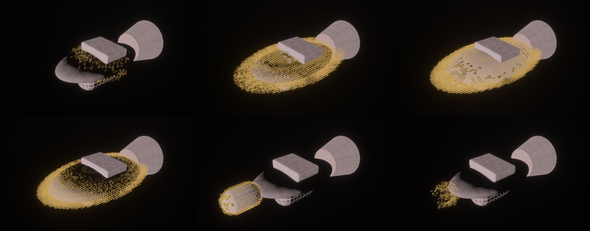
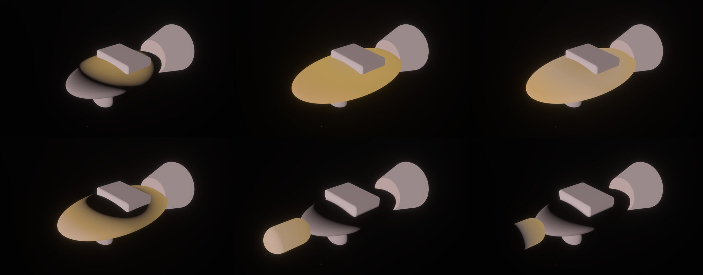
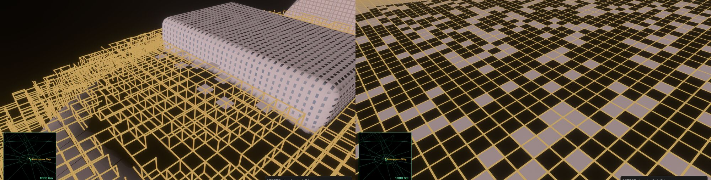
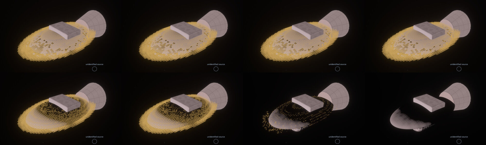

`--demo refit` stages one of each step on the starting form (the data core taken apart, the deck
moved aft, the hull grown by half, a mirrored pair of pods on spars) as a client fixture beside
`--form`, not a scenario: it is only the player's ship, and drawing a round from the game is R14's. The
Cluster preset would be the obvious target, and the planner refuses it from the starting form.

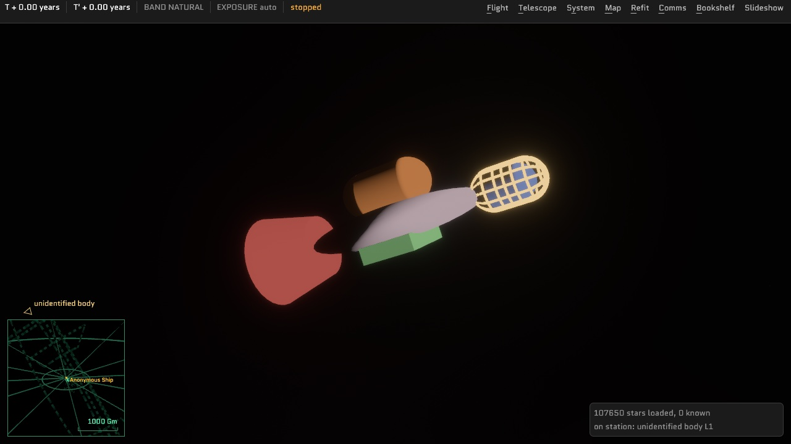
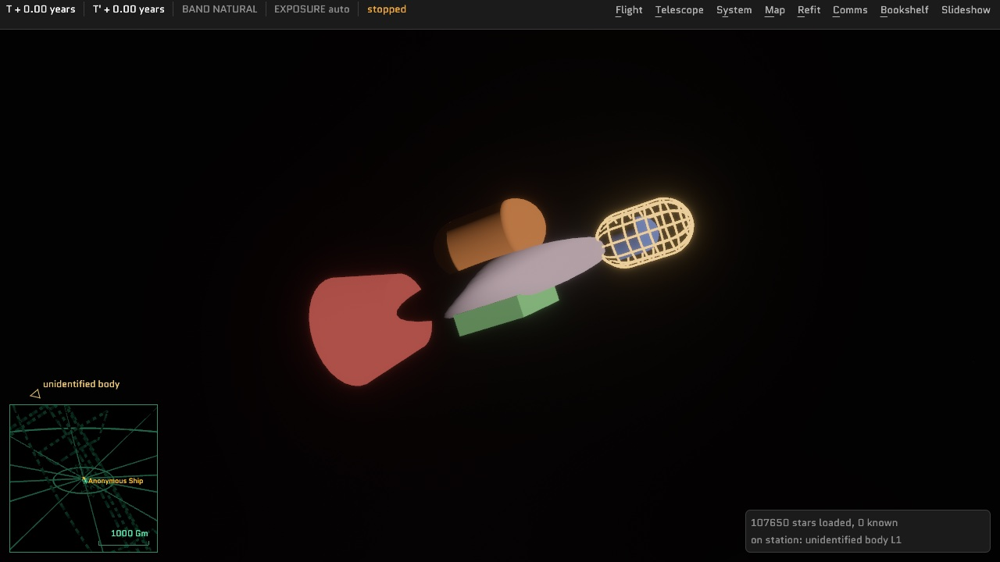
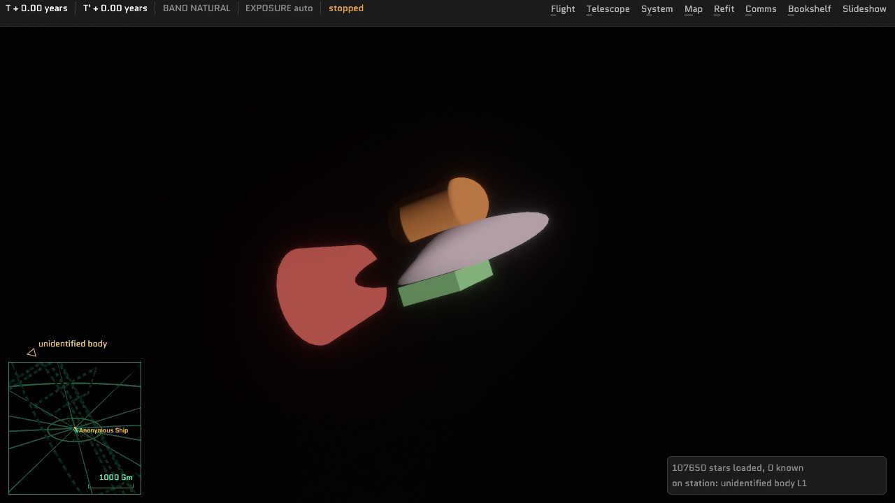
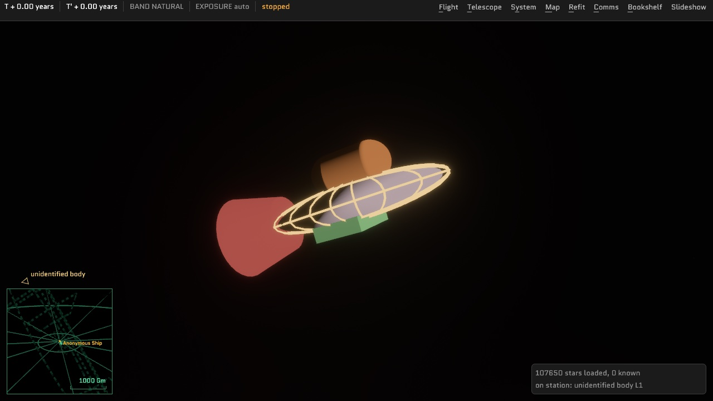
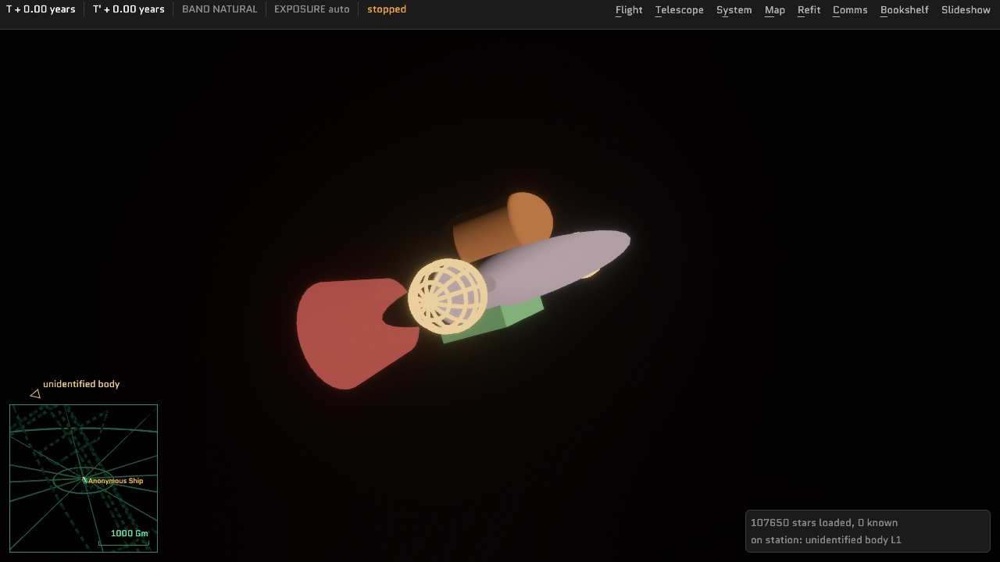

## Drones

Drones are **stateless particles**: each one's position is a closed-form function of its index, a
seed and `t`, evaluated in the vertex shader over one quad per drone. That is the same rule as the
hull: the picture is a function of the recipe and the clock. It also means no particle simulation
to keep in step, and no dependency such as `bevy_hanabi` to check against Bevy 0.19 and the browser
(WebGPU) build.

- **Count** follows drone volume, `particles_per_m3`, capped.
- **Working:** arcs from the drone part's docks to points on the sliver, a dwell at the frontier,
  and the arc back. On a dismantle they carry glowing pieces home, which reads as energy going back
  into storage.
- **Moving a part:** they swarm the joint.
- **Idle:** most docked, a thin patrol drifting over the hull.
- **At a distance:** the swarm fades into a soft haze over the frontier before individual motes
  would fall below a pixel.

As built (`em_render::drone_material`, `drones.wgsl`): the quads are one mesh, each carrying its
drone's index in a vertex, since Bevy's shared vertex buffers offset `vertex_index`. Docks and
targets are fixed arrays in the material's uniform, which the host fills. A hash of the index picks
each drone's role against two fractions, working and patrolling, so raising either adds drones
without reshuffling the rest. A working drone takes a new target every trip, switching while it is
docked. Haze is a mote's light spread over a disc about the spacing between drones, and never
narrower than a few pixels, because a quad under a pixel lands on no pixel center and sparkles. The
light is conserved, so the haze has the swarm's true brightness per pixel, as the hull does, and a
sparse swarm makes a faint haze. The clock is seconds since the refit round began (R4's `t`), or
since the view was spawned when idle. The host takes that difference in `f64` and only then narrows
it to the shader's `f32`, which resolves a clock since J2000 only to seconds.
`crates/lc-client/examples/drones_void.rs` photographs it.

On the player's ship (`lc_client::drones`), what the material is told is a pure function of R4's
`Frame`. The count is `PARTICLES_PER_M3` = 10⁻³ per m³ of drone part, 785 on the starting ship,
capped at `MAX_DRONES` = 8192 quads, since the vertex shader runs over all of them every frame.
Past the cap a mote stands for several drones: a fixed share of the width of the cube of drone part
it stands for, with the rest of their light in its brightness. Widening it enough to carry all the
light in area drew a GSV's swarm as a few hundred blobs. Docks are points just off the drone parts' surfaces, where no other
part covers them. A build or a dismantle sends drones to its sliver, and a dismantle's come home
glowing. A move sends them to ring the moved part's rim, from its foot to its middle. With no step
working, a few patrol and the rest stay docked.

The shader gives each drone a new target every trip, so a target that jumped would make every
drone on its way there jump with it. Instead each target is a continuous function of the step's
fraction: it sits on a fixed meridian of the part, where `Working::across` is a fixed share of the
way through the band. It is stood off along the meridian's ray rather than the surface normal,
because the normal turns at once over a cylinder's rim. Where the band crosses a flat stretch, such
as the hull's belt seen from its center, the targets move fast, because the band does reach all of
that stretch at once. Targets still change from one step to the next, so traffic fades in over the
first tenth of each step, or one trip if that is shorter, and out over the last. That is also why
no drone flies before a step starts or after it ends.

The drones' clock is the round's while it loops. `--refit-at` freezes the construction but not the
traffic, so a burst of one step moves; `--rate 0` freezes both. Four consecutive frames of the
dismantle at `--refit-at 0.1 --rate 3`, each mote a little further along:

 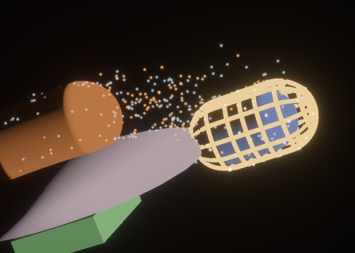
 
 The shader guards its distance to
the eye against zero and nothing else. It once clamped at 10⁻⁶, which was a micrometer in the
example and 150 km in the client, whose unit is an AU, and turned every mote into haze.

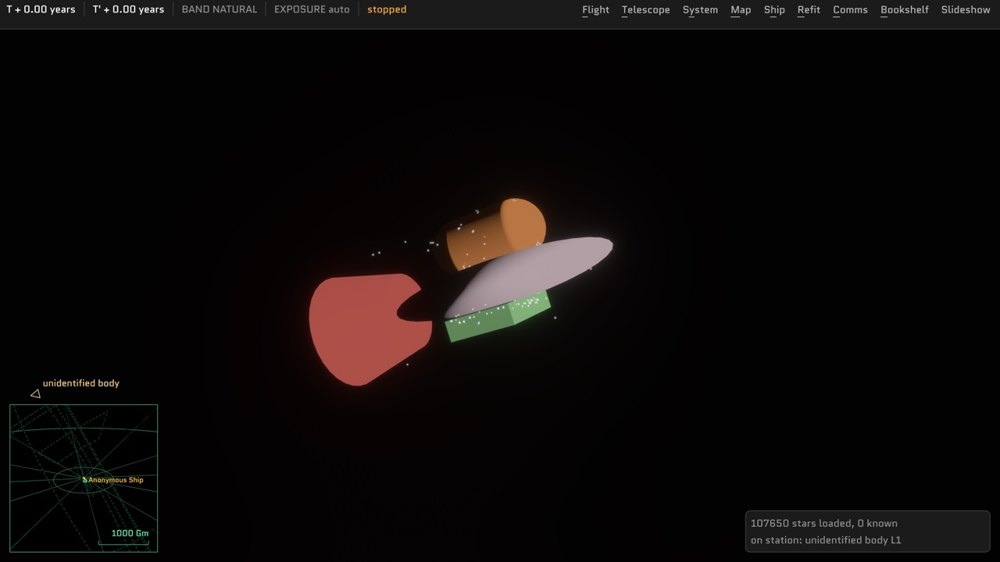

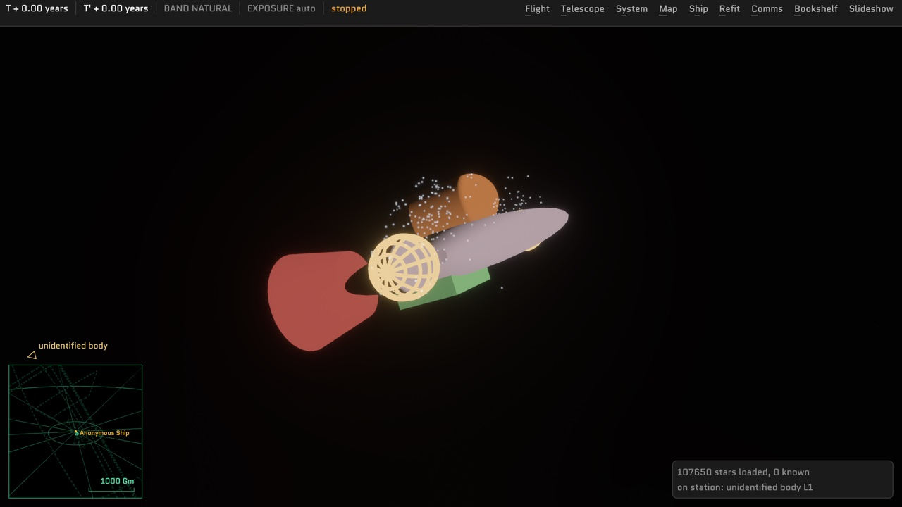
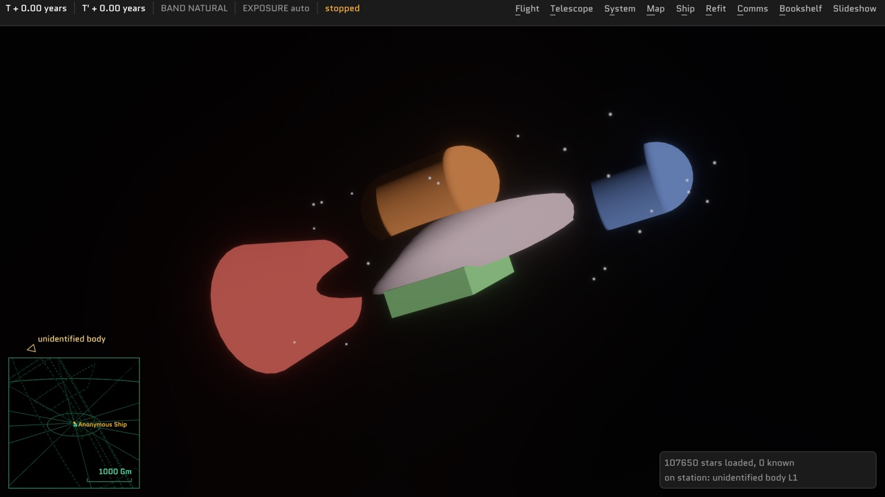
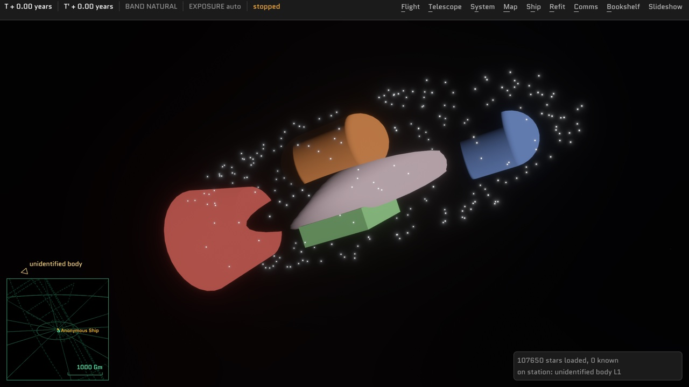

## The field

The envelope from [29-ship-form.md](29-ship-form.md), meshed coarsely, drawn as **two layers**
whatever is decided about air:

- **Inner: clear.** A fresnel rim, faint, with the ship plainly visible through it. If air is ever
  held, this is where the haze goes. `haze.rs` already scatters sunlight through a planet's
  atmosphere, and a park's sky is the same problem in a smaller volume.
- **Outer: the radiator.** Its color is a blackbody at the field's temperature through
  `em_spectra::blackbody`, and its brightness is **physical**: σT⁴ over its area, through the same
  exposure as the stars. The hull's plume already works this way ([`plume.rs`](../../crates/lc-client/src/plume.rs)):
  the color is a consequence, not a setting. At 400 K the outer layer is invisible in the visible
  bands. At 2 400 K on a dive it glows red-orange. At 4 600 K it is the brightest thing on screen.

**How it is drawn.** One mesh, three draws: the far wall, the inner rim, then the near wall, which
alone has alpha and so is the only one that can hide anything. By Kirchhoff each mode's emissivity is
its absorptivity, and a thin shell's grows toward one along a grazing path, so a Clear field is
limb-brightened and a Black one glows evenly. The same number is how much of what is behind a wall it
takes out: Clear shows the ship, Black hides it. The shader takes kelvin and fractions and a table of
blackbody colors the host has already put through the observer's bands, so nothing in
`em_render::field_material` knows a `Balance`.

**The mode sets the surface.** Clear is a shimmering, mostly transparent skin: thin-film color bands
that drift across it like a soap bubble's, over the fresnel rim, with the heat glow showing through
as a tint. Black is matte and dark, and the heat glow is all there is to see. A switch sweeps the new
surface across the envelope over `field_switch_s`, from the Mind outward.

| field state | drawn |
|---|---|
| idle | a faint rim, a slow shimmer |
| warm | a colored glow, even over the surface |
| beamed | a **hot spot** on the envelope toward each incoming beam's bearing, from `Outbound::Illuminated`, spreading as the field fills |
| past 80% of `Q_max` | the glow goes uneven and begins to flicker, faster as it nears the limit |
| collapse | below |

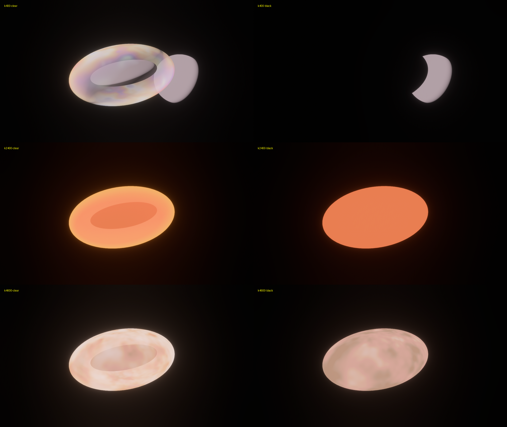

At 400 K the glow is nothing in the visible: Clear shows the ship and the world behind it through
the sheen, and Black is a hole in the world. At 2 400 K it is red-orange, Clear's limb the brighter.
At 4 600 K it is the brightest thing in the frame, and uneven.

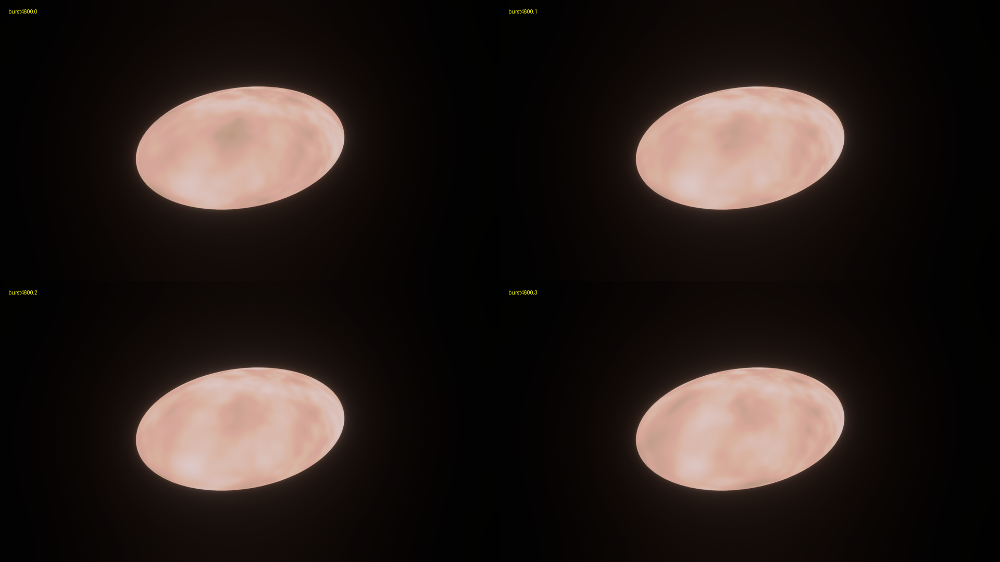

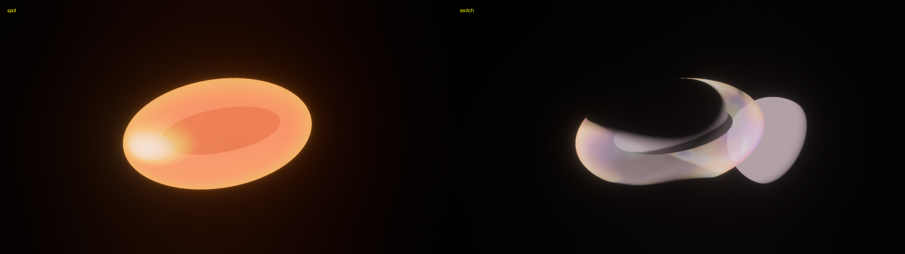

**Collapse** is a white flash and a sphere of hot debris expanding and cooling through the colors
of the afterglow over `collapse_afterglow_s`. Nearby fields brighten when the spike lands on them,
each at its own retarded time, so a cascade is seen spreading at c. From a distance, a collapse is
drawn by the photometry: a new point in the sky, as bright as [30-the-field.md](30-the-field.md)
says.

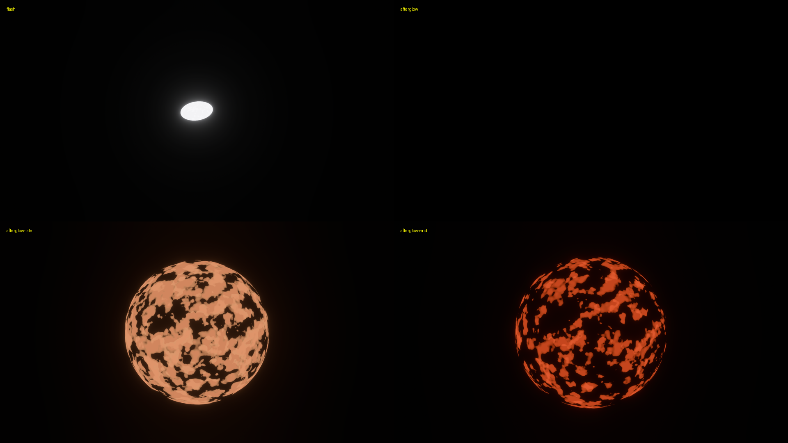

## Beams and plumes

- **A beam is invisible**, because vacuum scatters nothing. The one exception is an observer inside
  the cone, who sees the emitter as a blinding point in the beam's band. The map draws your own
  beams and the bearings of beams landing on you ([31-directed-energy.md](31-directed-energy.md)).
- A **fore** emission lights the bow's apertures as a drive lights the stern's.

### The exhaust cone

A photon drive's exhaust has no gas in it. Seen from the side, it is invisible; seen from inside, it
is a blinding point. `plume.wgsl` draws a reaction drive: a glowing column of fuel-rich gas 1.5 hull
lengths long, with soot lanes, heated by the jet power `½ F v`. None of that exists here. And the
cone that matters is thousands of times longer than any hull: 21 km of courtesy radius behind a
starting ship, 21 000 km behind a GSV.

The current shader is not the cost problem it might look like. It is one draw per burning ship: a
proxy cone, with each covered pixel marching 24 samples back along its ray. Cost goes with the pixels
covered and not with the length. What does not survive a longer cone is its content, so it is
replaced by two things:

- **The aperture.** The engine's open face glows as a blackbody at the flux leaving it, `F c` over the
  aperture's area, not `½ F v`. It is white-hot at any real thrust, and it is what a burning ship looks
  like from the side. A short near-field glow off the face, a few aperture widths, keeps the direction
  of thrust readable at a glance.
- **The cone**, drawn as an indicator rather than as light: a long, faint cone along the exhaust, out
  to the courtesy radius, shaded by how much heat lands at each distance. Heat falls as `1/d²` along
  the axis, so the shading is **closed form per pixel**: take the point where the view ray passes
  closest to the axis, and read the flux there. There is no march and no loop, one draw per cone,
  and the fragment works in the proxy's own coordinates from the surface back, as `plume.wgsl` does,
  so `f32` holds at 21 000 km.

  "Closest" is measured as an **angle from the apex**, not as a distance from the axis line. From
  beside the two are the same point. From behind the ship, the nearest point to the line can fall
  behind the apex, outside the cone, while the ray still crosses the cone further out, which leaves
  a hole. The angle along a ray has one minimum, and it solves as a linear equation. When the ray
  runs along the axis, the view from inside or from past the end, that solution cancels to noise.
  So the ends of the ray's segment are always tried as well, and the smallest of the three
  candidates wins.

The cone is drawn for your own ship whenever it burns, for any ship whose courtesy radius you are
inside, and for a selected ship. It uses the hazard color from [18-ui-style.md](18-ui-style.md)'s
palette, and is brightest where it would cook. The map draws the same cone as lines.

The hazard color is 18's red-orange. The material takes both of its colors as uniforms, so it
stays free of either product's palette. The aperture glow is a second material in
`exhaust_cone_material` rather than a reshaped `plume_material`, so the game's reaction-drive plume
is untouched until the switch to photon drives replaces it. The starting drive's face, all of
1.1 × 10²⁰ W through 100 m, is `lc_world::emit::aperture_temperature_k`: 7.0 × 10⁵ K.

Photograph it in a void with `cargo run -p lc-client --example cone_void -- --view
beside|behind|inside --length <m>`. Its flags are listed in the example's module doc.

An observer inside someone's cone gets the blinding point, from the photometry, as for a beam
([31-directed-energy.md](31-directed-energy.md)).
- God view may draw every beam's cone, as a debug overlay, like the causality lines of
  [07-rendering.md](07-rendering.md).

## Temporary assets

Before the mesher, the construction pass or the field shader exist, everything above has a
placeholder, so the rest can be built and a refit visibly changes the ship straight away:

- **Each part as a Bevy primitive mesh**, scaled to its solved size: `Sphere` scaled for an
  ellipsoid, `Capsule3d`, `Cuboid` for a slab and for the Mind, `Cylinder`, `Torus`,
  `ConicalFrustum`. No blends, and a slab's corners square.
- **A flat color per kind.**
- **Construction as scale plus wireframe:** the growing part drawn in `BodyWireframeMaterial`
  during the truss phase, crossfading to solid.
- **Drones as instanced motes** on straight lines.
- **The field as a fresnel sphere** around the bounds, tinted by temperature once there is one.
- **Spars uncut**: the plain primitive. The saddles and straps arrive with the distance-field
  mesher.

Until the grid gives a form its extent, the orbit camera frames the smallest sphere about the Mind
holding the corners of the form's bounds, so its stops and standoff follow the form's size as the
ovoid's follow its length.

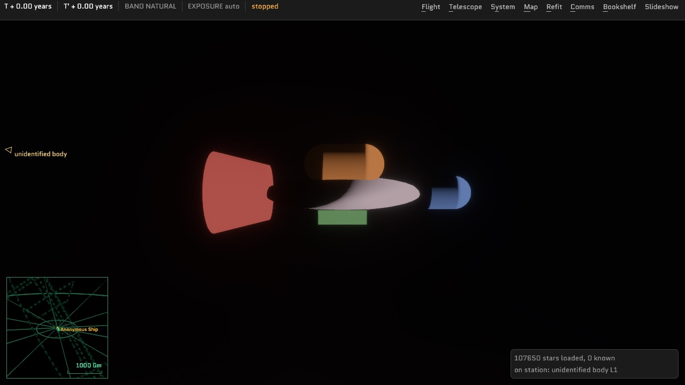

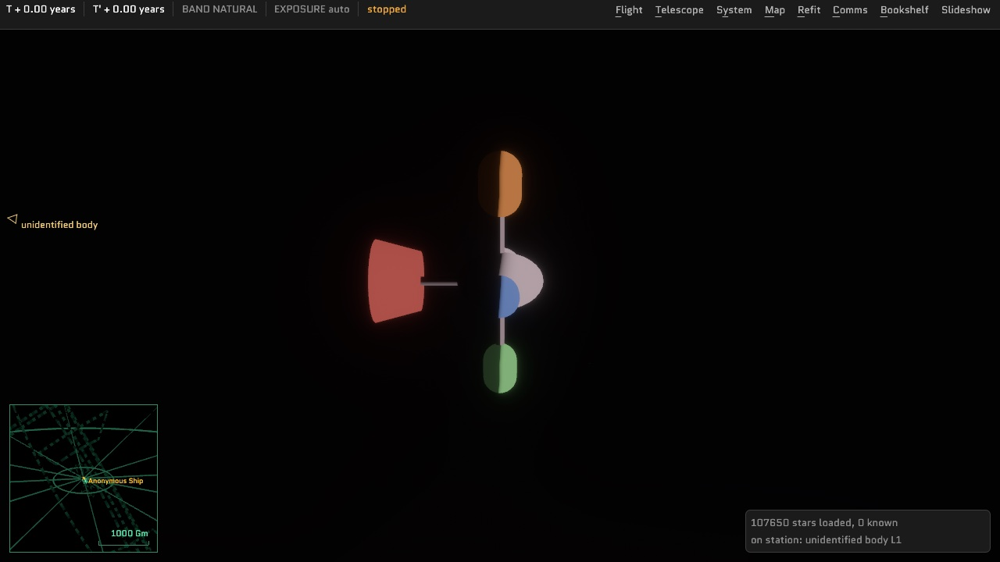
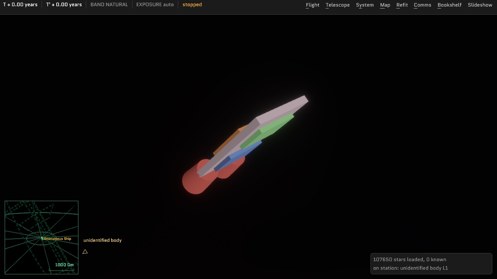
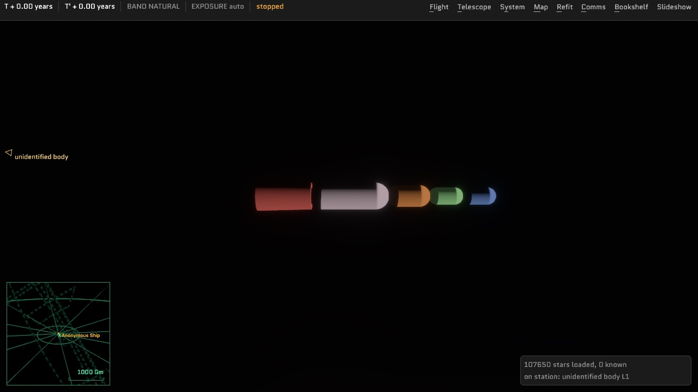

Every placeholder is replaced independently. None of them is on the server's side of anything.

## Photographing it

WGSL cannot be asserted from a test ([AGENTS.md](../../AGENTS.md)), so each piece gets a way to be
photographed:

| flag | shows |
|---|---|
| `--form <plate\|spindle\|cluster\|default>` | the ship in a preset form |
| `--view form` | the editor ([29-ship-form.md](29-ship-form.md)) |
| `--demo refit` | a staged refit, with `--refit-at <fraction>` to freeze it at a point, or `--refit-from <fraction>` to run it from there. With `--form default*k` every part is `k` times larger |
| `--demo-cam-at <x:y:z:m>` | orbit a point of the ship's frame from `m` meters, past the boom's stops. Aimed with `--demo-cam`; how the truss's pitch is photographed on a GSV |
| `--demo collapse` | a ship collapsing beside two others, one close enough to follow it |
| `--field-k <kelvin>` | the player's field held at a temperature, for the shader |

Until the player has a field, the shader is photographed in a void: `cargo run -p lc-client
--example field_void -- --field-k <kelvin> --mode clear|black`, around a stand-in hull, with its
own `--burst`, `--spot`, `--switch` and `--collapse`. Its flags are in the example's module doc.

`--burst` is the only way to see the saturation flicker, as it is for any flicker.

## Where it goes

| crate | new | changed |
|---|---|---|
| `em-render` | `hull_material` (triplanar, kind regions, reveal mask, living lights), `field_material`, `drone_material`, `exhaust_cone_material` (the cone, and the aperture glow beside it) | `plume_material` retires once `plume.rs` stops drawing the reaction drive |
| `lc-client` | `hull_mesh.rs` (finishes, painting, caching) over `surface_nets.rs` (any field), `truss.rs`, `refit_hull.rs`, `construction.rs` (the function of recipe and `t`), `drones.rs`, `field.rs` | `hull.rs` draws the form instead of the ovoid. `plume.rs` draws the aperture glow at `F c` and the cone |
| `lc-client/assets` | texture-graph graphs per kind. `field.wgsl`, `hull.wgsl`, `drones.wgsl`, `exhaust_cone.wgsl`, `aperture_glow.wgsl` | |

Materials go in `em-render` because nothing in them is specific to Lightcone. A hull with regions
and a reveal mask is as much Exotic Matters' as anyone's.

## Order of work, across 29 to 32

Each step leaves the game playable and adds one thing a player can see or feel.

1. **The form replaces the loadout.** `lc_world::form`: parts, the Mind, densities, the starting
   form. The planner plans rounds. `Form` on the wire and in saves. On the client, the placeholder
   meshes, construction as scale and wireframe, and instanced drones. Until the editor exists, the
   refit window is a list of parts with snapped size fields, and adds parts at default placements.
   A refit visibly changes the ship.
2. **The form has geometry, and an editor.** The grid, the shadow table, the envelope and moments.
   Solar reads the shadow. Hull mass by area. The editor, as a third view, with the budget and
   snapping.
3. **The field.** The heat account, collapse and proximity. `HULL_K` retires. Photometry of fields.
   The field shader, and the HUD's countdown.
4. **Directed energy.** Exhaust from heat, `Order::Emit`, beams fanned out and delivered, reciprocity,
   the gain moved onto stars, radio charged. The emit window.
5. **The real hull.** Surface nets, the truss and plating passes, materials by kind, scale-true
   detail. The placeholders go.
6. **Later:** bays and what is built in them, air under the field, parks, Dyson swarms.

Step 3 comes before 4 because heat has to exist before anything can dump it, and proximity heating
from a collapse needs no beams.

## Open

- **Refraction** of the stars behind the field. It needs the sky behind the ship, which is drawn by a
  different camera. It is a nice-to-have, and the rim carries the look without it.
- **Meshing a GSV.** A 50 km hull at fine detail is far too many triangles at once. It will want
  levels of detail per part, and the frontier meshed finer than the rest.
- **Looking into a bay.** The interior grid is procedural, but a ship being built inside a bay is the
  construction pass applied to a second form inside the first. That is the screenshot, and it waits
  for bays.
