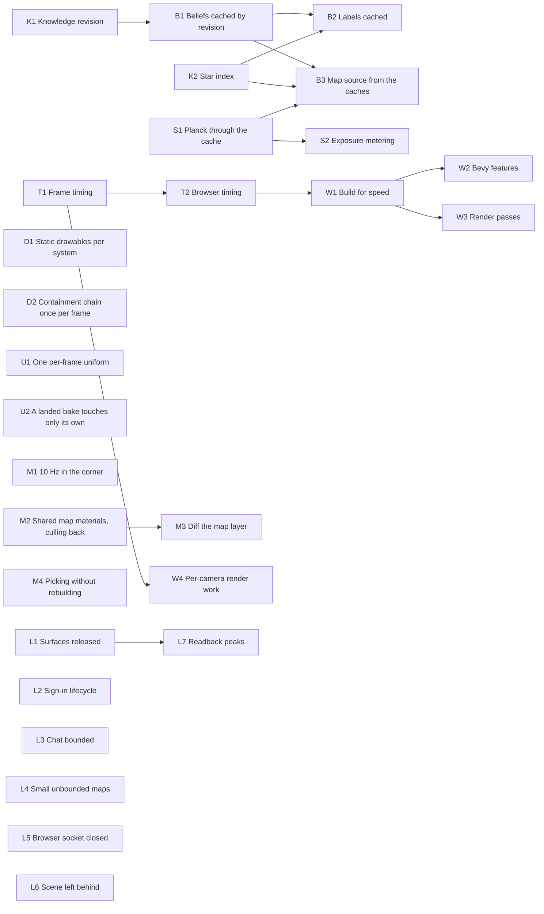

# The client's frame, and what it leaks

The browser build is one thread: every Update system, egui pass and render extract shares it. A
read of `lc-client` (2026-09-24) found most of the avoidable cost on the CPU, rebuilding each frame
what changes only with knowledge or with the system, several times over and often across the whole
6,000-star catalog. It also found a GPU memory leak that grows with every body seen up close.

Nothing was profiled; the costs are from reading the code. T1 exists so every later task is judged
by a number.

## How to use this file

- **What can I start?** `python3 tools/dag.py lightcone/docs/plans/client-frame.md ready`.
- **Claim a task** by changing its status line to `- status: active <your branch>`, in its own
  commit, before starting work. **Finish it** with `- status: done <PR or commit>` in the same PR.
- **Edit only your task's block.** New tasks go at the end of their stream with the next free
  number. A task that turns out unnecessary becomes `- status: dropped <why>`; it is never deleted.
- Every task ends as [AGENTS.md](../../../AGENTS.md) says: tests that fail when the mechanism is
  broken on purpose, `tools/api_surface.py` on each crate touched, screenshots through `--shot` for
  anything drawn, and `cargo clean`.
- A cache is only done when a test shows it invalidates: change the knowledge, the system or the
  view, and the cached thing must change with it.
- `python3 tools/dag.py lightcone/docs/plans/client-frame.md graph --write` regenerates the diagram.

## Decided

- **The map always runs.** It is the corner thumbnail while flying, and that stays live. What it
  may do is refresh at 10 Hz while in the corner and not being rotated or panned (M1).
- **Map transforms are written every frame.** Everything moves too fast for anything else to pay.
- **Texture LOD is deferred:** resolution by on-screen size, progressive upgrades, a bake budget,
  mips, dropping the CPU readback. The findings are kept under *Deferred* below.

## Shape of the graph

Three contract tasks come first: a revision counter on `Knowledge` (K1), an index from `StarId`
into the session's catalog (K2), and the frame timing that judges everything else (T1). After that:

| stream | what |
|---|---|
| **B** beliefs | cache what a craft believes by knowledge revision, not by the microsecond |
| **D** drawables | what never changes about a body, computed once per system |
| **S** spectra | every Planck integral through the cache; cheaper exposure metering |
| **U** uniforms | time-varying phases out of materials into one per-frame uniform |
| **M** map | 10 Hz in the corner, shared materials, culling, diffing instead of respawning |
| **W** wasm | build for speed, SIMD |
| **L** leaks | surfaces, sign-in, chat, drives, sockets, scene entities, readback peaks |

<!-- graph -->

<!-- /graph -->

## K: contracts

### K1 · Knowledge revision

- status: todo
- needs: —
- touches: `crates/lc-world/src/knowledge/mod.rs`
- read: 25
- deliver: a `revision()` on `Knowledge` that increases on every write that can change a belief: filing a sample, a conclusion, a name, a replica merge, decimation. One place bumps it, not each caller. Also `members(star)` as a range over that star's subjects rather than a filter over every file.
- done when: a test writes through each public mutating path and sees the revision move, and reads through every read path and sees it stay put.

### K2 · Star index

- status: todo
- needs: —
- touches: `crates/lc-client/src/session.rs`, `crates/lc-client/src/system_panel.rs`, `crates/lc-client/src/map_source.rs`
- read: —
- deliver: `Session::star(id)` through a `HashMap<StarId, usize>` built with the catalog, and every `stars.iter().find(|c| c.id == ..)` (`session.rs` ×4, `system_panel.rs`, `map_source.rs`) going through it. Also cache `local_star()` until the ship has moved, since `sync_system` runs it from both `advance` and `update_bodies`; and drop that second `sync_system` call if `advance` has already made it this frame.
- done when: no linear scan of `Session.stars` remains outside building the index.

### T1 · Frame timing

- status: done (baseline in *Measured*)
- needs: —
- touches: `tools/trace_systems.py`
- read: 13
- deliver: native only. Bevy's own `trace` and `trace_chrome` features already put a span on every system, schedule and camera, so no code was needed: `tools/trace_systems.py` reduces a chrome trace to milliseconds per frame per system. The browser half is T2.
- done when: a numbers table for three scenes — flying in Sol with the thumbnail, the map full-screen, a crossing — is added to this file's *Measured* section, and every later task adds its after-numbers there.

### T2 · Browser timing

- status: todo
- needs: T1
- touches: `crates/lc-client/src/bench.rs`, `crates/lc-client/src/bin/lightcone_web.rs`
- read: 14
- deliver: the same breakdown in the browser, where main world, extract and render share one thread and WebGPU calls cross into JS. `performance.mark`/`measure` around each schedule and camera so the browser's profiler shows them, and a `--bench`-like readout from a URL parameter. Needs a shard the page can reach; the dev stack or a local one.
- done when: *Measured* has the three scenes in Chrome, with the machine and browser named.

## B: beliefs

### B1 · Beliefs cached by revision

- status: todo
- needs: K1
- touches: `crates/lc-client/src/beliefs.rs`, `crates/lc-world/src/knowledge/body.rs`
- read: 25, 22
- deliver: `Beliefs::held` keys on `(star, revision)` instead of `(star, coordinate_time_s())`, which is microseconds and missed every frame (`beliefs.rs:74`, whose doc says "the second"). Split `BodyBelief` into what depends only on knowledge (names, kind, orbit chosen, radius, mass, colors, plane) and what moves (position, velocity); only the second is recomputed per frame, one Kepler solve per body.
- done when: a frame with an unchanged revision builds no belief; filing a sample rebuilds exactly once; positions still advance with time.

### B2 · Labels cached

- status: todo
- needs: B1, K2
- touches: `crates/lc-client/src/session.rs`, `crates/lc-client/src/pick.rs`, `crates/lc-client/src/hud.rs`, `crates/lc-client/src/panels.rs`
- read: 23
- deliver: `home_labels()` stops calling the uncached `beliefs::of` and `called()` per body; `Labels` live in a resource keyed on `(star, revision)`. `pick::sight` keeps body keys and resolves a label only for the hovered, selected and contact marks, not for all ~230 bodies. `called()`'s sort lookup stays as it is.
- done when: `pick::sight`, `hud::lines` and the Flight panel in one frame build labels at most once, and zero times when the revision has not moved. God view uses the same cache and `drawables_unpainted_at`.

### B3 · Map source from the caches

- status: todo
- needs: B1, K2, S1
- touches: `crates/lc-client/src/map_source.rs`
- read: 11
- deliver: `push_believed` takes its label and weight per body from a cache under the revision, including `guessed_mass_kg`, whose `radius_from_light` rebuilds a belief per sighting. `push_stars` keeps its star items and subjects keyed on the revision and the eye quantized to 0.1 ly; only the observer, contacts and local bodies are rebuilt each frame. Labels as `Arc<str>` so the snapshot, placement and galley share one allocation.
- done when: a still frame with the map open allocates no label strings.

## D: drawables

### D1 · Static drawables per system

- status: todo
- needs: —
- touches: `crates/lc-world/src/system.rs`, `crates/lc-client/src/starfield.rs`, `crates/lc-client/src/session.rs`
- read: 26, 07
- deliver: what `drawables_at` re-derives every frame and never changes — `Surface::classify`, giant, world, climate, airless, rings lookup, spin, pole, name — computed once when the system is entered and held beside it. Per frame, only position, phase and effective radius. `update_bodies` writes positions into the existing mesh's attribute rather than building and replacing the mesh. The server's lean survey path is separate; don't merge them.
- done when: the drawables per frame equal the old `drawables_at` output field for field over a year of Sol, and entering another system rebuilds the static part once.

### D2 · Containment chain once per frame

- status: todo
- needs: —
- touches: `crates/lc-client/src/map_source.rs`, `crates/lc-client/src/map.rs`, `crates/lc-client/src/hud.rs`
- read: —
- deliver: `map_source::primary` → `influence::containment_chain` is a Kepler solve and a sphere-of-influence propagation per body per level, asked by both the map and the HUD. Compute it once per frame into a resource, testing only the current primary and its parent's children, and fall back to the full walk only when that test fails.
- done when: a crossing of a sphere of influence changes the resource on the frame it happens, and a frame between crossings walks one level.

## S: spectra

### S1 · Planck through the cache

- status: todo
- needs: —
- touches: `crates/lc-client/src/session.rs`, `crates/lc-client/src/resolved.rs`, `crates/lc-client/src/envelope.rs`, `crates/lc-client/src/plume.rs`, `crates/lc-client/src/hull.rs`, `crates/lc-client/src/map_source.rs`
- read: 04
- deliver: `session::spectrum_at` made `pub(crate)` and every per-frame `band_radiance` going through it: `resolved::lit_radiance`/`blackbody_at`, `Grounds::of`, `air_of`, `hull::radiance_at` (called twice a frame), `envelope::source_radiance`, `plume::shine`, and the map's `sun_band_w`, which depends only on the band and becomes a table. Each is a 33-point Simpson rule, 33 `exp`s a band.
- done when: the rendered values are unchanged within the cache's quantization, and a steady frame calls `band_radiance` only on cache misses.

### S2 · Exposure metering

- status: todo
- needs: S1
- touches: `crates/lc-client/src/session.rs`
- read: 04
- deliver: `expose_to_percentile` (`session.rs:791`) with `select_nth_unstable_by` instead of a full sort, into a sample buffer reused across calls. Rest luminance cached per star, the Doppler shift applied through `spectrum_at`'s key. When `hold_exposure` and `sample_scene` both ask in one frame, meter once.
- done when: the chosen exposure is identical to before on the existing exposure tests.

## U: uniforms

### U1 · One per-frame uniform

- status: todo
- needs: —
- touches: `crates/lc-client/src/starfield.rs`, `crates/lc-client/src/plume.rs`, `crates/lc-client/src/resolved.rs`, `crates/lc-client/src/surfaces.rs`, `crates/lc-client/assets/shaders/`
- read: 07
- deliver: coordinate-time phases — `corona_flow_phase`, plume churn, weather drift — out of material uniforms into one shared per-frame uniform, extracted and written once. A material then changes only when its own state does, so it is not re-prepared (new uniform buffer and bind group) every frame. `f64` time is reduced modulo each effect's period before narrowing to `f32`. Also fix the stale comment at `starfield.rs:219`: in Bevy 0.19 `get_mut` marks changed only on write.
- done when: a steady frame with a corona, a burning plume and a cloudy world visible modifies no material asset, and the screenshots match before and after.

### U2 · A landed bake touches only its own

- status: todo
- needs: —
- touches: `crates/lc-client/src/procedural.rs`
- read: —
- deliver: `run_bakes` calls `iter_mut` on every population, surface, sky and plume material whenever any bake lands (`procedural.rs:417`), which re-prepares all of them. Mark only materials that bind the landed image.
- done when: a landed bake for one body re-prepares that body's materials alone.

## M: map

### M1 · 10 Hz in the corner

- status: todo
- needs: —
- touches: `crates/lc-client/src/map.rs`, `crates/lc-client/src/map_panel.rs`
- read: 13, 11
- deliver: while the view is World (the map is the corner thumbnail) and the map is not being rotated or panned, `survey`, `place` and the map camera's render run at 10 Hz; the texture holds its last image in between. Full rate on any input to the map, and always when the map is the main view. Thumbnail labels capped to the heaviest few.
- done when: T1's numbers show the map stages on one frame in six while flying, and dragging the thumbnail is as smooth as before.

### M2 · Shared map materials, culling back

- status: todo
- needs: —
- touches: `crates/lc-client/src/map.rs`, `crates/lc-client/assets/shaders/map_line.wgsl`
- read: 11, 18
- deliver: every placement gets its own material today (`map.rs:873`, "because its cap changes with its form"), and so does every spread. The per-item part is the tube fraction; move it to a vertex or instance attribute (or quantize it into a few buckets), so materials are one per `(color, form)` — a handful — shared by all items. Give item and spread meshes a correct `Aabb` and drop their `NoFrustumCulling`; only spokes and rings keep it.
- done when: the map scene holds a fixed number of materials however many items it draws, off-screen items are culled, and the screenshots match.

### M3 · Diff the map layer

- status: todo
- needs: M2
- touches: `crates/lc-client/src/map.rs`
- read: 11
- deliver: `map.rs:529` despawns and respawns the whole layer when the placement keys or the ring count change, which happens at every decade during a zoom and whenever a contact or star comes or goes. Keep a `HashMap<ItemKey, Entity>` and spawn and despawn only the difference; a pool of `MAX_RINGS` ring entities shown and hidden with `Visibility`; annulus meshes cached by shape rather than `meshes.add` per spawn.
- done when: zooming through three decades spawns no entity that already existed, and a contact appearing spawns only its own.

### M4 · Picking without rebuilding

- status: todo
- needs: —
- touches: `crates/lc-client/src/map_pick.rs`, `crates/lc-client/src/pick.rs`, `crates/em-map/src/camera.rs`, `crates/em-map/src/outline.rs`
- read: 11
- deliver: a per-frame projector holding the view basis, datum, `tan_half` and aspect, instead of `clip` recomputing them per point. Population torus outlines built once in the unit shape and transformed, not regenerated per population per frame, in both `map_pick` and `pick`. Candidate building skipped when there is no hover and nothing selected. `pick::sight` stops running `apparent_dir` over all 6,000 stars when the pointer is over egui or absent.
- done when: a frame with no pointer over the view does no picking work beyond the selected subject.

## W: wasm

### W1 · Build for speed

- status: todo
- needs: T2
- touches: `Cargo.toml`, `tools/build-wasm.sh`, `.cargo/config.toml`
- read: 14
- deliver: `wasm-release` at `opt-level = 3`, `wasm-opt -O3` instead of `-Oz`, and `+simd128` in the wasm target's rustflags with `--enable-simd` on `wasm-opt`. SIMD is safe for us: every browser with WebGPU already has wasm SIMD (Chrome 91, Firefox 89, Safari 16.4), so it narrows nothing. Record the size change and T1's before/after in *Measured*; if the size grows past what the CDN budget in 14 allows, try `opt-level = 2`.
- done when: the browser build runs on Chrome, Firefox and Safari with SIMD on, and the numbers are recorded.

### W2 · Bevy features

- status: todo
- needs: W1
- touches: `crates/lc-client/Cargo.toml`, `Cargo.toml`
- read: 06
- deliver: `bevy` with `default-features = false` and an explicit list, so gilrs stops polling `getGamepads()` and unused UI, sprite, text, picking, audio, gltf and animation systems stop running. `dev::*` systems gated off the wasm build. Native keeps what it needs.
- done when: native and browser both run the full game, and the dropped plugins are named in the PR.

### W3 · Render passes

- status: todo
- needs: W1
- touches: `crates/lc-client/src/app.rs`, `crates/lc-client/src/haze.rs`, `crates/lc-client/src/tonemap.rs`
- read: 07
- deliver: the haze camera and its composite active only when there are shells to draw. `CameraOutputMode::Skip` on the sky camera, which the UI camera overwrites anyway. MSAA 4× on the full-screen `Rgba16Float` targets tried off; this changes the image, so it is the user's call on screenshots.
- done when: screenshots with and without are shown to the user, and the haze pass is absent between stars.

### W4 · Per-camera render work

- status: done (this branch; see *Measured*)
- needs: T1
- touches: `crates/lc-client/src/app.rs`
- read: 07
- deliver: the client has no Bevy lights, yet Bevy clustered them on the GPU for three cameras. `app::no_lights` turns GPU clustering off, so Bevy falls back to its CPU path, which with nothing to cluster costs about a third as much. `ClusterConfig::None` on each camera would remove the rest, but with it `--bench` lost the Metal device in three runs of eight ("Cannot allocate sample buffer", then `DeviceLost`), against none in seventeen without; not pursued. The other per-camera costs turned out not to be waste: the map and haze cameras already skip tonemapping and bloom, and the haze camera MSAA. What is left is MSAA, which changes the picture and is W3's.
- done when: T1's traces show the clustering systems gone and each camera's `camera_schedule` smaller, and the screenshots match.

## L: leaks

### L1 · Surfaces released

- status: done 0d745a62
- needs: —
- touches: `crates/lc-client/src/surfaces.rs`, `crates/lc-client/src/procedural.rs`
- read: 07, 28
- deliver: `Surfaces.by_body` is "kept for the session" and never pruned, and each body holds 30–50 MB of GPU textures by strong handle. Prune it when the star changes, and cap it within a system at a byte budget (least recently resolved first; smaller on wasm). `Bakes::forget` for requests whose images were dropped before landing, so `unsettled` does not hold them. Survey beauty shots count as resolving. This is eviction only; resolution stays fixed until LOD.
- done when: a test visiting two systems ends holding only the second's surfaces, and surveying more bodies than the budget holds stays under it.

### L2 · Sign-in lifecycle

- status: done (this branch; unit-tested only: the real flow needs a broker and a person)
- needs: —
- touches: `crates/lc-client/src/auth.rs`, `crates/lc-client/src/signin_ui.rs`
- read: 16
- deliver: cancelling a sign-in closes the loopback listener. Today dropping `Loopback` drops only the receiver, and the thread stays blocked in `accept()` with the port open (`auth.rs:157`), one per cancelled attempt. A cancel flag set on drop plus a non-blocking or self-woken accept, and read/write timeouts on the accepted stream. Separately, each attempt is numbered, and `collect` drops reports from an older attempt, so a `Granted` landing after a sign-out or cancel no longer signs the player back in and rewrites the vault.
- done when: a test cancels a sign-in and finds the port closed; a test signs out with a ticket in flight and stays signed out.

### L3 · Chat bounded

- status: done (this branch; capped at 500 lines. Once bounded, the linear duplicate check and the sort per draw are bounded too, so neither was indexed; `show_rows` not done, since the lines wrap to different heights)
- needs: —
- touches: `crates/lc-client/src/chat.rs`, `crates/lc-client/src/radio_panel.rs`
- read: 27
- deliver: `loose` capped, as `console.rs` caps its lines, and each conversation too. The duplicate check indexed instead of linear, and `loose_where` sorted on insert rather than on every draw of the radio panel. Long logs drawn with `show_rows`.
- done when: a long session's chat memory is flat, and the panel draws only visible rows.

### L4 · Small unbounded maps

- status: done (this branch; drives are bounded at 1024 ships rather than pruned to contacts, because a ship out of sight needs its last drive state when it reappears. Offline capacity stays unlimited: that is a dev and test mode)
- needs: —
- touches: `crates/lc-client/src/uplink.rs`, `crates/lc-client/src/watch.rs`
- read: —
- deliver: `drives` (`uplink.rs:651`) pruned to ships in `contacts` when a `Present` arrives. In single-process mode, the client's `Knowledge` has unlimited capacity and its `unsaved` list is never drained: drain it with `take_changes` each tick when there is no shard, and give it the same capacity as a replica.
- done when: tests show both flat over many ticks.

### L5 · Browser socket closed

- status: done (this branch; compiles for wasm, not yet watched in a browser: needs T2's setup)
- needs: —
- touches: `crates/lc-client/src/link.rs`
- read: 08
- deliver: `BrowserLink` closes its socket and clears its `on*` handlers on drop and on an undecodable message, instead of only marking itself closed while the server keeps streaming. `queued` bounded while connecting.
- done when: a link dropped after an error leaves no open socket (checked in the browser's network panel, noted in the PR).

### L6 · Scene left behind

- status: active claude/game-loop-optimization-71831f
- needs: —
- touches: `crates/lc-client/src/app.rs`, `crates/lc-client/src/resolved.rs`, `crates/lc-client/src/envelope.rs`, `crates/lc-client/src/hull.rs`, `crates/lc-client/src/plume.rs`
- read: 13
- deliver: a `SceneScoped` marker on resolved spheres, envelopes, hulls and plumes, despawned in one system on `OnExit(InGame)`, along with the handle maps that index them. Today they stay spawned and drawn on the Unreachable screen.
- done when: leaving the game leaves no scene entity, and re-entering rebuilds them.

### L7 · Readback peaks

- status: todo
- needs: L1
- touches: `crates/lc-client/src/procedural.rs`
- read: 07
- deliver: `run_bakes` starts every waiting bake in one frame, and each reads its whole texture back into a `Vec` that the WebGPU backend copies again: a 24 MB cube briefly costs 48 MB, and wasm memory never shrinks, so every peak is permanent. Cap bakes in flight by bytes (one or two at a time) and group waiting requests by face size, since the baker's scratch pool only reuses textures of one exact size. This is the queue; the budget by screen size belongs to LOD.
- done when: resolving a rocky world never has more than the cap in flight, and the wasm heap after touring Sol is recorded in *Measured*.

## Measured

Every task adds its after-numbers here, measured the same way.

### Baseline, 2026-09-24, at `908142f8`

Native only; the browser is T2. Apple M3 Pro, window 1280×720 physical on a 75 Hz display.
Workspace code built at `opt-level = 3` (dependencies already are), so the weights are nearer the
browser build's than a debug build's. Offline, with no shard: **no contacts, hulls or plumes**, so
everything that scales with craft is absent from A–C. D has four craft, which is not many.

| scene | flags |
|---|---|
| A, flying, map in the corner | `--at Earth --charted` |
| B, the map full-screen | `--at Earth --charted --panel map` |
| C, a crossing | `--charted --fly` (boosting for HC 6703-31, 4.23 ly) |
| D, traffic | `--demo traffic`: a local shard and four craft in view, nothing charted |

```bash
CARGO_PROFILE_DEV_OPT_LEVEL=3 cargo build -p lc-client --bin lightcone
target/debug/lightcone assets/catalogs/hygdata_v42.csv <flags> --frames 300 --bench 600
```

**`--bench`**, two runs each, main-world CPU in ms. Frame time was 13.3 ms in every run: one
refresh, so it says nothing below that.

| scene | mean | p95 | p99 |
|---|---|---|---|
| A | 1.85 / 1.84 | 2.04 / 1.97 | 2.16 / 2.09 |
| B | 1.84 / 1.83 | 1.96 / 1.95 | 2.08 / 2.09 |
| C | 1.87 / 1.89 | 2.05 / 2.07 | 2.18 / 2.23 |
| D | 1.89 / 1.91 | 2.02 / 2.06 | 2.09 / 2.13 |

**Traced**, ms per frame over 300 frames after 120 of warm-up. Tracing inflates main-world CPU by
about half (2.8 against 1.85), so read these for proportion.

```bash
CARGO_TARGET_DIR=target/trace CARGO_PROFILE_DEV_OPT_LEVEL=3 \
  cargo build -p lc-client --bin lightcone --features bevy/trace,bevy/trace_chrome
TRACE_CHROME=a.json target/trace/debug/lightcone assets/catalogs/hygdata_v42.csv <flags> --frames 120 --bench 300
python3 tools/trace_systems.py a.json --skip 120 --spans
```

| | A | B | C | D |
|---|---|---|---|---|
| Main schedule | 2.85 | 2.74 | 2.89 | 2.92 |
| — PreUpdate | 0.39 | 0.48 | 0.39 | 0.46 |
| — Update | 0.86 | 0.67 | 0.87 | 0.83 |
| — PostUpdate | 1.20 | 1.19 | 1.24 | 1.22 |
| Extract | 0.50 | 0.49 | 0.48 | 0.50 |
| Render graph (render-world CPU) | 3.10 | 2.96 | 2.90 | 2.96 |
| all `lc_client::` systems | 0.63 | 0.54 | 0.67 | 0.61 |
| `starfield::update_bodies` | 0.22 | 0.20 | 0.22 | 0.21 |
| `pick::survey` | 0.09 | — | 0.13 | 0.09 |
| `map::survey` | 0.09 | 0.08 | 0.09 | 0.05 |
| `panels::hud` | 0.06 | 0.04 | 0.08 | 0.06 |
| `map_panel::draw` | 0.03 | 0.10 | 0.03 | 0.02 |
| `starfield::update_sky` | 0.05 | 0.04 | 0.04 | 0.05 |
| `uplink::pump` | — | — | — | 0.05 |

Render-world CPU in A, by camera: sky (order 0) 0.97, haze (−2) 0.62, map (−1) 0.55, UI (1)
0.19. Across them: GPU clustering 0.47 (three cameras; the client has no lights), bloom 0.30,
`queue_submit` 0.66 for 30 submits a frame.

**What it says.**

- Our own systems are about a fifth of main-world CPU. PostUpdate — transforms, visibility, egui
  — is more than all of Update, and render-world CPU is more than the whole main schedule. On
  native those two run in parallel; in the browser they run one after the other on one thread.
  So W4, and whatever cuts entities and cameras, may matter more than the read expected.
- The map is cheap here: `map::survey` under 0.1 ms, and its camera 0.55 ms of render CPU. The
  belief rebuild the read called largest is inside that `survey`, so on native, with Sol charted,
  it is small. It grows with knowledge; B1 is still worth doing, but it is not a frame's worth.
- `pick::survey` does not run in B, which is why B's Update is lower.
- Four craft (D) cost nothing visible. Not exercised: tens of craft, plumes, bakes landing
  (warmed up past them), the radio and telescope panels, a beauty shot.

The browser build (`tools/build-wasm.sh`, `wasm-release` at `opt-level = "s"`, `wasm-opt -Oz`):
`lightcone_web_bg.wasm` 35.50 MB raw, 7.87 MB brotli; the build took 13 minutes.

### W4, 2026-09-25

Measured differently from the baseline: the window opened on the laptop's Retina display
(2560×1440 physical) and the machine was busy, so main-world CPU swung by more than a millisecond
between runs of the same binary. Only the clustering systems' own time is steady enough to read.
Three traced runs of each binary, alternating, scene A; every span with "cluster" in its name:

| | clustering, ms per frame |
|---|---|
| before (`0355b46b`) | 1.15, 2.12, 2.20 |
| after | 0.36, 0.65, 0.57 |

About 70% less every time, and all of it render-world CPU, which in the browser is on the one
thread. Build both binaries from one checkout by swapping the changed files: two checkouts sharing
one `CARGO_TARGET_DIR` reuse each other's artifacts, and the "before" binary silently was the
"after" one.

### L1, 2026-09-25

`Surfaces::keep`, called by `update_resolved` every frame with the bodies it draws, releases every
other body when the star changes (or the ship is between stars), and past `IDLE_BYTES` (640 MB
native, 160 MB in the browser) releases the least recently drawn. A body counts its bakes' bytes
as `route` asks for them, so one whose bakes were never asked for counts zero: the first version
kept those across a change of system, and the test caught it. Not measured in memory yet; T2's
browser readout is where the heap after a tour of Sol belongs.

## Not yet agreed

Found in the same read, smaller, and not yet discussed:

- Telescope panel: `known()` collects and sorts every known star per frame; `game.curve()` copies the whole light curve per frame.
- Library: `keep_up` parses a whole chapter per frame until all are counted; `report_place` builds a `Bookmark` every frame to send one every 5 s.
- `read_keys` builds its binding table each frame; `sample_scene` allocates new Vecs each frame.
- `place_eye` and `map::survey` write `Ui` every frame, so it is always changed. Harmless until something reads that.
- Starfield as instances (one per star) rather than four vertices each.
- `Session::targets` and `settled` grow with stars aimed at and bodies seen; bounded by the catalog.

## Deferred: texture LOD

Kept so the next person starts where this read stopped.

- Today a body resolves at 2 px radius (`RESOLVE_PX`) and gets full-size bakes: a 1024 color cube (24 MiB), 1024 weather keyframes ×3, masks at 512, relief at 1024. No mips, so a 1024 face on a 20 px disc shimmers.
- texture-graph already takes the face size per call (`bake_color_cube(graph, face, ..)`, `bake_scalar_cube(.., face, ..)`), and evaluation is analytic, so resolution is free. It has no resample, and a small direct bake aliases the high octaves.
- Buckets by radius on screen: under 2 px a point; 2–12 px a flat sphere in the body's average color (a 16-face bake, solid-angle averaged); then 64, 256, 1024. Hysteresis on the way down. Bake 64 first, then the target, swapping in place with `images.insert`.
- Copy the bake into the `GpuImage` on the GPU instead of reading it back, then build mips and give `pattern_sampler` a mip filter.
- `RELIEF_STEP` in `body_surface.wgsl` assumes a 1024 face; derive it from `textureDimensions`.
- Wanted from texture-graph: a stepped cube bake like `VolumeJob`, a pool keyed by size, and one schedule baking several layers so the four masks share it.
