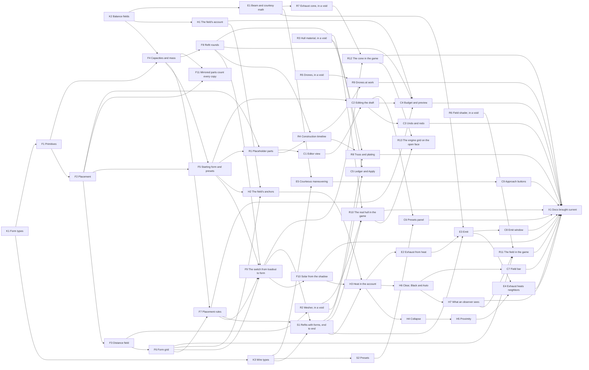

# Forms, fields and directed energy: the work

The build of [29-ship-form.md](../29-ship-form.md), [30-the-field.md](../30-the-field.md),
[31-directed-energy.md](../31-directed-energy.md) and [32-ship-rendering.md](../32-ship-rendering.md),
cut into tasks that many agents can run at once. The design is in those four docs. This file is
only the order.

## How to use this file

- **What can I start?** `python3 tools/dag.py lightcone/docs/plans/forms-and-fields.md ready` lists
  every task whose needs are done. It also warns when a task would touch a path an active task is
  touching.
- **Claims live on `master`.** Whoever hands a task out changes its status line to
  `- status: active <who>` and pushes that one commit straight to `master` before the work starts,
  so `ready` on `master` never offers it twice. A claim on a branch is invisible until it merges.
  The agent doing the task does not claim it again.
- **Finish it** by merging `master` into your branch, then changing the line to
  `- status: done <PR or commit>` in the same PR as the work. Merging first puts the claim in your
  branch's history, so your one-line change merges cleanly.
- **Edit only your task's block.** Every block is separated from the next by blank lines and its
  status sits on a line of its own, so two agents finishing two tasks change lines git sees as far
  apart and the merge is clean. Do not reflow, reorder or renumber anything.
- **New tasks go at the end of their stream**, with the next free number. A task that turns out to
  be unnecessary becomes `- status: dropped <why>`. It is never deleted, because other blocks name it.
- **If the build departs from the design, update the design doc in the same PR.** The docs are the
  argument; this file is not.
- Each task is written to be started cold. `read` is where the design is; `touches` is where the
  work is expected to land, so parallel tasks can be kept apart.
- Every task ends as [AGENTS.md](../../../AGENTS.md) says: tests that fail when the mechanism is
  broken on purpose, `tools/api_surface.py` on each crate touched, screenshots through `--shot` for
  anything drawn, and `cargo clean`.
- **New modules are declared up front where it is cheap.** K1 creates every `lc-world` module the F
  and H streams name, empty, so those tasks never add `mod` lines side by side. In `lc-client` and
  `em-render`, a task adding a module adds its `mod` line in alphabetical order, and a conflict
  between two such lines is resolved by keeping both.
- `python3 tools/dag.py lightcone/docs/plans/forms-and-fields.md check` validates the graph, and
  `graph --write` regenerates the diagram below from the `needs` lines. The diagram is derived.
  The `needs` lines are the truth.

## Shape of the graph

**Three contract tasks come first**, and nearly everything fans out from them: the form's types
(K1), every new `Balance` field (K2), and every new wire type (K3). They are small on purpose.
Putting each shared type in one place early means later tasks add behavior without two of them
editing the same enum. `lc-proto`'s goldens change once, in K3, rather than in six PRs.

After that there are six streams, and the only edges between them are real ones:

| stream | what | depends on others for |
|---|---|---|
| **F** form | parts, geometry, the refit planner, the switch away from `Loadout` | contracts only |
| **S** server | refits with forms end to end, presets | F |
| **H** heat | the field's account, collapse, proximity, modes, photometry | F, S |
| **E** energy | beams, exhaust, emit, courteous maneuvering | H for heat. E5 needs only contracts |
| **R** rendering | meshes, materials, construction, drones, field and cone shaders | many start in a void with fixtures |
| **C** client | the editor, presets, bars, windows | F, S, H, E |

**Work in a void** wherever it is honest. A mesher, a material, a particle shader or a field shader
can be built and photographed against fixture forms and fixed uniforms long before the game can
feed it. Those tasks have no needs and are wiring later. The wiring is a separate task, so the void
work is never blocked.

**The critical path** is K1 → F1 → F2 → F3 → F6 → F7 → F9 → F10 → H3 → H4 → H5 → E4, twelve tasks
long. Its first half is where the game stops having a loadout, and everything that reads a ship's
parts in play is downstream of F9. `dag.py waves` prints the full layering: thirteen waves, and up
to six tasks at once in the widest of them.

<!-- graph -->

<!-- /graph -->

## K: contracts

### K1 · Form types

- status: done #62
- needs: —
- touches: `crates/lc-world/src/form.rs`, `crates/lc-world/src/lib.rs`
- read: 29 §Parts, §Kinds, §The Mind, §Placement is relative
- deliver: `Form`, `Part`, `PartId`, `Kind` (mind, storage, drone, engine, living, data, bay, spar), `Primitive` and its proportions, `Placement` (attached or enclosing, anchor, twist, tilt, standoff, blend, mirror), `SparMode`. Serde. Structural validation only: exactly one Mind at the root, parents exist, no cycles, `MAX_PARTS`. Also creates, empty and declared, every module later tasks fill: `form/{primitive, place, sdf, capacity, presets, grid, rules}.rs`, `field.rs`, `emit.rs`, `courtesy.rs`.
- done when: a form with two Minds, a missing parent or a cycle is refused by name. No behavior beyond structure.

### K2 · Balance fields

- status: done #63
- needs: —
- touches: `crates/lc-world/src/fitting.rs`
- read: the Balance tables of 29, 30 and 31
- deliver: every new field in `Balance` with its first guess: densities and mass fractions, `min_part_m3`, `min_drone_m3`, `move_work_factor`, `hull_areal_density`, `envelope_margin`, `engine_clear_half_angle_rad`, `spar_gap`, `spar_thickness`, the field's settings, `conversion_efficiency` (renamed from `solar_efficiency`), the modes and Auto, `drive_spread_rad`, `rcs_accel_g`, `rcs_spread_rad`, `courtesy_fraction`, the collapse settings. Anchored values are marked as such and filled in by their tasks. Nothing reads them yet. The old per-module fields stay until F9.
- done when: the crate builds, and `Balance::DEFAULT` has every field with the value the docs give.

### K3 · Wire types

- status: done #68
- needs: K1
- touches: `crates/lc-proto/src/lib.rs`, `crates/lc-proto/src/golden.rs`, `crates/lc-proto/src/form.rs`, `crates/lc-proto/src/field.rs`, `crates/lc-proto/src/fitting.rs`, `crates/lc-world/src/form.rs`, `crates/lc-world/src/fitting.rs`, `crates/lc-server/src/`, `crates/lc-client/src/action.rs`, `crates/lc-client/src/uplink.rs`, `crates/lc-client/src/hud.rs`, `lightcone/docs/29-ship-form.md`, `lightcone/docs/30-the-field.md`, `lightcone/docs/31-directed-energy.md`
- read: the Protocol sections of 29, 30 and 31
- deliver: every new wire type at once: the form's mirror types, `Order::Refit` taking a `Form` beside the old loadout, `Order::FieldMode`, `Order::Emit`, `approach` on `Order::Intercept`, `Outbound::Collapsed`, `Outbound::Illuminated`, `Outbound::Presets`, `Inbound::SavePreset` and `DeletePreset`, the new `Fitted` and `Presence` fields, `Balance`'s new fields and `solar_efficiency` renamed to `conversion_efficiency`, the new refusals. The server answers each new order with a refusal saying it is not built yet. Goldens regenerated once.
- done when: every type round-trips, the goldens pass, and the game plays exactly as before.

## F: form

### F1 · Primitives

- status: done #65
- needs: K1
- touches: `crates/lc-world/src/form/primitive.rs`, `crates/lc-world/src/form.rs`
- read: 29 §Parts
- deliver: for each of the six primitives, volume from scale and proportions, scale solved from volume, and surface area (closed form, or the standard approximation for the ellipsoid). The Mind as a cube of `min_part_m3`.
- done when: scale solved from a volume gives the volume back to a part in 10¹², and each area is checked against a fine tessellation.

### F2 · Placement

- status: done #72
- needs: F1
- touches: `crates/lc-world/src/form/place.rs`
- read: 29 §Placement is relative
- deliver: every part's transform in the ship's frame, from the tree: attached (the anchor ray's last exit from the parent's surface, twist, tilt, standoff) and enclosing (centered on the parent), with mirrored subtrees.
- done when: an attached child touches its parent at the anchor for every primitive pair (a torus child, whose foot is the center of its hole, lies tangent to the anchor's plane), a child moves out with its parent when the parent grows, and a torus's child hangs off the rim.

### F3 · Distance field

- status: done #76
- needs: F2
- touches: `crates/lc-world/src/form/sdf.rs`
- read: 29 §Spars conform, §What the server computes
- deliver: the signed distance of each primitive, the blended union of a form, spars cut by their tree neighbors (saddle and strap) and joined hard. Evaluated at a point in the ship's frame. Engine-free, and the one definition the grid (F6) and the mesher (R2) both read.
- done when: the distance is exact on each primitive's surface, a saddle sits `spar_gap` off its neighbor, and a strap stays inside its shell.

### F4 · Capacities and mass

- status: done #71
- needs: F1, K2
- touches: `crates/lc-world/src/form/capacity.rs`, `crates/lc-world/src/fitting.rs`
- read: 29 §Kinds, §Hull structure follows area
- deliver: capacities per kind from volume at the densities, dry mass from volume and mass fraction plus structure over each part's own area, a spar charged as its uncut primitive, and the mass-energy of adding or removing any part.
- done when: a form with 19's starting volumes has 19's starting capacities to a part in 10⁹.

### F5 · Starting form and presets

- status: done #77
- needs: F2, F4
- touches: `crates/lc-world/src/form/presets.rs`, `crates/lc-world/src/fitting.rs`, `crates/lc-world/src/form/capacity.rs`, `crates/lc-world/src/form/place.rs`, `lightcone/docs/29-ship-form.md`
- read: 29 §The starting form, §Your own presets
- deliver: `Form::starting()`, the Plate, Spindle and Cluster layouts, and applying any preset as a **layout** (this ship's volumes in the preset's arrangement, by share of each kind) or as a **design** (exactly). `hull_areal_density` anchored in `Balance::DEFAULT` so the starting form weighs what 19's starting ship does.
- done when: a layout keeps every kind's total volume, and a design reproduces the preset.

### F6 · Form grid

- status: done #84
- needs: F3
- touches: `crates/lc-world/src/form/grid.rs`, `crates/lc-world/src/form/sdf.rs`, `crates/lc-world/src/form.rs`, `lightcone/docs/29-ship-form.md`
- read: 29 §What the server computes from a form
- deliver: the voxel grid at `FORM_GRID`, the shadow table over 162 directions with interpolation, broadside and its roll, the envelope (offset, area, volume), moments of inertia, extent.
- done when: a one-ellipsoid form reproduces 20's analytic `A(ŝ)` to within the grid's resolution, and a stack of plates shades itself.

### F7 · Placement rules

- status: active card "Build F7: placement rules"
- needs: F4, F6
- touches: `crates/lc-world/src/form/rules.rs`
- read: 29 §Placement rules
- deliver: validation of a target: engine parts fore or aft with a clear cone, a bay's mouth clear, attached parts touching and enclosing parts containing, extent inside `LENGTH_RANGE_M`, the size minimums, the drone minimum. Each failure names the part.
- done when: one form per rule is refused with that rule's reason, and the starting form passes.

### F8 · Refit rounds

- status: done #75
- needs: F4
- touches: `crates/lc-world/src/refit.rs`, `crates/lc-world/src/refit/rounds.rs`, `lightcone/docs/29-ship-form.md`
- read: 29 §Refits
- deliver: the planner over forms: diff two forms into dismantle, move and build steps per part (a reshape is a dismantle and a build), drones last and first, the energy check, venting of what storage cannot hold, timing from drone power at each step's start, data's work factor, cancel. Lives beside the old planner until F9 removes it.
- done when: a round that cannot pay for its builds is refused; a round that overflows storage reports the vent and the step that frees it; cancel keeps finished steps and reverses the rest.

### F9 · The switch from loadout to form

- status: todo
- needs: F5, F6, F7, F8
- touches: `crates/lc-world/src/fitting.rs`, `crates/lc-world/src/craft.rs`, `crates/lc-world/src/cost.rs`, `crates/lc-world/src/refit.rs`
- read: 29 whole, 19 for what stays
- deliver: `Loadout` removed from `lc-world`. `Craft` holds a `Form`; everything read from the loadout reads capacities; the rated acceleration counts aft engines; slew from the moments; `length_m` from the extent; the old planner and per-module `Balance` fields deleted.
- done when: every existing `lc-world` test passes against the starting form, with numbers changed only where the new starting ship differs from the old and each such change is explained in its test.

### F10 · Solar from the shadow

- status: todo
- needs: F9
- touches: `crates/lc-world/src/solar.rs`, `crates/lc-world/src/craft.rs`
- read: 29 §What the server computes, 20 §Attitude
- deliver: collection reads the shadow table; the idle attitude turns the largest shadow to the star; `solar_gain` re-anchored on the starting form; 20's tables recomputed.
- done when: 20's anchor holds for the starting form to 1%, and a plate collects more than a spindle of the same volume broadside.

### F11 · Mirrored parts count every copy

- status: done #78
- needs: F2, F4
- touches: `crates/lc-world/src/form/capacity.rs`, `crates/lc-world/src/form/place.rs`, `lightcone/docs/29-ship-form.md`
- read: 29 §Placement is relative, §Kinds, §Refits, §Hull structure follows area
- deliver: `volume_m3` is per copy. `Form::copies`, valid or not; capacities, dry mass and the areal density's solve count every copy; `Transfer::of` takes a count of copies. 29 prices a mirror as a build or dismantle of the copy, not a move. F8's planner adopts it.
- done when: a mirrored subtree holds, weighs and costs what the same parts built out by hand do.

## S: server

### S1 · Refits with forms, end to end

- status: todo
- needs: K3, F7, F9
- touches: `crates/lc-server/src/fitting.rs`, `crates/lc-server/src/persist.rs`, `crates/lc-server/src/command/`, `crates/lc-proto/src/lib.rs`
- read: 29 §Protocol and persistence
- deliver: `Loadout` removed from the wire and saves; `Order::Refit { target: Form }` validated and run as rounds; `Fitted` carries the form, solved scales, capacities and geometry; `Presence` carries the form; the console's fitting commands take parts; the client reads the form from `Fitted` with no drawing change yet.
- done when: a refit round runs on a shard and survives a restart, an invalid target is refused by name, and another client sees the new form only when its light arrives.

### S2 · Presets

- status: done #88
- needs: K3
- touches: `crates/lc-store/src/presets.rs`, `crates/lc-server/src/`, `crates/lc-store/sql/0013_presets.sql`, `crates/lc-store/src/migrate.rs`, `crates/lc-store/src/lib.rs`, `crates/lc-server/tests/checkpoint.rs`, `crates/lc-proto/src/lib.rs`, `crates/lc-client/src/uplink.rs`, `lightcone/docs/29-ship-form.md`
- read: 29 §Your own presets
- deliver: a `presets` table keyed by account and name; save, delete and list; `Outbound::Presets` after `Welcome` and after each change; the limits.
- done when: presets survive a restart, one account never sees another's, and the store's tests skip cleanly without PostgreSQL.

## H: heat

### H1 · The field's account

- status: done #69
- needs: K2
- touches: `crates/lc-world/src/field.rs`
- read: 30 §The heat account, §Conversion, §Clear and Black
- deliver: `Q` with its closed forms, temperature from `Q` and envelope area, the time to any threshold, bursts, conversion at a rating and efficiency with storage room, the storage-fills split, absorptivity. Pure math over inputs; nothing reads it yet.
- done when: the closed form agrees with fine stepping through a starlight segment, a burst and a fill split, and a linear equation of state put in on purpose fails the temperature tests.

### H2 · The field's anchors

- status: todo
- needs: H1, F5, F6
- touches: `crates/lc-world/src/fitting.rs`, `crates/lc-world/src/field.rs`
- read: 30 §The anchors
- deliver: `q_idle`, `field_capacity` and `τ` derived in `Balance::DEFAULT` from the starting form's envelope; 30's tables recomputed for it.
- done when: the three anchors hold to a part in a million.

### H3 · Heat in the account

- status: todo
- needs: H2, F10, S1
- touches: `crates/lc-world/src/fitting.rs`, `crates/lc-world/src/solar.rs`, `crates/lc-server/src/fitting.rs`
- read: 30 §The inputs, 31 §The star's gain
- deliver: the settled account carries `Q`: the living drain, conversion loss, dismantling loss and vents go in; starlight is the field's intake, with the gain on the star's output; conversion is rated by engine volume; heat counts in mass; `Fitted` carries `Q`.
- done when: a full ship at 0.1 AU settles at 30's temperature, and a vent raises `Q` by exactly what storage could not hold.

### H4 · Collapse

- status: todo
- needs: H3
- touches: `crates/lc-server/src/field.rs`, `crates/lc-world/src/field.rs`
- read: 30 §Collapse
- deliver: collapse scheduled from the account and re-solved on every change; the event; the release; `Outbound::Collapsed`; the owner's new starting ship.
- done when: a collapse fires at the predicted instant, a change of input moves it, and a distant client learns of it no earlier than its light.

### H5 · Proximity

- status: todo
- needs: H4
- touches: `crates/lc-server/src/field.rs`
- read: 30 §Proximity
- deliver: a neighbor's glow as intake; a collapse's spike delivered to each neighbor at its retarded time as a burst; cascades.
- done when: a ship inside the lethal radius dies, one outside it survives, and the second death in a cascade comes later by the light time between them.

### H6 · Clear, Black and Auto

- status: todo
- needs: H3
- touches: `crates/lc-world/src/field.rs`, `crates/lc-server/src/field.rs`
- read: 30 §Clear and Black, §Auto
- deliver: `Order::FieldMode`; absorptivity per mode; the switch taking `field_switch_s`; Auto's thresholds scheduled from the account on the authority, with hysteresis; new ships in Auto.
- done when: a switch changes nothing until it completes, Auto switches at the predicted instants with no client connected, and equal thresholds put in on purpose fail the hysteresis test.

### H7 · What an observer sees

- status: todo
- needs: H6
- touches: `crates/lc-world/src/craft.rs`, `crates/lc-client/src/hull.rs`, `crates/lc-server/src/`
- read: 30 §What an observer sees
- deliver: `HULL_K` retired; a ship's light is reflected (`1 − α`) plus thermal at its field's temperature over the envelope; `Presence` carries temperature and mode; instruments see it.
- done when: a Black ship vanishes in V and not at ten microns, and a hot field's color moves through the bands as 30's table says.

## E: energy

### E1 · Beam and courtesy math

- status: done #70
- needs: K2
- touches: `crates/lc-world/src/signal.rs`, `crates/lc-world/src/emit.rs`, `crates/lc-world/src/courtesy.rs`
- read: 31 §Spread, §What arrives, §Courtesy
- deliver: `Transmitter` for any wavelength and aperture; received fraction; lead uncertainty; the cooking flux; the courtesy radius of a drive and of station-keeping thrusters.
- done when: 31's tables come out of the functions.

### E2 · Exhaust from heat

- status: todo
- needs: H3
- touches: `crates/lc-world/src/cost.rs`, `crates/lc-world/src/field.rs`
- read: 31 §The drive is the radiator
- deliver: while lit, exhaust draws on `Q` first; the account's sink with its floor; what heat supplies refunded from the commitment.
- done when: a burn from a hot ship ends colder, lighter and where the plan said, and costs storage only what heat could not supply.

### E3 · Emit

- status: todo
- needs: E1, E2, S1
- touches: `crates/lc-world/src/emit.rs`, `crates/lc-server/src/emit.rs`, `crates/lc-server/src/radio.rs`
- read: 31 §Emitting on purpose, §Three uses, §Radio
- deliver: `Order::Emit`, balanced and as a burn; fan-out to every worldline in the cone; delivery at the retarded time as intake; `Outbound::Illuminated`; `Presence` carries `Glare` to observers inside the cone; radio charged.
- done when: a second craft in the cone is fed and a third just outside is not, a balanced emit leaves the worldline alone, and an aimed beam misses a target that maneuvered after it left.

### E4 · Exhaust heats neighbors

- status: todo
- needs: E3, H5
- touches: `crates/lc-server/src/emit.rs`
- read: 31 §Exhaust lands on whatever is behind
- deliver: every lit drive as a continuous emission at `drive_spread_rad`, fanned out to craft within the cutoff, changing their intake at the retarded times of ignition and cutoff.
- done when: a full ship inside the cooking distance behind a burn walks to collapse, and one beside the burn feels nothing.

### E5 · Courteous maneuvering

- status: done #73
- needs: E1, K3
- touches: `crates/lc-world/src/pursuit.rs`, `crates/lc-world/src/escort.rs`, `crates/lc-world/src/consort.rs`, `crates/lc-world/src/courtesy.rs`, `crates/lc-server/src/chase.rs`, `crates/lc-server/src/server.rs`, `crates/lc-server/src/fitting.rs`, `crates/lc-server/src/persist.rs` (the approach is saved), `crates/lc-server/src/director.rs` (a staged chase states its approach)
- read: 31 §Maneuvering near others, 08 §Intercept
- deliver: station-keeping legs as a `Cruise` at `rcs_accel_g`; abeam stations; ingress points at the courtesy radius; flotilla azimuths; `approach` on `Intercept`, Courteous by default. Needs no heat: it keeps to the courtesy limit whether or not anything yet burns from it.
- done when: a courteous approach and escort never exceed the courtesy flux on the quarry at any instant, a direct one does, and three followers of one leader take three azimuths with none in another's cone.

## R: rendering

### R1 · Placeholder parts

- status: done #82
- needs: F2, F5
- touches: `crates/lc-client/src/hull.rs`, `crates/lc-client/src/parts.rs`, `crates/lc-client/src/lib.rs`, `crates/lc-client/src/app.rs`, `crates/lc-client/src/dev.rs`, `crates/lc-client/src/entry.rs`, `crates/lc-client/src/resolved.rs`, `lightcone/docs/32-ship-rendering.md`, `lightcone/images/`
- read: 32 §Temporary assets
- deliver: each part as a Bevy primitive at its solved transform, a flat color per kind, the Mind as a small cube; `--form <preset>` draws the player's ship as that preset from a fixture, with no server involved.
- done when: `--form cluster --shot` photographs a cluster, and the ovoid is only drawn for craft with no form.

### R2 · Mesher, in a void

- status: done #85
- needs: F3
- touches: `crates/lc-client/src/hull_mesh.rs`, `crates/lc-client/examples/`, `crates/lc-client/src/lib.rs`, `lightcone/docs/32-ship-rendering.md`, `lightcone/images/`
- read: 32 §From distance field to mesh
- deliver: surface nets over F3's field at a resolution set by pixels on screen; smooth, faceted and blocky finishes; meshing on the async pool, cached by the form's hash; an example that meshes fixture forms, spars conforming included, and photographs them.
- done when: every primitive and a spar saddle and strap mesh without holes at three resolutions, and a remesh never blocks a frame.

### R3 · Hull material, in a void

- status: done #67
- needs: —
- touches: `crates/em-render/src/hull_material.rs`, `crates/lc-client/assets/shaders/hull.wgsl`, `crates/lc-client/assets/textures/`, `crates/lc-client/examples/hull_void.rs`, `crates/lc-client/src/procedural.rs` (a plane bake)
- read: 32 §Details are sized in meters, §Materials by kind
- deliver: a triplanar material with kind regions, detail fixed in meters and faded at distance, living lights through the exposure, a reveal-mask uniform for plating, and one texture-graph graph per kind.
- done when: photographed on spheres of 500 m and 50 km, the detail is the same size in meters on both, and nothing shimmers at a distance.

### R4 · Construction timeline

- status: todo
- needs: F8, R1
- touches: `crates/lc-client/src/construction.rs`
- read: 32 §Building, as a function of time
- deliver: the pure function from a round's recipe and `t` to each part's volume, the sliver, and each point's phase; drawn on the placeholders as scale plus wireframe; `--demo refit` and `--refit-at`.
- done when: the function is tested without a window, and `--refit-at 0.5` photographs a half-built part.

### R5 · Drones, in a void

- status: done https://github.com/Zanderwohl/rusty-space/pull/64
- needs: —
- touches: `crates/em-render/src/drone_material.rs`, `crates/lc-client/assets/shaders/drones.wgsl`, `crates/lc-client/examples/drones_void.rs`, `lightcone/images/drones-*.png`
- read: 32 §Drones
- deliver: stateless particles: position a closed form of index, seed and `t`, in the vertex shader over one quad per drone; arcs to fixture targets, dwell, return; idle patrol; haze at a distance.
- done when: `--burst` shows smooth motion, and a paused clock photographs the same frame twice.

### R6 · Field shader, in a void

- status: done #66
- needs: —
- touches: `crates/em-render/src/field_material.rs`, `crates/lc-client/assets/shaders/field.wgsl`, `crates/lc-client/examples/field_void.rs`
- read: 32 §The field
- deliver: two layers on any envelope mesh; Clear's thin-film shimmer and Black's matte surface; the blackbody glow from temperature at physical brightness through the exposure; hot spots from bearings; the flicker past 80%; the switch sweep; the collapse flash and afterglow; `--field-k`.
- done when: photographed at 400, 2 400 and 4 600 K in both modes, and `--burst` shows the flicker.
- note: photographed through `examples/field_void.rs`, which has its own `--field-k`, `--mode` and `--burst`. The binary's `--field-k` holds the player's field, and there is none until R11, whose deliver line has it.

### R7 · Exhaust cone, in a void

- status: done #74
- needs: E1
- touches: `crates/em-render/src/exhaust_cone_material.rs`, `crates/lc-client/assets/shaders/exhaust_cone.wgsl`, `crates/lc-client/assets/shaders/aperture_glow.wgsl`, `crates/lc-client/examples/cone_void.rs`, `crates/lc-world/src/emit.rs`, `lightcone/images/cone-*.jpg`
- read: 32 §The exhaust cone
- deliver: the cone shaded in closed form per pixel from the flux at the ray's closest approach to the axis, one draw, precise at 26 000 km; the aperture glow at `F c` over its area.
- done when: photographed from beside, behind and inside the cone, at 26 km and at 26 000 km.
- note: left for R12, which wires the cone in: move `HAZARD` out of `examples/cone_void.rs` into `lc-client`, and retire `crates/em-render/src/plume_material.rs` and `crates/lc-client/assets/shaders/plume.wgsl` once `plume.rs` stops drawing the reaction drive. The face's temperature is `lc_world::emit::aperture_temperature_k`.

### R8 · Truss and plating

- status: todo
- needs: R2, R3, R4
- touches: `crates/lc-client/src/construction.rs`, `crates/lc-client/assets/shaders/hull.wgsl`
- read: 32 §A build step is a frontier
- deliver: the truss lattice meshed in the sliver at each step's start, plating by the reveal mask, fitting-out and scaffold-down as bands sweeping from the attachment point, and dismantling in reverse.
- done when: `--refit-at` photographs each phase on a starting ship and a GSV-sized fixture.

### R9 · Drones at work

- status: todo
- needs: R4, R5
- touches: `crates/lc-client/src/drones.rs`
- read: 32 §Drones
- deliver: the drone count from drone volume; paths from the drone part's docks to the sliver's frontier, loaded home on a dismantle, swarming a moved part's joint.
- done when: `--demo refit` shows drones only where a step is working.

### R10 · The real hull in the game

- status: todo
- needs: R2, R3, S1
- touches: `crates/lc-client/src/hull.rs`, `crates/lc-client/src/parts.rs`
- read: 32 §The hull
- deliver: the mesher and material replace the placeholders for every craft with a form, the player's from `Fitted` and others' from `Presence`.
- done when: two clients photograph each other's ships in their own forms.

### R11 · The field in the game

- status: todo
- needs: R6, F6, H7
- touches: `crates/lc-client/src/field.rs`
- read: 32 §The field, 30 §What an observer sees
- deliver: the envelope meshed from F6's grid, the shader fed by `Q`, mode and switch from `Fitted` and `Presence`, and hot spots from `Illuminated` once E3 exists; `--field-k` in the binary (32 §Photographing it), holding the player's field at a temperature.
- done when: a diving ship glows the color the field bar shows.

### R12 · The cone in the game

- status: todo
- needs: R7, F9
- touches: `crates/lc-client/src/plume.rs`
- read: 32 §The exhaust cone
- deliver: the aperture glow on each engine part's open face; the cone for your own burns, for any burn whose courtesy radius you are in, and for a selected ship; the map's lines.
- done when: a burning ship photographs with its cone, and the old gas plume is gone.

### R13 · The engine grid on the open face

- status: todo
- needs: R10, R12
- touches: `crates/em-render/src/hull_material.rs`, `crates/lc-client/assets/shaders/hull.wgsl`, `crates/lc-client/src/hull.rs`
- read: 32 §Materials by kind, §The exhaust cone
- deliver: the engine kind's emitter grid lit only on each engine part's open face, from a per-vertex share the mesher reads off the part, at the exhaust's power. R3 lights it over the whole region, which is right in a void and wrong on a ship; R12's aperture glow sits over it.
- done when: a burning ship photographs with the grid glowing on its open face and dark on the engine's flanks.

## C: client

### C1 · Editor view

- status: todo
- needs: R1
- touches: `crates/lc-client/src/form_view.rs`, `crates/lc-client/src/ui.rs`, `crates/lc-client/src/app.rs`
- read: 29 §The editor
- deliver: `ViewMode::Form` on `H`; its camera with the `FormCamera` marker, never the first camera created; the orbit; the sky in the corner square; the draft drawn on the placeholders; `--view form`.
- done when: `--view form --shot` photographs it, and every existing camera query still finds its camera.

### C2 · Editing the draft

- status: todo
- needs: C1, F5
- touches: `crates/lc-client/src/form_view.rs`, `crates/lc-client/src/form_panel.rs`, `crates/lc-client/src/snap.rs`, `crates/lc-client/src/action.rs`
- read: 29 §Handles, §Snapping, §What else it shows
- deliver: the draft in `Ui`; handles for every edit; the tree and fields panels; the snapping table; every edit an `Action`.
- done when: every edit is tested as an `Action` without a window, and a size handle snaps to the R10 ladder.

### C3 · Undo and redo

- status: todo
- needs: C2
- touches: `crates/lc-client/src/form_history.rs`
- read: 29 §Undo and redo
- deliver: the history of before-and-after entries, the cursor, the panel, the keys, cleared on Apply.
- done when: undoing a removal restores the same part with the same id and children, and a drag is one entry.

### C4 · Budget and preview

- status: todo
- needs: C2, F7, F8, H1
- touches: `crates/lc-client/src/form_panel.rs`
- read: 29 §The budget, §What else it shows
- deliver: the local planner's round: available, spent, peak in storage, the vent and the field's peak temperature from it; capacities, shadow, slew, headroom and brightness; handles stop at what the budget allows; Apply asks again when the vent would collapse the field.
- done when: the preview is a pure function tested without a window, and matches the server's plan for the same round.

### C5 · Ledger and Apply

- status: todo
- needs: S1, F8
- touches: `crates/lc-client/src/refit_panel.rs`
- read: 29 §The editor
- deliver: the refit window as the ledger (budget, phases, progress, Cancel), with a list of parts and snapped size fields as the editor until C2 lands; Apply sends `Order::Refit { target }` from either.
- done when: a refit can be made, applied and cancelled from the window alone.

### C6 · Presets panel

- status: todo
- needs: C2, S2
- touches: `crates/lc-client/src/presets_panel.rs`
- read: 29 §Your own presets
- deliver: save the draft by name, apply as layout or design, delete, export to and import from the clipboard as RON.
- done when: an exported preset imported on another account applies to the same draft.

### C7 · Field bar

- status: todo
- needs: H6
- touches: `crates/lc-client/src/hud.rs`, `crates/lc-client/src/panels.rs`
- read: 30 §The field bar
- deliver: `Hud::field`; the bar beside energy; blue to blackbody color from the Draper point; the pulse; the equilibrium tick; the countdown; the Black, Clear and Auto buttons with Auto's threshold markers.
- done when: `Field` is tested as a pure function, and a scheduled collapse puts its countdown in the text.

### C8 · Emit window

- status: todo
- needs: E3
- touches: `crates/lc-client/src/emit_panel.rs`, `crates/lc-client/src/map.rs`
- read: 31 §Client
- deliver: the emit window on `E` with its preview of spread, spot, lead uncertainty, fraction arriving, recoil and source; the incoming list; beams on the map.
- done when: the preview is a pure function tested without a window.

### C9 · Approach buttons

- status: done #89
- needs: E5
- touches: `crates/lc-client/src/panels.rs`, `crates/lc-client/src/hud.rs`, `crates/lc-client/src/action.rs`, `crates/lc-server/src/director.rs`
- read: 31 §Two ways to approach
- deliver: Courteous and Direct beside Company and Intimate; the HUD line names the approach.
- done when: both styles can be ordered from the panel, and the HUD says which is flown.

## X: closing

### X1 · Docs brought current

- status: todo
- needs: F10, H7, E4, R12, C3, C4, C6, C7, C8, C9, R8, R9, R10, R11
- touches: `lightcone/docs/`, `lightcone/README.md`, `crates/lc-proto/src/lib.rs`
- read: all four design docs
- deliver: 03, 13 and 19 updated for what was built; 29 to 31 marked built, with what departed from the plan said where it did; the README's status; `Refusal::NotBuilt` deleted.
- done when: nothing in `lightcone/docs/` describes a loadout as current.
